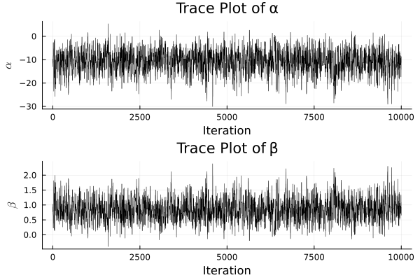
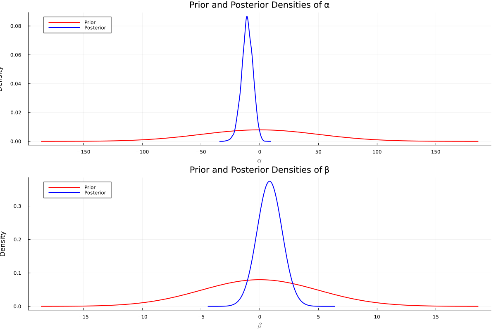
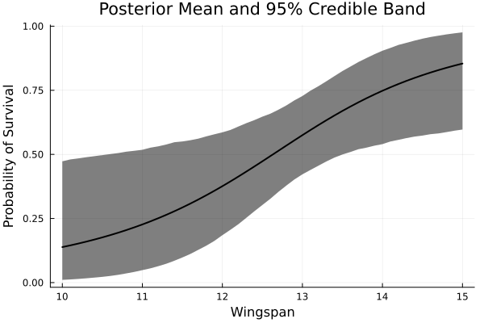

#+TITLE: Exercise 10.2 Solution - Hoff, A First Course in Bayesian Statistical Methods
#+SUBTITLE: 標準ベイズ統計学 演習問題 10.2 解答例
#+SETUPFILE: ../setup.org
#+STARTUP:showeverything
* Question :noexport:
Nesting success:
Younger male sparrows may or may not nest during a mating season, perhaps depending on their physical characteristics.
Researchers have recorded the nesting success of 43 young male sparrows of the same age,
as well as their wingspan, and the data appear in the file ~msparrownest.dat~.
Let \(Y_i\) be the binary indicator that sparrow \(i\) successfully nests, and let \(x_{i}\) denote their wingspan.
Our model for \(Y_i\) is
\(\text{logit Pr}(Y_i = 1|\alpha, \beta x_i) = \alpha + \beta x) \), where the logit function is given by
\(\text{logit} \theta = \log \frac{\theta}{1-\theta}\).

* a)
** Question :noexport:
Write out the joint sampling distribution
\(\prod_{i=1}^n p(y_i | \alpha, \beta, x_i)\) and simplify as much as possible.
** Answer
\begin{align*}
\prod_{i=1}^n p(y_i | \alpha, \beta, x_i)
&= \prod_{i=1}^n \frac{\exp(\alpha + \beta x_i)^{y_i}}{1 + \exp(\alpha + \beta x_i)} \\
\end{align*}

* b)
** Question :noexport:
Formulate a prior probability distribution over \(\alpha\) and \(\beta\) by considering the range of \(\mathrm{Pr}(Y=1 | \alpha, \beta, x) \) as \(x\) ranges over 10 to 15, the approximate range of the observed wingspans.

** Answer
Let \(p\) be the probability of nesting success.
Then,
\begin{align*}
\alpha + \beta x_i
&= \text{logit } p \\
&= \log \frac{p}{1-p}. \\
\end{align*}
Thus, if we have no prior information about the probability of nesting success,
we can set the prior expectation of \(\alpha + \beta x_i\) to 0, \(p = 0.5\).
Also, we have no prior information about the relationship between wingspan and nesting success,
so we can set the prior expectation of \(\beta\) to 0.
Consequently, we can set the prior expectation of \(\alpha\) to 0.

Next, we consider the prior variance of \(\alpha\) and \(\beta\).
Suppose temporarily that \(\beta = 0\).
If the prior variance of \(\alpha\) is set to \(2500\),
\(\alpha\) ranges between \(-100\) and \(100\) for 95% probability, and
the odds ratio should be between
\(\exp(-100) \approx 3.7 \times 10^{-44}\) and
\(\exp(100) \approx 2.7 \times 10^{43}\).
This prior can be seen quite uninformative.
Similarly, considering \(x_i\) ranges between 10 and 15,
we can set the prior variance of \(\beta\) to 25.
Thus, we can set the prior distribution of \(\alpha\) and \(\beta\) as follows:
\begin{align*}
\alpha &\sim \mathcal{N}(0, 2500) \\
\beta &\sim \mathcal{N}(0, 25) \\
\end{align*}
* c)
** Question :noexport:
Implement a Metropolis algorithm that approximates that approximates \(p(\alpha, \beta |\by, \bx)\).
Adjust the proposal distribution to achieve a reasonable acceptance rate, and run the algorithm long enough so that the effective sample size is at least 1,000 for each parameter.

** Answer

#+begin_src julia :exports none
# start session at project root
import Pkg; Pkg.activate("./code")
#+end_src

#+RESULTS:

#+begin_src julia :exports code
using BayesPlots
using DelimitedFiles
using Distributions
using LaTeXStrings
using LinearAlgebra
using MCMCChains
using Plots
using Plots.Measures
using Random
using StatsBase
using StatsModels
using StatsPlots
using GLM
#+end_src

#+RESULTS:
: nil

#+begin_src julia :exports code :eval never
data = readdlm("../../Exercises/msparrownest.dat")
y = data[:, 1]
x = data[:, 2]
# add intercept
x = hcat(ones(length(x)), x)

function MetropolisLogit(S, y, x, β₀, Σ₀, var_prop; seed=123)
    # S: number of samples
    # y: response vector
    # x: predictor vector
    # β₀: prior mean of β
    # Σ₀: prior covariance of β
    # var_prop: proposal variance

    function logistic(ψ)
        return exp(ψ) / (1 + exp(ψ))
    end

    Random.seed!(seed)
    q = length(β₀)
    BETA = Matrix{Float64}(undef, S, q)
    acs = 0 # acceptance rate

    # Initialize
    glmfit = glm(x, y, Binomial(), LogitLink())
    β = coef(glmfit)

    # Metropolis algorithm
    for s in 1:S
        p = logistic.(x*β)
        # Draw β*
        β_star = rand(MvNormal(β, var_prop))
        p_star = logistic.(x*β_star)
        log_r = sum(logpdf.(Bernoulli.(p_star), y)) +
                logpdf(MvNormal(β_star, Σ₀), β) -
                sum(logpdf.(Bernoulli.(p), y)) -
                logpdf(MvNormal(β, Σ₀), β_star)

        if log(rand()) < log_r
            β = β_star
            acs += 1
        end
        BETA[s, :] = β
    end
    return BETA, acs/S
end

# Prior
β₀ = [0, 0]
Σ₀ = [2500 0; 0 25]

S = 10000

# search best proposal variance
for i in 1:20
# Proposal variance
    var_prop = i*inv(x'x)
    BETA, acs = MetropolisLogit(S, y, x, β₀, Σ₀, var_prop)
    println("i = ", i)
    println("acceptance rate = ", acs)
    ess_α = MCMCDiagnosticTools.ess(BETA[:,1])
    ess_β = MCMCDiagnosticTools.ess(BETA[:,2])
    println("ess_α = ", ess_α)
    println("ess_β = ", ess_β)
end
#+end_src

#+begin_src julia :exports both :eval never
var_prop = 17*inv(x'x)
BETA, acs = MetropolisLogit(S, y, x, β₀, Σ₀, var_prop)

ess(MCMCChains.Chains(BETA))
#+end_src

#+RESULTS:
#+begin_example julia
ESS
  parameters         ess   ess_per_sec
      Symbol     Float64       Missing

     param_1   1261.2209       missing
     param_2   1248.0384       missing
#+end_example

* d)
** Question :noexport:
Compare the posterior densities of \(\alpha\) and \(\beta\) to their prior densities.
** Answer

* e)
** Question :noexport:
Using output from the Metropolis algorithm,
come up with a way to make a confidence band for the following /function/ \(f_{\alpha \beta}(x)\) of wingspan:
\[
f_{\alpha \beta}(x) = \frac{ e^{\alpha + \beta x} }{ 1 + e^{\alpha + \beta x} }.
\]
where \(\alpha\) and \(\beta\) are the parameters in your sampling model.
Make a plot of such a band.

** Answer

#+begin_src julia :exports code :eval never
x_grid = 10:0.1:15
x_grid = hcat(ones(length(x_grid)), x_grid)

# %%
f_post = logistic.(x_grid*BETA[burnin:end, :]')

# %%
f_post_mean = mean(f_post, dims=2)
f_post_lower = map(x -> quantile(x, 0.025), eachrow(f_post))
f_post_upper = map(x -> quantile(x, 0.975), eachrow(f_post))
#+end_src

* nav :ignore:
#+ATTR_HTML: :class nav-prev
[[./10-1.org][10.1]]

#+ATTR_HTML: :class nav-next
[[./10-3.org][10.3]]
