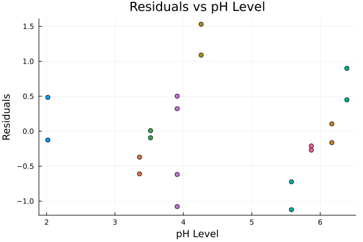
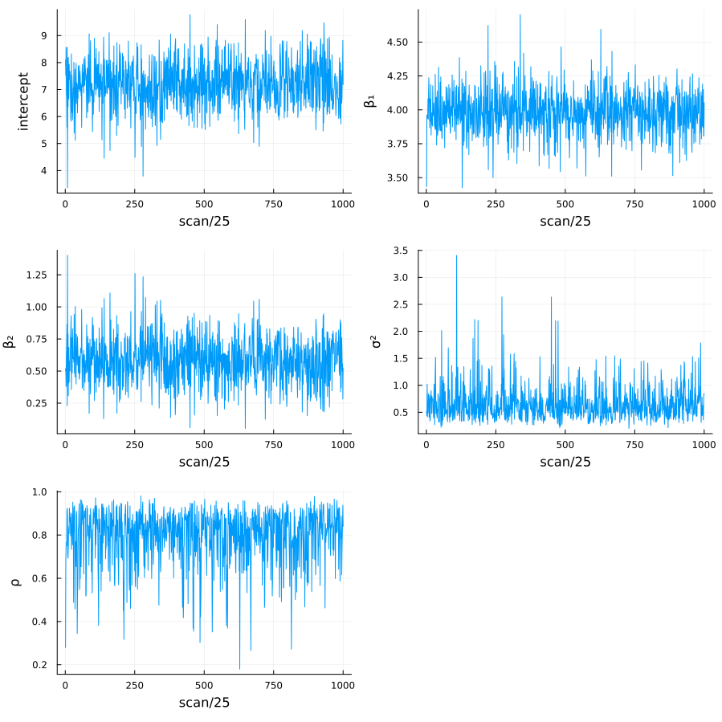
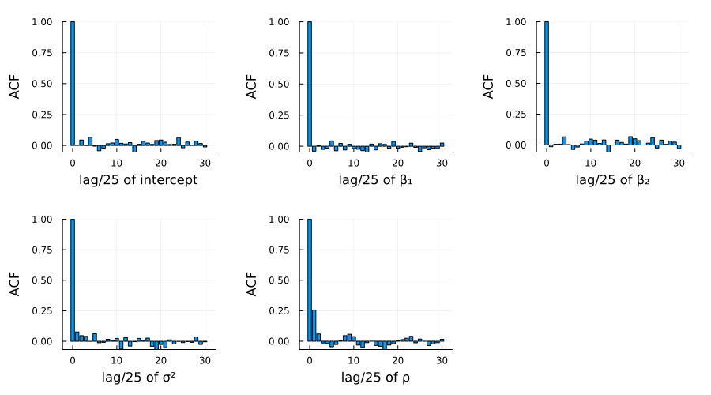
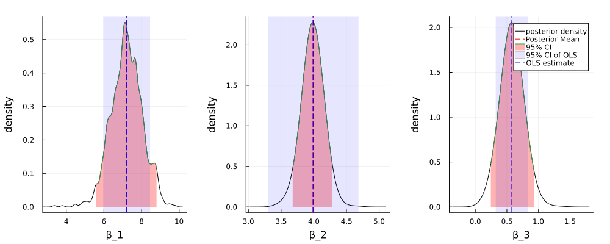

#+TITLE: Exercise 10.3 Solution Example - Hoff, A First Course in Bayesian Statistical Methods
#+SUBTITLE: 標準ベイズ統計学 演習問題 10.3 解答例
#+SETUPFILE: ../setup.org
#+STARTUP:showeverything
* Question :noexport:
Tomato plants:
The file ~tplant.dat~ contains data on the heights of ten tomato plants, grown under a variety of soil =pH= conditions.
Each plant was measured twice.
During the first measurement, each plant’s height was recorded and a reading of soil =pH= was taken.
During the second measurement only plant height was measured, although it is assumed that pH levels did not vary much from measurement to measurement.

* a)
** Question :noexport:
Using ordinary least squares, fit a linear regression to the data, modeling plant height as a function of time (measurement period) and =pH= level.
Interpret your model parameters.

** Answer

#+begin_src julia :exports none
import Pkg; Pkg.activate("./code")
#+end_src

#+RESULTS:

#+begin_src julia :exports code
import Pkg; Pkg.add(url="https://github.com/KaoruBB/BayesPlots.jl")
#+end_src

#+begin_src julia :results output :exports both
data = readdlm("Exercises/tplant.dat")
#+end_src

#+RESULTS:
#+begin_example
20×3 Matrix{Float64}:
 11.8   0.0  6.39
 15.34  1.0  6.39
  9.31  0.0  5.58
 13.7   1.0  5.58
 11.2   0.0  4.26
 14.75  1.0  4.26
 10.33  0.0  5.87
 14.38  1.0  5.87
  9.79  0.0  3.91
 13.96  1.0  3.91
  8.39  0.0  3.91
 12.84  1.0  3.91
 10.61  0.0  6.17
 14.87  1.0  6.17
  8.54  0.0  3.36
 12.77  1.0  3.36
  9.25  0.0  3.52
 13.14  1.0  3.52
  8.86  0.0  2.02
 12.24  1.0  2.02
#+end_example

#+begin_src julia :exports both :results code
# first column: plant height
# second column: measurement period
# third column: pH level
y = data[:, 1]
X = data[:, 2]
# add intercept
X = hcat(ones(length(X)), X)
df = DataFrame(
    height = y,
    time = X[:, 2],
    pH = data[:, 3]
)
lmfit = lm(@formula(height ~ time + pH), df)
#+end_src

#+RESULTS:
#+begin_src julia
"StatsModels.TableRegressionModel{LinearModel{GLM.LmResp{Vector{Float64}}, GLM.DensePredChol{Float64, CholeskyPivoted{Float64, Matrix{Float64}, Vector{Int64}}}}, Matrix{Float64}}

height ~ 1 + time + pH

Coefficients:
────────────────────────────────────────────────────────────────────────
                Coef.  Std. Error      t  Pr(>|t|)  Lower 95%  Upper 95%
────────────────────────────────────────────────────────────────────────
(Intercept)  7.20869     0.589054  12.24    <1e-09   5.9659     8.45149
time         3.991       0.328003  12.17    <1e-09   3.29897    4.68303
pH           0.577752    0.120354   4.80    0.0002   0.323828   0.831676
────────────────────────────────────────────────────────────────────────"
#+end_src

*** English :ignore:English:
This result shows that the height of tomato plants increases by 3.99 cm per time on average.
Also, the height of tomato plants increases by 0.58 cm when the pH level increases by 1.
Even with a significance level of 0.01, these effects are statistically significant.
*** Japanese :ignore:Japanese:
この結果は、トマトの苗の高さは平均して時間あたり3.99 cmずつ増加し、
pHレベルが1上昇すると、0.58 cm増加することを示唆している。
有意水準0.01でも、有意な結果となっている。

* b)
** Question :noexport:
Perform model diagnostics.
In particular, carefully analyze the residuals and comment on possible violations of the model assumptions.
In particular, assesss (graphically or otherwise) whether or not the residuals within a plant are independent.
What parts of your ordinary linear regression model do you think are sensitive to any violations of assumptions you may have detected?

** Answer

*** Japanese :ignore:Japanese:
上は残差の散布図である。
同じトマトの苗は同じ色で示されており、同じ苗に関する残差に相関が見られる。
これより、このデータは一般的なOLSモデルの仮定である、
誤差項が独立同一に分布しているという仮定(random sampling)を満たしていないことが示唆される。
この仮定からの逸脱は、回帰係数や標準誤差の妥当性を損なう。

*** English :ignore:English:
The scatter plot of residuals is shown above.
The same tomato plants are indicated in the same color, and the residuals for the same plant show correlation.
This suggests that the data do not satisfy the assumption of the ordinary least squares model that the errors are independently and identically distributed (random sampling).
Deviation from this assumption would compromise the validity of the regression coefficients and standard errors.

* c)
** Question :noexport:
Hypothesize a new model for your data which allows for observations within a plant to be correlated.
Fit the model using a MCMC approximation to the posterior distribution, and present diagnostics for your approximation.

** Answer
*** algorithm :ignore:
\[
\boldsymbol{Y} = \begin{pmatrix}
Y_{1,1} \\ Y_{1,2} \\
Y_{2,1} \\ Y_{2,2} \\
\vdots \\
Y_{n,1} \\ Y_{n,2}
\end{pmatrix}
\sim \text{multivariate normal} \left( \mathbf{X} \boldsymbol{\beta}, \Sigma \right)
\]
where
\[
\Sigma = \sigma^2 \mathbf{C}_{\rho}
= \sigma^2 \begin{pmatrix}
1 & \rho & 0 & 0 & \cdots & 0 \\
\rho & 1 & 0 & 0 & \cdots & 0 \\
0 & 0 & 1 & \rho & \cdots & 0 \\
0 & 0 & \rho & 1 & \cdots & 0 \\
\vdots & \vdots & \vdots & \vdots & \ddots & \vdots \\
0 & 0 & 0 & 0 & \cdots & 1
\end{pmatrix}
\]
and \(\rho\) is the correlation between the two measurements of the same plant.

Setting the prior distribution of \(\beta, \sigma, \rho\) as follows,
- \(\beta\):
  \[
  \beta \sim \mathcal{N}(\boldsymbol{\beta}_0, \Sigma_0),
  \]
- \(\sigma\):
  \[
  \sigma \sim \text{inverse-gamma}( \frac{v_0}{2}, \frac{v_0 \sigma_0^2}{2} ),
  \]
- \(\rho\):
  \[
  \rho \sim \text{uniform}( 0, 1 ),
  \]
the posterior distributions of \(\beta, \sigma\) are given by
\begin{align*}
\{\boldsymbol{\beta} | \boldsymbol{y}, \mathbf{X}, \sigma^2, \rho \} &\sim \text{multivariate normal}(\boldsymbol{\beta}_n, \Sigma_n), \text{ where} \\
\Sigma_n &= \left( \mathbf{X}^{\top} \mathbf{C}_{\rho}^{-1} \mathbf{X}/\sigma^2 + \Sigma_0^{-1} \right)^{-1} \\
\boldsymbol{\beta}_n &= \Sigma_n \left( \mathbf{X}^{\top} \mathbf{C}_{\rho}^{-1} \boldsymbol{y}/\sigma^2 + \Sigma_0^{-1} \boldsymbol{\beta}_0 \right), \text{ and} \\
\{\sigma^2 | \boldsymbol{y}, \mathbf{X}, \boldsymbol{\beta}, \rho \} &\sim \text{inverse-gamma} \left( \frac{ \nu_0 + n }{2}, \frac{ \nu_0 + \mathrm{SSR}_{\rho} }{2} \right), \text{ where} \\
\mathrm{SSR}_{\rho} &= \left( \boldsymbol{y} - \mathbf{X} \boldsymbol{\beta} \right)^{\top} \mathbf{C}_{\rho}^{-1} \left( \boldsymbol{y} - \mathbf{X} \boldsymbol{\beta} \right). \\
\end{align*}

The posterior distribution of \(\rho\) is not analytically tractable, so we use the Metropolis algorithm to sample from the posterior distribution.

Given \(\{\boldsymbol{\beta}^{(s)}, \sigma^{2(s)}, \rho^{(s)}\}\), we update the parameters as follows:
1. Update \(\boldsymbol{\beta}\):
   Sample \(\boldsymbol{\beta}^{(s+1)} \sim \text{multivariate normal}(\boldsymbol{\beta}_n, \Sigma_n)\),
   where \(\boldsymbol{\beta}_n \) and \(\Sigma_n\) depend on \(\sigma^{2(s)}\) and \(\rho^{(s)}\).
2. Update \(\sigma^2\):
   Sample \(\sigma^{2(s+1)} \sim \text{inverse-gamma}([\nu_0 + n]/2, [\nu_0 \sigma_0^2 + \mathrm{SSR}_{\rho}] / 2)\),
   where \(\mathrm{SSR}_{\rho}\) depends on \(\boldsymbol{\beta}^{(s+1)}\) and \(\rho^{(s)}\).
3. Update \(\rho\):
   a. Propose \(\rho^{\ast} \sim \text{uniform}(\rho^{(s)} - \delta, \rho^{(s)} + \delta)\).
      If \(\rho^{\ast} \lt 0\) then reassin it to be \(|\rho^{\ast}|\).
      If \(\rho^{\ast} > 1\) reassin it to be \(2 - \rho^{\ast}\).
   b. Compute the acceptance ratio
      \[ r = \frac{ p(\boldsymbol{y} | \mathbf{X}, \boldsymbol{\beta}^{(s+1)}, \sigma^{2(s+1)}, \rho^{\ast} ) p(\rho^{\ast})}{ p(\boldsymbol{y} | \mathbf{X}, \boldsymbol{\beta}^{(s+1)}, \sigma^{2(s+1)}, \rho^{(s)} ) p(\rho^{(s)})} \]
      and sample \(u \sim \text{uniform}(0,1)\).
      If \(u \lt r\), set \(\rho^{(s+1)} = \rho^{\ast}\), otherwise set \(\rho^{(s+1)} = \rho^{(s)}\).

*** code :ignore:

#+begin_src julia :exports code
function fit_ar1_linear_model_for_repeated_individuals(y, X, β₀, Σ₀, ν₀, σ₀²; S=5000, δ=1, seed=42, thin=1)

    n, p = size(X)

    # starting values
    lmfit = lm(X, y)
    β = coef(lmfit)
    σ² = sum(map(x -> x^2, residuals(lmfit))) / (n - p)
    res = residuals(lmfit)
    ρ = autocor(res, [1])[1]

    Random.seed!(seed)
    OUT = Matrix{Float64}(undef, 0, p+2)
    ac = 0 # acceptance count

    function _create_cor_matrix(n::Int, ρ::Number)
        Cᵨ = zeros(n, n)
        for i in 1:n
            for j in 1:n
                if i == j
                    Cᵨ[i, j] = 1
                elseif (i - j == 1 && i % 2 == 0) || (j - i == 1 && j % 2 == 0)
                    Cᵨ[i, j] = ρ
                end
            end
        end
        return Cᵨ
    end

    function _update_β(y, X, σ², iCor, Σ₀, β₀)
        V_β = inv(X' * iCor * X/σ² + Σ₀)
        E_β = V_β * (X' * iCor * y/σ² + inv(Σ₀) * β₀)
        return rand(MvNormal(E_β, Symmetric(V_β)))
    end

    function _update_σ²(y, X, β, iCor, ν₀, σ₀²)
        νₙ = ν₀ + length(y)
        SSR = (y - X*β)' * iCor * (y - X*β)
        νₙσ²ₙ = ν₀ * σ₀² + SSR
        return rand(InverseGamma(νₙ / 2, νₙσ²ₙ/2))
    end

    function _update_ρ(ρ, y, X, β, σ², δ)
        ρₚ = rand(Uniform(ρ-δ, ρ+δ)) |> abs
        ρₚ = minimum([ρₚ, 2-ρₚ])
        Cor = _create_cor_matrix(n, ρ)
        Corₚ = _create_cor_matrix(n, ρₚ)
        lr = -0.5*(
            logdet(Corₚ) - logdet(Cor)  +
            tr((y-X*β)*(y-X*β)' * (inv(Corₚ) - inv(Cor)))/σ²
        )
        if log(rand()) < lr
            ac += 1
            return ρₚ
        else
            return ρ
        end
    end

    # MCMC algorithm
    for s in 1:S
        Cor = _create_cor_matrix(n, ρ)
        iCor = inv(Cor)

        β = _update_β(y, X, σ², iCor, Σ₀, β₀)
        σ² = _update_σ²(y, X, β, iCor, ν₀, σ₀²)
        ρ = _update_ρ(ρ, y, X, β, σ², δ)

        # store
        if s % thin == 0
            # println(s, ac/s, β, σ², ρ)
            println(join([s, ac/s, β, σ², ρ], ", "))
            params = vcat(β, σ², ρ)'
            OUT = vcat(OUT, params)
        end
    end

    return OUT
end
#+end_src

#+RESULTS:
: fit_ar1_linear_model_for_repeated_individuals

#+begin_src julia :exports code
# set prior parameters
ν₀ = 1
σ₀² = 1
Σ₀ = diagm(repeat([1/1000], 3))
β₀ = [0, 0, 0]
#+end_src

#+RESULTS:
| 0 |
| 0 |
| 0 |

#+begin_src julia :results output :exports both
y = df[:, 1];
X = hcat(ones(length(y)), df[:,2], df[:,3])
#+end_src

#+RESULTS:
#+begin_example

20×3 Matrix{Float64}:
 1.0  0.0  6.39
 1.0  1.0  6.39
 1.0  0.0  5.58
 1.0  1.0  5.58
 1.0  0.0  4.26
 1.0  1.0  4.26
 1.0  0.0  5.87
 1.0  1.0  5.87
 1.0  0.0  3.91
 1.0  1.0  3.91
 1.0  0.0  3.91
 1.0  1.0  3.91
 1.0  0.0  6.17
 1.0  1.0  6.17
 1.0  0.0  3.36
 1.0  1.0  3.36
 1.0  0.0  3.52
 1.0  1.0  3.52
 1.0  0.0  2.02
 1.0  1.0  2.02
#+end_example

#+begin_src julia :exports code
# MCMC
S=25000
δ=0.1
thin=25
fitted_sample = fit_ar1_linear_model_for_repeated_individuals(y, X, β₀, Σ₀, ν₀, σ₀², S=S, δ=δ, thin=thin);
#+end_src

#+RESULTS:

#+begin_src julia :results file :exports both
plot(
    map(
        1:size(fitted_sample, 2), ["intercept", "β₁", "β₂", "σ²", "ρ"]
    ) do i, label
        plot(
            fitted_sample[:, i],
            xlabel="scan/25",
            ylabel=label,
            legend=nothing
        )
    end...,
    layout=(3, 2), size=(900, 900)
)
savefig("../../fig/ch10/ex10_3_scan.png")
"../../fig/ch10/ex10_3_scan.png"
#+end_src

#+CAPTION: Sample paths of the parameters
#+NAME: fig:ex10_3_scan
#+RESULTS:

#+begin_src julia :results file :exports both
plot(
    map(
        1:size(fitted_sample, 2), ["intercept", "β₁", "β₂", "σ²", "ρ"]
    ) do i, label
        bar(
            0:30,
            autocor(fitted_sample[:, i], 0:30),
            xlabel="lag/25 of $label",
            ylabel="ACF",
            legend=false
        )
    end...,
    layout=(2, 3), size=(900, 500), margin=5mm
)
savefig("./../../fig/ch10/ex10_3_acf.png")
"./../../fig/ch10/ex10_3_acf.png"
#+end_src

#+CAPTION: Autocorrelation plots of the parameters
#+NAME: fig:ex10_3_acf
#+RESULTS:

*** Japanese :ignore:Japanese:
図[[fig:ex10_3_scan]]、[[fig:ex10_3_acf]]はそれぞれ、25,000スキャンのうち25スキャンごとに保存された各パラメーターのサンプルパスと、自己相関のプロットである。
これらの結果から、MCMCサンプリングが十分に収束していること確認できる。
*** English :ignore:English:
Figure [[fig:ex10_3_scan]] and [[fig:ex10_3_acf]] show the sample paths and autocorrelation plots of each parameter saved every 25 scans out of 25,000 scans.
These results confirm that the MCMC sampling has sufficiently converged.

* d)
** Question :noexport:
Discuss the results of your data analysis.
In particular, discuss similarities and differences between the ordinary linear regression and the model fit with correlated responses.
Are the conclusions different?
** Answer
*** plot :ignore:
#+begin_src julia :exports both :results raw file
figs = []
for i in 1:3
    fig = plot_posterior_density(
        fitted_sample[:, i], bandwidth=0.1, xlabel="β" * "_$i"
    )
    fig = vspan!(
        fig,
        confint(lmfit)[i, :],
        color = :blue,
        alpha = 0.1,
        label = "95% CI of OLS",
        legend = i == 3 ? :topright : nothing,
    )
    fig = vline!(
        fig,
        [coef(lmfit)[i]],
        color = :blue,
        linestyle = :dash,
        label = "OLS estimate",
    )
    push!(figs, fig)
end

plot(figs..., layout=(1, 3), size=(1000, 400), margin=5mm)
savefig("../../fig/ch10/ex10_3d.png")
"../../fig/ch10/ex10_3d.png"
#+end_src

#+CAPTION: Posterior of the coefficients
#+NAME: fig:ex10_3d
#+RESULTS:

*** Japanese :ignore:Japanese:
図[[fig:ex10_3d]]は、MCMCサンプリングによる事後分布の分布、事後平均、95%信用区間と、
OLSによる点推定量と95%信頼区間を示している。
切片(\(\beta_1\)), timeの係数(\(\beta_2\)), pHの係数(\(\beta_3\))について、MCMCサンプリングによる事後平均とOLS推定量はほぼ一致しているが、95%信用区間とOLSの信頼区間は異なる。
もし点推定値のみに関心がある場合、同様な結論が得られるが、推定値の不確実性などを考慮したい場合、今回のベイズモデルとOLSモデルの結論は大きく異なる。
*** English :ignore:English:
Figure [[fig:ex10_3d]] shows the posterior density, posterior mean, and 95% credible interval of the coefficients obtained by MCMC sampling, as well as the point estimate and 95% confidence interval obtained by OLS.
The posterior means of \(\beta_1\) and \(\beta_2\) are almost identical to the OLS estimates, but the 95% credible intervals and OLS confidence intervals differ.
If only point estimates are of interest, similar conclusions can be drawn, but if uncertainties in the estimates are to be considered, the conclusions of the Bayesian model and the OLS model differ significantly.

* nav :ignore:
#+ATTR_HTML: :class nav-prev
[[./10-2.org][10.2]]

#+ATTR_HTML: :class nav-next
[[./10-4.org][10.4]]
