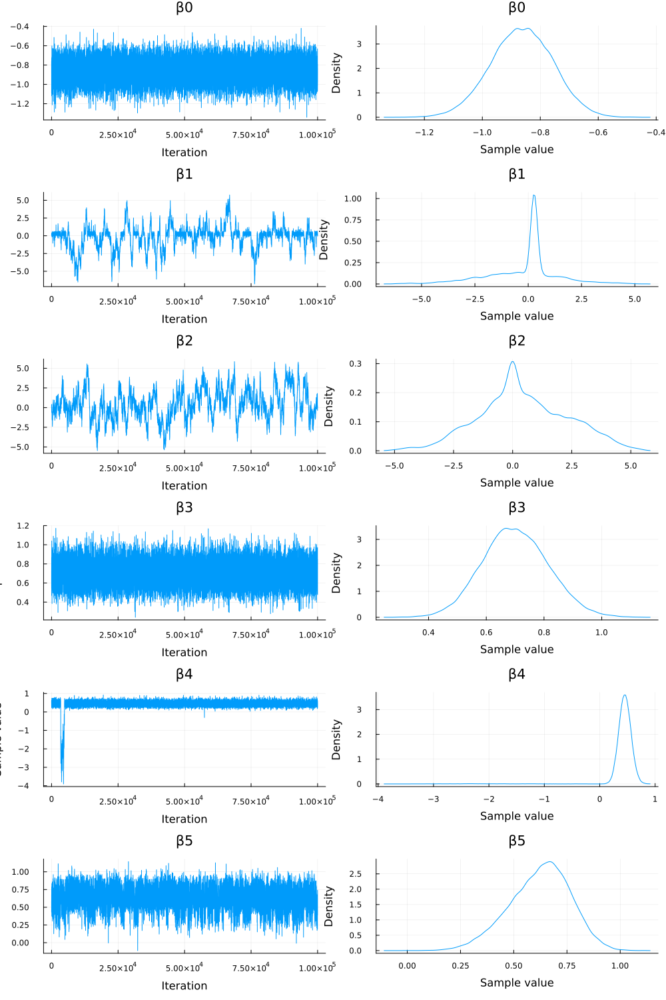
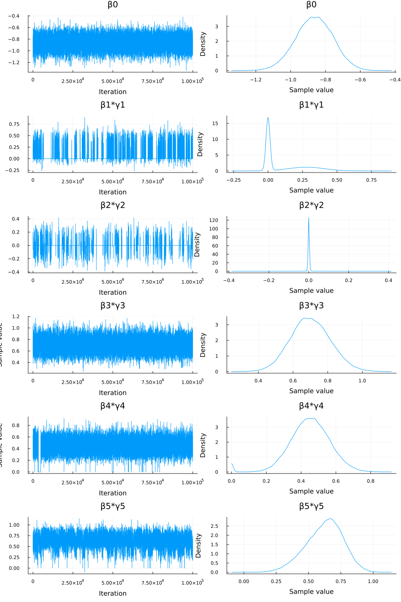
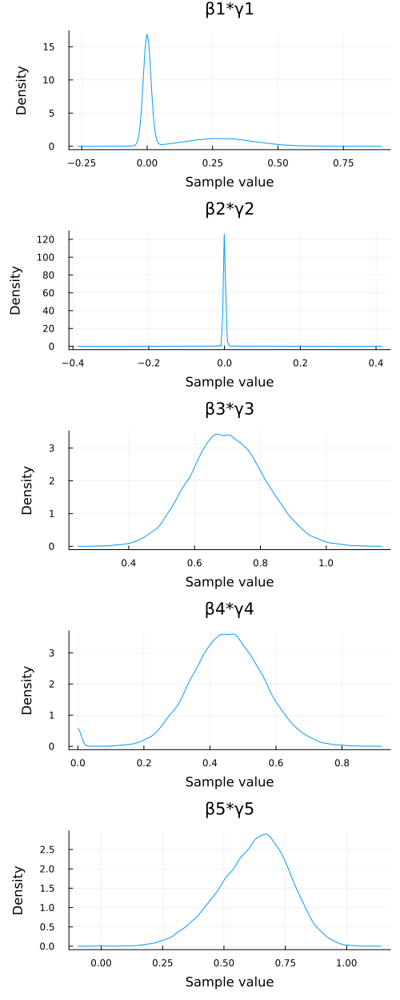

#+TITLE: Exercise 10.5 Solution Example - Hoff, A First Course in Bayesian Statistical Methods
#+SUBTITLE: 標準ベイズ統計学 演習問題 10.5 解答例
#+SETUPFILE: ../setup.org
#+STARTUP:showeverything
#+PROPERTY: header-args:julia :session julia_hoff :eval no-export :exports code :tangle (expand-file-name "./exercise10-5.jl")

* Question :noexport:
Logistic regression variable selection:
Consider a logistic regression model for predicting diabetes as a function of \(x1 =\) number of pregnancies, \(x2 =\) blood pressure, \(x3 =\) body mass index, \(x4 =\) diabetes pedigree and \(x5 =\) age.
Using the data in ~azdiabetes.dat~, center and scale each of the \(x\)- variables by subtracting the sample average and dividing by the sample standard deviation for each variable.
Consider a logistic regression model of the form \(\mathrm{Pr}(Y_i=1 | \bm{x}_i, \bm{\beta}, \bm{\gamma}) = e^{\theta_i}/(1+e^{\theta_i})\) where
\[
\theta_i = \beta_0 + \beta_1 \gamma_1 x_{i,1} + \beta_2 \gamma_2 x_{i,2} + \beta_3 \gamma_3 x_{i,3} + \beta_4 \gamma_4 x_{i,4} + \beta_5 \gamma_5 x_{i,5}
\]
In this model, each \(\gamma_j\) is either 0 or 1, indicating whether or not variable \( j \) is a predictor of diabetes.
For example, if it were the case that \(\bm{\gamma} = (1, 1, 0, 0, 0)\), then \(\theta_i = \beta_0 + \beta_1 x_{i,1} + \beta_2 x_{i,2}\).
Obtain posterior distributions for \(\bm{\beta}\) and \(\bm{\gamma}\), using independent prior distributions for the parameters, such that \(\gamma_j \sim \mathrm{binary}(1/2), \beta_0 \sim \mathrm{normal}(0,16)\) and \(\beta_j \sim \mathrm{normal}(0, 4)\) for each \(j > 0\).

* a)
** Question :noexport:
Implement a Metropolis-Hastings algorithm for approximating the posterior distribution of \(\bm{\beta}\) and \(\bm{\gamma}\).
Examine the sequence \(\beta_j^{(s)}\) and \(\beta_j^{(s)} \times \gamma_j^{(s)}\) for each \(j\) and discuss the mixing of the chain.
** Answer
*** sampling model
\begin{align*}
Y_i &\sim \text{Bernoulli} \left(\frac{e^{\theta_i}}{1 + e^{\theta_i}} \right) \quad (i = 1, \dots, n) \\
\theta_i &= \beta_0 + \beta_1 \gamma_1 x_{i,1} + \beta_2 \gamma_2 x_{i,2} + \beta_3 \gamma_3 x_{i,3} + \beta_4 \gamma_4 x_{i,4} + \beta_5 \gamma_5 x_{i,5} \\
\end{align*}

*** prior
\begin{align*}
\gamma_j &\sim \text{Bernoulli}(1/2) \quad (j = 1, \dots, 5) \\
\beta_0 &\sim \mathcal{N}(0, 16) \\
\beta_j &\sim \mathcal{N}(0, 4) \quad (j = 1, \dots, 5) \\
\end{align*}

*** calculation of acceptance ratio \(r\)
The likelihood and log-likelihood are as follows:

\begin{align*}
p(\bm{y} | \bm{x}, \bm{\beta}, \bm{\gamma})
&= \prod_{i=1}^n \left( \frac{e^{\theta_i}}{1 + e^{\theta_i}} \right)^{y_i} \left( \frac{1}{1 + e^{\theta_i}} \right)^{1-y_i} \\
\log p(\bm{y} | \bm{x}, \bm{\beta}, \bm{\gamma})
&= \sum_{i=1}^n \left\{ y_i \log \left( \frac{e^{\theta_i}}{1 + e^{\theta_i}} \right) + (1-y_i) \log \left( \frac{1}{1 + e^{\theta_i}} \right) \right\} \\
&= \sum_{i=1}^n \left\{ y_i \left[ \log(e^{\theta_i}) - \log(1 + e^{\theta_i}) \right] + (1-y_i) \left[ - \log(1 + e^{\theta_i}) \right] \right\} \\
&= \sum_{i=1}^n \left( y_i \theta_i - y_i \log(1 + e^{\theta_i}) - (1-y_i) \log(1 + e^{\theta_i}) \right) \\
&= \sum_{i=1}^n \left( y_i \theta_i - \log(1 + e^{\theta_i}) \right) \\
\end{align*}

For example, when updating \(\gamma_j\), the acceptance ratio is calculated as follows:

\[
r = \frac{ p(\bm{y} | \bm{x}, \bm{\beta}^{(s)}, \bm{\gamma}^{(s)}_{-j}, \gamma_j^{\ast} ) p(\gamma_j^{\ast})}{ p(\bm{y} | \bm{x}, \bm{\beta}^{(s)}, \bm{\gamma}^{(s)}_{-j}, \gamma_j^{(s)}) p(\gamma_j^{(s)}) }
\times \frac{ J(\gamma_j^{(s)} | \gamma_j^{\ast}) }{ J(\gamma_j^{\ast} | \gamma_j^{(s)}) }
\]
*** proposal distributions
\begin{align*}
\beta_j^{\ast} | \beta_j^{(s)} &\sim \mathcal{N}(\beta_j^{(s)}, \delta^2) \\
\gamma_j^{\ast} | \gamma_j^{(s)} &= \begin{cases} 0 & \text{ if } \gamma_j^{(s)} = 1 \\ 1 & \text{ if } \gamma_j^{(s)} = 0 \end{cases} \\
\end{align*}

*** import data
#+begin_src julia :exports code
using DataFrames
using DelimitedFiles
using Distributions
using GLM
using LinearAlgebra
using MCMCChains
using OffsetArrays
using Plots.PlotMeasures
using Random
using StatsBase
using StatsModels
using StatsPlots
#+end_src

#+RESULTS:
: nil

#+begin_src julia :exports code :results none 
data = readdlm("./Exercises/azdiabetes.dat", header=true)
header = data[2] |> vec
df = DataFrame(data[1], header)

col_int = [:npreg, :glu, :bp, :skin, :age]
col_float = [:bmi, :ped]
col_str = :diabetes
df[!,col_int] = Int.(df[!,col_int])
df[!,col_float] = Float32.(df[!,col_float])
df[!,col_str] = String.(df[!,col_str])
#+end_src

#+begin_src julia :results output
first(df, 5)
#+end_src

#+RESULTS:
#+begin_example
5×8 DataFrame
 Row │ npreg  glu    bp     skin   bmi      ped      age    diabetes
     │ Int64  Int64  Int64  Int64  Float32  Float32  Int64  String
─────┼───────────────────────────────────────────────────────────────
   1 │     5     86     68     28     30.2    0.364     24  No
   2 │     7    195     70     33     25.1    0.163     55  Yes
   3 │     5     77     82     41     35.8    0.156     35  No
   4 │     0    165     76     43     47.9    0.259     26  No
   5 │     0    107     60     25     26.4    0.133     23  No
#+end_example

*** process data
#+begin_src julia :exports code :results none
predictors = [:npreg, :bp, :bmi, :ped, :age]
X = hcat(ones(size(df, 1)), mapcols(zscore, df[!, predictors])) |>
    Matrix |> (x -> OffsetArray(x, :, 0:size(x, 2)-1)) # align the notation with the textbook
y = map(x -> x == "Yes" ? 1 : 0, df[!, :diabetes]) |> Vector
#+end_src

#+begin_src julia :exports both :results output
X[1:5, :]
#+end_src

#+RESULTS:
#+begin_example
5×6 OffsetArray(::Matrix{Float64}, 1:5, 0:5) with eltype Float64 with indices 1:5×0:5:
 1.0   0.447786  -0.284774  -0.390958  -0.403331  -0.707578
 1.0   1.05164   -0.122308  -1.13212   -0.986707   2.17304
 1.0   0.447786   0.852489   0.422864  -1.00702    0.314576
 1.0  -1.06186    0.365091   2.1813    -0.708079  -0.521732
 1.0  -1.06186   -0.934639  -0.943195  -1.07378   -0.800501
#+end_example

*** step by step :noexport:
**** step 1: initialize
#+begin_src julia :exports both :results output
γ_init = ones(5);
glmfit = glm(parent(X), y, Binomial(), LogitLink())
#+end_src

#+RESULTS:
#+begin_example

GeneralizedLinearModel{GLM.GlmResp{Vector{Float64}, Binomial{Float64}, LogitLink}, GLM.DensePredChol{Float64, CholeskyPivoted{Float64, Matrix{Float64}, Vector{Int64}}}}:

Coefficients:
──────────────────────────────────────────────────────────────────
         Coef.  Std. Error      z  Pr(>|z|)   Lower 95%  Upper 95%
──────────────────────────────────────────────────────────────────
x1  -0.864381     0.108382  -7.98    <1e-14  -1.07681    -0.651956
x2   0.280428     0.128647   2.18    0.0293   0.0282854   0.532571
x3   0.0111493    0.115413   0.10    0.9230  -0.215057    0.237355
x4   0.702529     0.11985    5.86    <1e-08   0.467628    0.93743
x5   0.456899     0.10762    4.25    <1e-04   0.245969    0.66783
x6   0.504739     0.135298   3.73    0.0002   0.239561    0.769917
──────────────────────────────────────────────────────────────────
#+end_example

#+begin_src julia :exports both :results output
β_init = coef(glmfit) |> (x -> OffsetArray(x, 0:size(x, 1)-1))
#+end_src

#+RESULTS:
#+begin_example
6-element OffsetArray(::Vector{Float64}, 0:5) with eltype Float64 with indices 0:5:
 -0.8643810299747683
  0.2804280589402069
  0.011149325407118655
  0.7025291397493797
  0.4568994903080483
  0.5047389752091812
#+end_example

**** step 2: update \(\beta\)
#+begin_src julia
δ = 0.1

γ = γ_init
β = β_init

j = 1
β_prp = copy(β)
β_prp[j] = rand(Normal(β[j], δ))
#+end_src

#+RESULTS:
: 0.18736029453255368

#+begin_src julia
γ, β
#+end_src

#+RESULTS:

#+begin_src julia
(parent(β) .* [1;γ])
#+end_src

#+RESULTS:
|  -0.8643810299747683 |
|   0.2804280589402069 |
| 0.011149325407118655 |
|   0.7025291397493797 |
|   0.4568994903080483 |
|   0.5047389752091812 |

#+begin_src julia :results none
function _loglikelihood(y, X, β, γ)
    θ = parent(X) * (parent(β) .* [1;γ])
    return sum(y .* θ - log.(1 .+ exp.(θ)))
end
#+end_src

#+begin_src julia :results output
_loglikelihood(y, X, β, γ)
#+end_src

#+RESULTS:
: -276.82014775366935

#+begin_src julia
log_r = _loglikelihood(y, X, β_prp, γ) - _loglikelihood(y, X, β, γ) +
    logpdf(Normal(0, 4), β_prp[j]) - logpdf(Normal(0, 4), β[j]) +
    logpdf(Normal(β_prp[j], δ), β[j]) - logpdf(Normal(β[j], δ), β_prp[j])
#+end_src

#+RESULTS:
: -0.43541356696823863

#+begin_src julia :results value
if log(rand()) < log_r
    β[j] = β_prp[j]
end
β[j]
#+end_src

#+RESULTS:
: 0.18736029453255368

#+begin_src julia
j = 2
β_prp = copy(β)
β_prp[j] = rand(Normal(β[j], δ))
log_r = _loglikelihood(y, X, β_prp, γ) - _loglikelihood(y, X, β, γ) +
    logpdf(Normal(0, 2), β_prp[j]) - logpdf(Normal(0, 2), β[j]) +
    logpdf(Normal(β_prp[j], δ), β[j]) - logpdf(Normal(β[j], δ), β_prp[j])
#+end_src

#+RESULTS:
: -0.22529442173038494

#+begin_src julia :results value
if log(rand()) < log_r
    β[j] = β_prp[j]
end
parent(β)
#+end_src

#+RESULTS:
|  -0.8643810299747683 |
|  0.18736029453255368 |
| -0.04366763856065033 |
|   0.7025291397493797 |
|   0.4568994903080483 |
|   0.5047389752091812 |

**** step 3: update \(\gamma\)

#+begin_src julia
γ_prp = copy(γ)
#+end_src

#+RESULTS:
| 1.0 |
| 1.0 |
| 1.0 |
| 1.0 |
| 1.0 |

#+begin_src julia
j = 1
J_γ(x) = x == 1 ? 0 : 1
γ_prp[j] = J_γ(γ_prp[j])
γ_prp
#+end_src

#+RESULTS:
| 0.0 |
| 1.0 |
| 1.0 |
| 1.0 |
| 1.0 |

#+begin_src julia
log_r = _loglikelihood(y, X, β, γ_prp) - _loglikelihood(y, X, β, γ)
log_r
#+end_src

#+RESULTS:
: -3.783748248979009

#+begin_src julia
if log(rand()) < log_r
    γ[j] = γ_prp[j]
end
γ
#+end_src

#+RESULTS:
| 1.0 |
| 1.0 |
| 1.0 |
| 1.0 |
| 1.0 |

*** M-H algorithm
#+begin_src julia :exports code :results none
function _loglikelihood(y, X, β, γ)
    θ = parent(X) * (parent(β) .* [1;γ])
    return sum(y .* θ - log.(1 .+ exp.(θ)))
end
#+end_src

#+begin_src julia :exports code :results none
function update_βj(β, γ, j, δ, prior_var)
    β_prp = copy(β)
    β_prp[j] = rand(Normal(β[j], δ))
    log_likelihood_diff = _loglikelihood(y, X, β_prp, γ) - _loglikelihood(y, X, β, γ)
    log_prior_ratio = logpdf(Normal(0, sqrt(prior_var)), β_prp[j]) - logpdf(Normal(0, sqrt(prior_var)), β[j])
    # log_proposal_ratio = 0 because the proposal distribution is symmetric
    log_r = log_likelihood_diff + log_prior_ratio
    return log(rand()) < log_r ? β_prp : β
end
#+end_src

#+begin_src julia :exports code :results none
function update_γj(β, γ, j)
    γ_prp = copy(γ)
    J_γ(x) = x == 1 ? 0 : 1
    γ_prp[j] = J_γ(γ_prp[j])
    log_r = _loglikelihood(y, X, β, γ_prp) - _loglikelihood(y, X, β, γ)
    return log(rand()) < log_r ? γ_prp : γ
end
#+end_src

#+begin_src julia :exports code :results none
function logit_reg_with_var_select(y, X, β_init, γ_init, δ; S=1000, seed=42)
    Random.seed!(seed)

    # initialize
    β = copy(β_init) |> (x -> OffsetArray(x, 0:size(x, 1)-1))
    γ = copy(γ_init)

    # prepare storage
    q = length(β)
    BETA = Matrix{Float64}(undef, S, q) |> (x -> OffsetArray(x, :, 0:q-1))
    GAMMA = Matrix{Float64}(undef, S, q-1)

    for s in 1:S
        for j in 0:q-1
            prior_var = j == 0 ? 16.0 : 4.0
            β = update_βj(β, γ, j, δ, prior_var)
        end
        for j in 1:q-1
            γ = update_γj(β, γ, j)
        end
        BETA[s, :] = β
        GAMMA[s, :] = γ
    end
    return BETA, GAMMA
end
#+end_src

*** run M-H algorithm
#+begin_src julia :exports code :results none :async yes
glmfit = glm(parent(X), y, Binomial(), LogitLink())
β_init = coef(glmfit) |> (x -> OffsetArray(x, 0:size(x, 1)-1))
γ_init = ones(5)
δ = 0.1

BETA, GAMMA = logit_reg_with_var_select(y, X, β_init, γ_init, δ; S=100000, seed=42)
#+end_src

#+begin_src julia :results output :exports both
chn_β = Chains(BETA, ["β0","β1", "β2", "β3", "β4", "β5"])
#+end_src

#+RESULTS:
#+begin_example
Chains MCMC chain (100000×6×1 Array{Float64, 3}):

Iterations        = 1:1:100000
Number of chains  = 1
Samples per chain = 100000
parameters        = β0, β1, β2, β3, β4, β5

Summary Statistics
  parameters      mean       std      mcse    ess_bulk     ess_tail      rhat   ess_per_sec
      Symbol   Float64   Float64   Float64     Float64      Float64   Float64       Missing

          β0   -0.8643    0.1074    0.0011   9840.1042   14036.6980    1.0000       missing
          β1   -0.1809    1.6226    0.1067    248.3265     311.7660    1.0329       missing
          β2    0.4507    1.8907    0.1242    233.2992     362.5542    1.0896       missing
          β3    0.7011    0.1149    0.0012   9615.0141   14094.3526    1.0000       missing
          β4    0.4211    0.3230    0.0203   2079.9963     785.9287    1.0011       missing
          β5    0.6219    0.1437    0.0043   1145.7115    3625.2569    1.0085       missing

Quantiles
  parameters      2.5%     25.0%     50.0%     75.0%     97.5%
      Symbol   Float64   Float64   Float64   Float64   Float64

          β0   -1.0778   -0.9364   -0.8632   -0.7906   -0.6576
          β1   -4.0152   -0.9524    0.2031    0.4246    3.1453
          β2   -3.1593   -0.7570    0.2529    1.7502    4.1636
          β3    0.4817    0.6228    0.6985    0.7777    0.9310
          β4    0.2154    0.3784    0.4521    0.5261    0.6706
          β5    0.3170    0.5285    0.6340    0.7230    0.8777
#+end_example

#+begin_src julia :results output :exports both
chn_γ = Chains(GAMMA, ["γ1", "γ2", "γ3", "γ4", "γ5"])
#+end_src

#+RESULTS:
#+begin_example
Chains MCMC chain (100000×5×1 Array{Float64, 3}):

Iterations        = 1:1:100000
Number of chains  = 1
Samples per chain = 100000
parameters        = γ1, γ2, γ3, γ4, γ5

Summary Statistics
  parameters      mean       std      mcse     ess_bulk   ess_tail      rhat   ess_per_sec
      Symbol   Float64   Float64   Float64      Float64    Float64   Float64       Missing

          γ1    0.3852    0.4866    0.0228     456.4099        NaN    1.0181       missing
          γ2    0.0570    0.2319    0.0043    2899.6368        NaN    1.0005       missing
          γ3    1.0000    0.0000       NaN          NaN        NaN       NaN       missing
          γ4    0.9857    0.1186    0.0079     224.7567        NaN    1.0136       missing
          γ5    0.9995    0.0217    0.0001   21159.3116        NaN    1.0000       missing

Quantiles
  parameters      2.5%     25.0%     50.0%     75.0%     97.5%
      Symbol   Float64   Float64   Float64   Float64   Float64

          γ1    0.0000    0.0000    0.0000    1.0000    1.0000
          γ2    0.0000    0.0000    0.0000    0.0000    1.0000
          γ3    1.0000    1.0000    1.0000    1.0000    1.0000
          γ4    1.0000    1.0000    1.0000    1.0000    1.0000
          γ5    1.0000    1.0000    1.0000    1.0000    1.0000
#+end_example

*** sequence \(\beta_j^{(s)}\)

#+begin_src julia :results value raw
# visualize the MCMC simulation results
p = plot(chn_β)
savefig("./ch10/img/exercise10-5a-beta.png")
"#+NAME: beta_sequence\n[[file:./img/exercise10-5a-beta.png]]"
#+end_src

#+RESULTS:
#+CAPTION: traceplots of \(\beta_j\)
#+LABEL: beta_sequence

*** sequence \(\beta_j^{(s)} \times \gamma_j^{(s)}\)

#+begin_src julia :exports code
beta_gamma_prod = BETA[:, 1:end] .* GAMMA
#+end_src

#+begin_src julia :exports both :results output
beta_gamma_prod[1:5, :]
#+end_src

#+RESULTS:
#+begin_example
5×5 OffsetArray(::Matrix{Float64}, 1:5, 1:5) with eltype Float64 with indices 1:5×1:5:
 0.193049  -0.0        0.611237  0.600768  0.584352
 0.218734   0.0543198  0.611237  0.539856  0.584352
 0.122185   0.0        0.731033  0.539856  0.538677
 0.215258   0.0        0.702999  0.519566  0.515501
 0.215258   0.0        0.686469  0.501306  0.515501
#+end_example

#+begin_src julia :exports code :results output
BETA_TIMES_GAMMA = hcat(parent(BETA[:, 0]), beta_gamma_prod);
BETA_TIMES_GAMMA[1:6, :]
#+end_src

#+RESULTS:
#+begin_example

6×6 Matrix{Float64}:
 -0.785545  0.193049  -0.0        0.611237  0.600768  0.584352
 -0.822972  0.218734   0.0543198  0.611237  0.539856  0.584352
 -0.82702   0.122185   0.0        0.731033  0.539856  0.538677
 -0.852756  0.215258   0.0        0.702999  0.519566  0.515501
 -0.879097  0.215258   0.0        0.686469  0.501306  0.515501
 -0.809994  0.183705   0.0        0.619408  0.446849  0.575571
#+end_example

#+begin_src julia :exports both :results output
param_names = ["β0"; ["β$(j)*γ$(j)" for j in 1:5]];
chn_βγ = Chains(BETA_TIMES_GAMMA, param_names)
#+end_src

#+RESULTS:
#+begin_example

Chains MCMC chain (100000×6×1 Array{Float64, 3}):

Iterations        = 1:1:100000
Number of chains  = 1
Samples per chain = 100000
parameters        = β0, β1*γ1, β2*γ2, β3*γ3, β4*γ4, β5*γ5

Summary Statistics
  parameters      mean       std      mcse     ess_bulk     ess_tail      rhat   ess_per_sec
      Symbol   Float64   Float64   Float64      Float64      Float64   Float64       Missing

          β0   -0.8643    0.1074    0.0011    9840.1042   14036.6980    1.0000       missing
       β1*γ1    0.1080    0.1586    0.0067     584.5482     461.7220    1.0174       missing
       β2*γ2    0.0005    0.0275    0.0002   39422.3894    5534.9789    1.0005       missing
       β3*γ3    0.7011    0.1149    0.0012    9615.0141   14094.3526    1.0000       missing
       β4*γ4    0.4489    0.1199    0.0037    2252.0682     786.6917    1.0010       missing
       β5*γ5    0.6217    0.1441    0.0044    1144.9386    3642.2000    1.0086       missing

Quantiles
  parameters      2.5%     25.0%     50.0%     75.0%     97.5%
      Symbol   Float64   Float64   Float64   Float64   Float64

          β0   -1.0778   -0.9364   -0.8632   -0.7906   -0.6576
       β1*γ1    0.0000    0.0000    0.0000    0.2296    0.4768
       β2*γ2   -0.0109    0.0000    0.0000    0.0000    0.0248
       β3*γ3    0.4817    0.6228    0.6985    0.7777    0.9310
       β4*γ4    0.2150    0.3784    0.4521    0.5261    0.6705
       β5*γ5    0.3167    0.5284    0.6339    0.7230    0.8777
#+end_example

#+begin_src julia :results value raw :exports both
p_bg = plot(chn_βγ)
savefig("./ch10/img/exercise10-5b-beta-gamma.png")
"#+NAME: beta_gamma_sequence\n[[file:./img/exercise10-5b-beta-gamma.png]]"
#+end_src

#+RESULTS:
#+CAPTION: traceplots of \(\beta_j \times \gamma_j\)
#+NAME: beta_gamma_sequence

*** summary
**** 日本語
MCMCシミュレーションによって得られた \(\beta_j\) と \(\gamma_j\) のサンプルを用いて、\(\beta_j\) の系列と \(\beta_j \times \gamma_j\) の系列の混合について評価した。

+ _\(\beta_j\) の系列_:
    + トレースプロット([[beta_sequence]]) と診断統計量 (~chn_β~ のサマリー) を見ると、特に \(\beta_1\) と \(\beta_2\) のチェーンは混合が悪いことが示唆された。
        + ~rhat~ 値が1から離れており (それぞれ約 1.03, 1.09)、 ~ess_bulk~ 値も他のパラメータと比較して低い (それぞれ約 248, 233)。
        + トレースプロットも安定していないように見える。
    + これは、対応するインジケータ変数 \(\gamma_1\) と \(\gamma_2\) の事後平均がそれぞれ約 0.39 と 0.06 であり、シミュレーション中にこれらの変数がモデルから除外されている (\(\gamma_j=0\)) 状態が多かったためと考えられる。
    + \(\gamma_j=0\) の場合、尤度は \(\beta_j\) に依存しなくなり、\(\beta_j\) の条件付き事後分布はその事前分布 (\(\mathcal{N}(0, 4)\)) となる。
        + その結果、\(\beta_1\) と \(\beta_2\) のサンプラーはデータからの情報をあまり受けずに事前分布の広い範囲を動き回り、混合が悪く見えた。
    + 一方、\(\beta_0, \beta_3, \beta_4, \beta_5\) については、対応する \(\gamma_j\) ( \(\gamma_0=1\) は固定、\(\gamma_3, \gamma_4, \gamma_5\) はほぼ常に1) が1であるため、データからの情報が反映され、混合は比較的良好であった (~rhat ≈ 1~, 高い ~ess~)。

+ _\(\beta_j \times \gamma_j\) の系列_:
    + この系列は、変数 \(j\) がモデルに含まれる場合 (\(\gamma_j=1\)) の係数の効果を表し、含まれない場合 (\(\gamma_j=0\)) は効果が 0 となる。
    + トレースプロット ([[beta_gamma_sequence]]) と診断統計量 (~chn_βγ~ のサマリー) を見ると、こちらの系列は全体的に混合が良いことがわかった。
        + 特に ~β1*γ1~ と ~β2*γ2~ の ~rhat~ 値は1に近くなり (それぞれ約 1.017, 1.0005)、 ~ess_bulk~ 値も改善した (それぞれ約 585, 39422)。
        + トレースプロットも、特に ~β2*γ2~ は 0 付近で非常に安定している。
    + これは、\(\gamma_j=0\) の場合に \(\beta_j \times \gamma_j\) の値が 0 に固定されるため、系列の変動が抑えられるからである。
        + \(\gamma_1\) や \(\gamma_2\) が 0 になる頻度が高いため、対応する積の系列は多くの時間 0 を取り、結果として混合が良く見えた。

+ _結論_:
    + 変数選択モデルにおいては、係数 \(\beta_j\) のみの系列を見ると、変数がモデルに含まれない場合に事前分布の影響で混合が悪く見えることがある。
    + そのため、チェーンの混合を評価する際には、変数のモデルへの実質的な寄与を表す \(\beta_j \times \gamma_j\) の系列も合わせて確認することが重要である。
    + 今回のケースでは、\(\beta_1 \times \gamma_1\) と \(\beta_2 \times \gamma_2\) の混合が良いことから、モデルはこれらの変数の効果（多くの場合 0 であるが、含まれる場合の効果も含む）について安定して学習していると解釈できる。

**** English

We evaluated the mixing of the MCMC chains for the \(\beta_j\) series and the \(\beta_j \times \gamma_j\) series using the samples obtained from the simulation.

+ _Series for \(\beta_j\)_:
    + The trace plots ([[beta_sequence]]) and diagnostic statistics (summary of ~chn_β~) suggested poor mixing, especially for the \(\beta_1\) and \(\beta_2\) chains.
        + The ~rhat~ values were far from 1 (approx. 1.03 and 1.09, respectively), and the ~ess_bulk~ values were low compared to other parameters (approx. 248 and 233, respectively).
        + The trace plots also appeared unstable.
    + This is likely because the posterior means of the corresponding indicator variables \(\gamma_1\) and \(\gamma_2\) were low (approx. 0.39 and 0.06, respectively), indicating that these variables were often excluded from the model (\(\gamma_j=0\)) during the simulation.
    + When \(\gamma_j=0\), the likelihood does not depend on \(\beta_j\), and the conditional posterior distribution of \(\beta_j\) becomes its prior distribution (\(\mathcal{N}(0, 4)\)).
        + As a result, the samplers for \(\beta_1\) and \(\beta_2\) moved around the wide range of the prior without much influence from the data, leading to the appearance of poor mixing.
    + In contrast, for \(\beta_0, \beta_3, \beta_4, \beta_5\), the corresponding \(\gamma_j\) (\(\gamma_0=1\) is fixed, \(\gamma_3, \gamma_4, \gamma_5\) were almost always 1) were 1, allowing the data to inform the posterior, resulting in relatively good mixing (~rhat~ ≈ 1, high ~ess~).

+ _Series for \(\beta_j \times \gamma_j\)_:
    + This series represents the coefficient's effect when variable \(j\) is included in the model (\(\gamma_j=1\)) and is zero when excluded (\(\gamma_j=0\)).
    + The trace plots ([[beta_gamma_sequence]]) and diagnostic statistics (summary of ~chn_βγ~) showed that this series generally exhibited good mixing.
        + In particular, the ~rhat~ values for ~β1*γ1~ and ~β2*γ2~ were close to 1 (approx. 1.017 and 1.0005, respectively), and the ~ess_bulk~ values improved (approx. 585 and 39422, respectively).
        + The trace plots were also stable, especially for ~β2*γ2~, which stayed very close to 0.
    + This is because when \(\gamma_j=0\), the value of \(\beta_j \times \gamma_j\) is fixed at 0, reducing the series' variability.
        + Since \(\gamma_1\) and \(\gamma_2\) were frequently 0, the corresponding product series took the value 0 much of the time, resulting in the appearance of good mixing.

+ _Conclusion_:
    + In variable selection models, looking only at the \(\beta_j\) series can be misleading regarding mixing, as it might appear poor due to the influence of the prior when the variable is excluded from the model.
    + Therefore, when assessing chain mixing, it is crucial to also examine the \(\beta_j \times \gamma_j\) series, which represents the variable's actual contribution to the model.
    + In this case, the good mixing of the \(\beta_1 \times \gamma_1\) and \(\beta_2 \times \gamma_2\) series suggests that the model is stably learning the effects of these variables (which are often zero, but also includes their effects when included).
* b)
** Question :noexport:
Approximate the posterior probability of the top five most frequently occurring values of \(\gamma\).
How good do you think the MCMC estimates of these posterior probabilities are?
** Answer
*** top five most frequently occurring values of \(\gamma\)
#+begin_src julia :exports code :results output
gamma_tuples = [tuple(Int.(GAMMA[i, :])...) for i in 1:size(GAMMA, 1)];
gamma_tuples[1:5]
#+end_src

#+RESULTS:
#+begin_example
5-element Vector{NTuple{5, Int64}}:
 (1, 0, 1, 1, 1)
 (1, 1, 1, 1, 1)
 (1, 0, 1, 1, 1)
 (1, 0, 1, 1, 1)
 (1, 0, 1, 1, 1)
#+end_example

#+begin_src julia :exports code :results output
gamma_counts = countmap(gamma_tuples);
sorted_gamma_counts = sort(collect(gamma_counts), by=x->x[2], rev=true);
sorted_gamma_counts
#+end_src

#+RESULTS:
#+begin_example
10-element Vector{Pair{NTuple{5, Int64}, Int64}}:
 (0, 0, 1, 1, 1) => 57479
 (1, 0, 1, 1, 1) => 35433
 (0, 1, 1, 1, 1) => 3387
 (1, 1, 1, 1, 1) => 2228
 (1, 0, 1, 0, 1) => 771
 (0, 0, 1, 0, 1) => 574
 (0, 1, 1, 0, 1) => 43
 (1, 0, 1, 1, 0) => 40
 (1, 1, 1, 0, 1) => 38
 (1, 1, 1, 1, 0) => 7
#+end_example

#+begin_src julia :exports :results output :eval never
# sorted_gamma_counts はすでに計算済み
# 上位5つを取得
top5_gamma = sorted_gamma_counts[1:5]

# 総サンプル数を取得
S = size(GAMMA, 1)

# 上位5つのγベクトル、出現回数、推定事後確率を表示
println("Top 5 most frequent gamma vectors, counts, and estimated posterior probabilities:")
println("Total samples (S) = $(S)")
println("-"^60)
println("Gamma Vector      Count   Estimated Probability (Count/S)")
println("-"^60)
for (gamma_vec, count) in top5_gamma
    prob = count / S
    println("$(gamma_vec)   $(rpad(count, 7)) $(round(prob, digits=4))")
end
println("-"^60)
#+end_src

#+RESULTS:
#+begin_example
Top 5 most frequent gamma vectors, counts, and estimated posterior probabilities:
Total samples (S) = 100000
------------------------------------------------------------
Gamma Vector      Count   Estimated Probability (Count/S)
------------------------------------------------------------
(0, 0, 1, 1, 1)   57479   0.5748
(1, 0, 1, 1, 1)   35433   0.3543
(0, 1, 1, 1, 1)   3387    0.0339
(1, 1, 1, 1, 1)   2228    0.0223
(1, 0, 1, 0, 1)   771     0.0077
------------------------------------------------------------
#+end_example

*** How good are the estimates?
**** 日本語
1. *結果の解釈*:
   + 上位のモデルを見ると、\(\gamma_3\) (BMI) と \(\gamma_5\) (Age) は常に1となっている。これは、これらの変数が糖尿病の予測において重要であることを強く示唆している。
   + \(\gamma_2\) (Blood Pressure) は上位2モデル（合計確率約93%）では0であり、\(\gamma_1\) (Pregnancies) も最も確率の高いモデル（確率約58%）では0となっている。これは、これらの変数の予測への寄与が相対的に小さい可能性を示唆している。
   + \(\gamma_4\) (Pedigree) は上位4モデルでは1だが、5番目のモデルでは0となっており、重要度は中程度かもしれない。
   + 最も確率の高いモデルは、BMI, 糖尿病の血統, 年齢 のみを含むモデル ~γ = (0, 0, 1, 1, 1)~ であった。

2. *推定の質の評価*:
   + MCMCの総サンプル数 (~S = 100,000~) は十分に大きい。
   + 事後確率は上位2つのモデルに非常に集中しており（合計約93%）、上位5モデルで全体の約99%を占める。このように確率が集中している場合、上位モデルの相対的な頻度の推定は比較的安定しやすい。
   + \(\gamma\) のチェーンの診断統計量を見ると、\(\gamma_3\) と \(\gamma_5\) は常に1であり問題ない。\(\gamma_2\) の混合も良好であった (~rhat~ ≈ 1.00, ~ess_bulk~ ≈ 2900)。\(\gamma_1\) と \(\gamma_4\) の混合は完璧ではないが (~rhat~ ≈ 1.02, 1.01; ~ess_bulk~ ≈ 456, 225)、致命的に悪いわけではない。
   + 以上を考慮すると、特に上位2つのモデルの推定事後確率（約 0.575 と 0.354）はかなり信頼できると考えられる。3位以下のモデルの確率推定にはやや不確実性が残るものの、これらのモデルが他の多くの可能なモデルよりもはるかに確率が高いという結論は頑健である可能性が高い。

**** English
1. *Interpretation of Results*:
   + Looking at the top models, \(\gamma_3\) (BMI) and \(\gamma_5\) (Age) are always 1. This strongly suggests that these variables are important for predicting diabetes.
   + \(\gamma_2\) (Blood Pressure) is 0 in the top two models (total probability ≈ 93%), and \(\gamma_1\) (Pregnancies) is 0 in the most probable model (probability ≈ 58%). This suggests that the predictive contribution of these variables might be relatively small.
   + \(\gamma_4\) (Pedigree) is 1 in the top four models but 0 in the fifth model, indicating potentially moderate importance.
   + The most probable model was ~γ = (0, 0, 1, 1, 1)~, which includes only BMI, Pedigree, and Age.

2. *Assessment of Estimate Quality*:
   + The total number of MCMC samples (~S = 100,000~) is sufficiently large.
   + The posterior probability is highly concentrated in the top two models (totaling ≈ 93%), and the top five models account for ≈ 99% of the total probability mass. When the probability is concentrated like this, the estimation of the relative frequencies of the top models tends to be relatively stable.
   + Examining the diagnostic statistics for the \(\gamma\) chains, \(\gamma_3\) and \(\gamma_5\) were always 1 and pose no issue. The mixing for \(\gamma_2\) was also good (~rhat~ ≈ 1.00, ~ess_bulk~ ≈ 2900). The mixing for \(\gamma_1\) and \(\gamma_4\) was not perfect (~rhat~ ≈ 1.02, 1.01; ~ess_bulk~ ≈ 456, 225) but not critically poor.
   + Considering these points, the estimated posterior probabilities for the top two models (≈ 0.575 and 0.354) are likely quite reliable. While there might be slightly more uncertainty in the probability estimates for the 3rd to 5th models, the conclusion that these models are far more probable than most other possible models is likely robust.
* c)
** Question :noexport:
For each \(j\), plot posterior densities and obtain posterior means for \(\beta_j \gamma_j\).
Also obtain \(\mathrm{Pr}(\gamma_j=1|\boldsymbol{x}, \boldsymbol{y}\)
** Answer
*** posterior densities

#+begin_src julia :results value raw :exports code
# Plot posterior densities for βj*γj (j=1 to 5)
# We select the parameters of interest from the chain object
p_density_bg = plot(chn_βγ[:, ["β$(j)*γ$(j)" for j in 1:5], :], seriestype=:density, left_margin=10mm)
savefig("./ch10/img/exercise10-5c_density.png")
"#+NAME:exercise10-5c_density\n[[file:./img/exercise10-5c_density.png]]"
#+end_src

#+RESULTS:
#+NAME:exercise10-5c_density

*** posterior means

#+BEGIN_SRC julia  :exports both :results output
mean(GAMMA, dims=1)
#+end_src

#+RESULTS:
#+begin_example
1×5 Matrix{Float64}:
 0.38517  0.05703  1.0  0.98574  0.99953
#+end_example

+ \(\mathrm{Pr}(\gamma_1=1|\boldsymbol{x}, \boldsymbol{y}) \approx 0.385\)
+ \(\mathrm{Pr}(\gamma_2=1|\boldsymbol{x}, \boldsymbol{y}) \approx 0.057\)
+ \(\mathrm{Pr}(\gamma_3=1|\boldsymbol{x}, \boldsymbol{y}) \approx 1.000\)
+ \(\mathrm{Pr}(\gamma_4=1|\boldsymbol{x}, \boldsymbol{y}) \approx 0.986\)
+ \(\mathrm{Pr}(\gamma_5=1|\boldsymbol{x}, \boldsymbol{y}) \approx 1.000\)

* nav :ignore:
#+ATTR_HTML: :class nav-prev
[[./10-4.org][10.4]]

#+ATTR_HTML: :class nav-next
# [[./10-5.org][10.5]]
