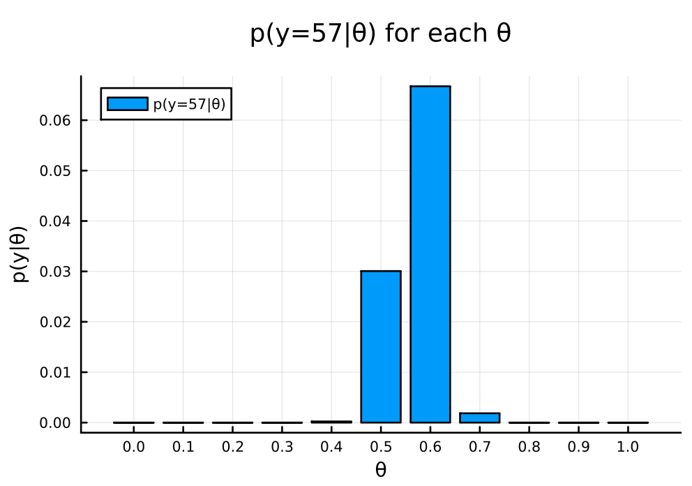
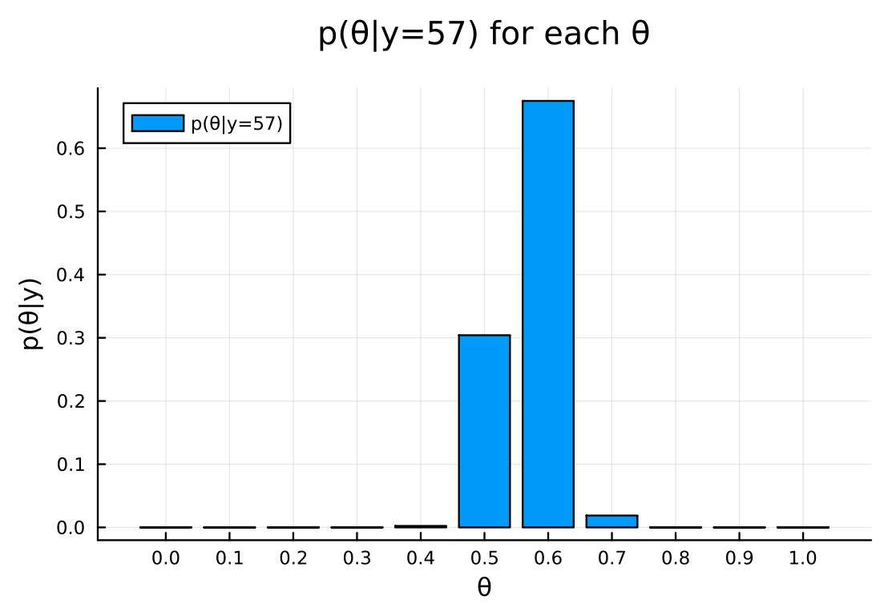
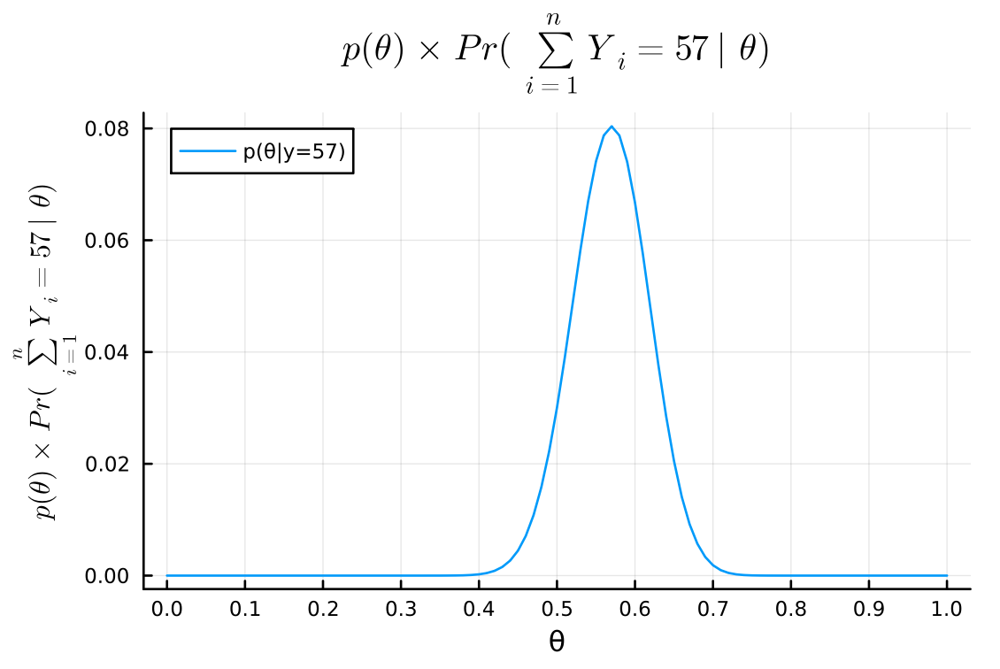
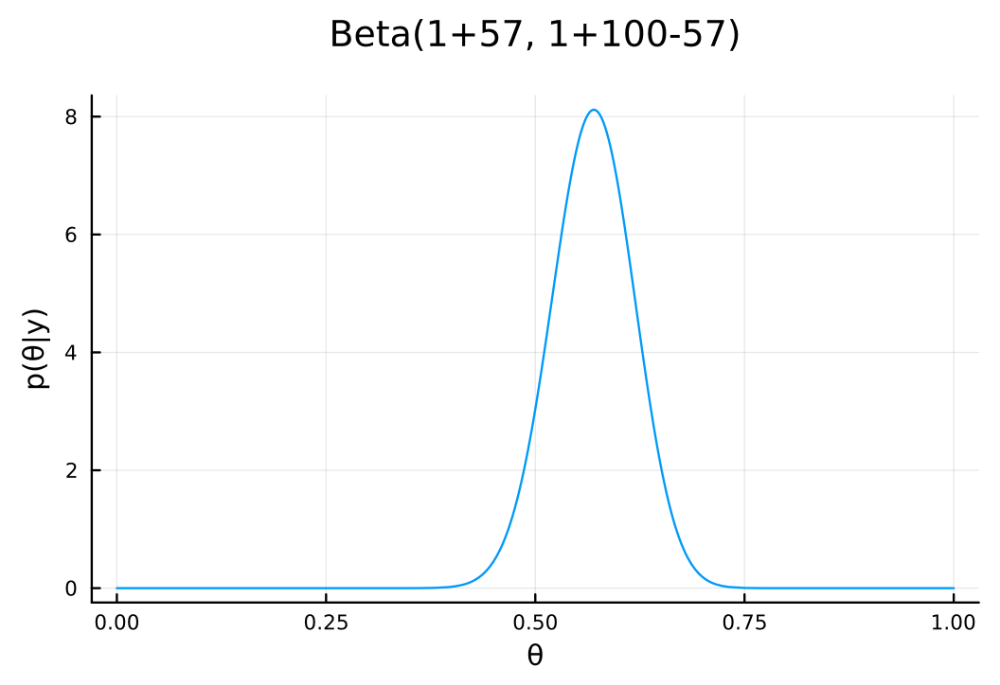

#+TITLE: Exercise 3.1 Solution Example - Hoff, A First Course in Bayesian Statistical Methods
#+SUBTITLE: 標準ベイズ統計学 演習問題 3.1 解答例
#+SETUPFILE: ../setup.org
* question :noexport:
Sample survey:
Suppose we are going to sample 100 individuals from a county (of size much larger than 100)
and ask each sampled person supports the policy, and \(Y_i = 0\) otherwise.
* Answer
** a
*** Question :noexport:
Assume \(Y_1 , \dots , Y_{100}\) are, conditional on \(\theta\), i.i.d. binary random variables with expectation \(\theta\).
Write down the joint distribution of Pr(\(Y_1 = y_1, \dots ,Y_{100}=y_{100} \mid \theta\)) is a compact form.
Also write down the form of Pr(\(\sum Y_i = y \mid \theta\)).
*** Answer

\begin{align*}
& \text{Pr}(Y_1 = y_1, \dots , Y_{100}=y_{100} \mid \theta) \\
= &\text{Pr}(Y_1 = y_1 \mid \theta) \cdot \text{Pr}(Y_2 = y_2 \mid \theta) \cdot \dots \cdot \text{Pr}(Y_{100} = y_{100} \mid \theta)
\qquad (\because \text{conditionally i.i.d.}) \\
= &\prod_{i=1}^{100} \text{Pr}(Y_i = y_i \mid \theta) \\
= &\theta^{\sum_{i=1}^{100} y_i} (1 - \theta)^{100 - \sum_{i=1}^{100} y_i}
\end{align*}

\begin{align*}
\text{Pr}\left(\sum Y_i = y \mid \theta\right)
&= \begin{pmatrix} 100 \\ y \end{pmatrix} \theta^y (1-\theta)^{100-y}
\end{align*}

** b
:PROPERTIES:
:CUSTOM_ID: 3.1B
:END:
*** Question :noexport:
For the moment, suppose you believed that
\(\theta \in \{0,0, 0.1, \dots, 0.9, 1.0\}\).
Given that the results of the survey were
\(\sum_{i=1}^{100} Y_i = 57\),
compute Pr(\( \sum Y_i = 57 \mid \theta\))
for each of these 11 values of \(\theta\)
and plot these probabilities as a function of \(\theta\).

*** Answer
:PROPERTIES:
:ID:       b0c4a6fc-c6ce-4a6c-a48a-93547093aed3
:END:

#+begin_src julia :exports both :results output
begin
using Plots
using Plots.PlotMeasures
using Distributions

θ = 0:0.1:1.0
n = 100
y = 57

# 全てのθで計算
pdf_for_θs = map(θ -> pdf(Binomial(n, θ), y), θ)
end
#+end_src

#+RESULTS:
#+begin_example
11-element Vector{Float64}:
 0.0
 4.107156919234531e-31
 3.7384586685675986e-16
 1.3068947992216428e-8
 0.000228579175709527
 0.03006864264421479
 0.06672894967432967
 0.0018531715480875613
 1.0035348574340773e-7
 9.39585764212832e-18
 0.0
#+end_example

#+begin_src julia :output code
# plot
bar(
    θ, pdf_for_θs,
    xlabel = "θ", ylabel = "p(y|θ)",
    title = "p(y=$y|θ) for each θ",
    label = "p(y=$y|θ)",
    legend = :topleft,
    size = (600, 400)
    , margin = 5mm
    , xticks = 0:0.1:1.0
)
#+end_src

#+RESULTS:

#+ATTR_HTML: :width 500

** c
*** Question :noexport:
Now suppose you originally had no prior information to believe one of these \(\theta\)-values over another,
and so
\(\text{Pr}(\theta =0.0) = \text{Pr}(\theta = 0.1) = \cdots = \text{Pr}(\theta = 0.9) = \text{Pr}(\theta = 1.0) \).
Use Bayes' rule to compute
\(p(\theta \mid \sum_{i=1}^{100} Y_i = 57)\)
for each \(\theta\)-value.
Make a plot of this posterior distribution as a function of \(\theta\).

*** Answer
:PROPERTIES:
:ID:       0245c103-12eb-4250-bec6-e165cb52e797
:END:
\begin{align*}
p(\theta \mid \sum_{i=1}^{100} Y_i = 57)
&= \frac{p(\sum_{i=1}^{100} Y_i = 57 \mid \theta) p(\theta)}{p(\sum_{i=1}^{100} Y_i = 57)} \\
&= \frac{p(\sum_{i=1}^{100} Y_i = 57 \mid \theta) p(\theta)}{\sum_{\theta} p(\sum_{i=1}^{100} Y_i = 57 \mid \theta) p(\theta)} \\
&= \frac{\text{Pr}\left(\sum Y_i = 57 \mid \theta\right) p(\theta)}{\sum_{\theta} \text{Pr}\left(\sum Y_i = 57 \mid \theta\right) p(\theta)} \\
&= \frac{\text{Pr}\left(\sum Y_i = 57 \mid \theta\right) \frac{1}{11} }{\sum_{\theta} \text{Pr}\left(\sum Y_i = 57 \mid \theta\right) \frac{1}{11} } \\
&= \frac{\text{Pr}\left(\sum Y_i = 57 \mid \theta\right) }{\sum_{\theta} \text{Pr}\left(\sum Y_i = 57 \mid \theta\right) } \\
\end{align*}

[[#3.1B][b]] で求めたものを使うと以下のように簡単に計算できる。
(Using the result from [[#3.1B][b]], we can easily calculate the posterior probability.)

#+begin_src julia :exports both :results output
posterior_for_θs = pdf_for_θs ./ sum(pdf_for_θs)
#+end_src

#+RESULTS:
#+begin_example
11-element Vector{Float64}:
 0.0
 4.153700946664936e-30
 3.780824452548815e-15
 1.3217050800508843e-7
 0.0023116953094392757
 0.30409393133068335
 0.6748515016170306
 0.018741724664998797
 1.0149073359758722e-6
 9.502335447682657e-17
 0.0
#+end_example

#+begin_src julia :output code
bar(
    θ, posterior_for_θs,
    xlabel = "θ", ylabel = "p(θ|y)",
    title = "p(θ|y=$y) for each θ",
    label = "p(θ|y=$y)",
    legend = :topleft,
    size = (600, 400)
    , margin = 5mm
    , xticks = 0:0.1:1.0
)
#+end_src

#+ATTR_HTML: :width 500

** d
*** Question :noexport:
Now suppose you allow \(\theta\) to be any value in the interval \([0,1]\).
Using the uniform prior density for \(\theta\), so that \(p(\theta) = 1\),
plot the posterior density
\(p(\theta) \times \text{Pr}(\sum_{i=1}^n Y_i = 57 \mid \theta)\) as a function of \(\theta\).
*** Answer
:PROPERTIES:
:ID:       3c79f697-e587-4aec-8d37-7c594da42f11
:END:
\begin{align*}
p(\theta) \times \text{Pr}(\sum_{i=1}^n Y_i = 57 \mid \theta)
&= \text{Pr}(\sum_{i=1}^n Y_i = 57 \mid \theta)
\qquad (\because \text{Pr}(\theta) = 1) \\
&= \begin{pmatrix} 100 \\ 57 \end{pmatrix} \theta^{57} (1-\theta)^{43} \\
&= \text{dbinom}(57, 100, \theta)
\end{align*}

よって、以下のように計算できる。
(Therefore, we can calculate it as follows.)

#+begin_src julia
posterior = x -> pdf(Binomial(n, x), y)
# plot
xs = 0:0.01:1.0
plot(
    xs, posterior.(xs),
    xlabel = "θ", ylabel = L"p(\theta) \times Pr(\sum_{i=1}^n Y_i = 57 \mid \theta)",
    title = L"p(\theta) \times Pr(\sum_{i=1}^n Y_i = 57 \mid \theta)",
    label = "p(θ|y=$y)",
    legend = :topleft,
    size = (600, 400)
    , margin = 5mm
    , xticks = 0:0.1:1.0
)
#+end_src

#+ATTR_HTML: :width 500

** e
*** Question :noexport:
As discussed in this chapter, the posterior distribution of \(\theta\) is beta(1 + 57, 1 + 100 − 57).
Plot the posterior density as a function of \(\theta\).
Discuss the relationship among all of the plots you have made in this exercise.

*** Answer :ATTACH:
:PROPERTIES:
:ID:       ed6b4e69-40e1-450c-9c6f-e2acae922abc
:END:
#+begin_src julia
plot(
    Beta(1+y, 1+n-y),
    xlabel = "θ", ylabel = "p(θ|y)",
    title = "Beta(1+$y, 1+$n-$y)",
    label = nothing
    , size = (600, 400)
    , margin = 5mm
)
#+end_src

#+ATTR_HTML: :width 500

d と e は同じ形状で、dを正規化したのが e。
また、c, b のグラフは、パラメータ\(\theta\)を 11 個の値をとる離散変数として扱っているもので、同じ形状をしている。
コードを見ればわかるように、それぞれの確率の和が 1 になるように正規化しているのが c である。

(3.1d and 3.1e have the same shape, and 3.1e is a normalized version of 3.1d.
3.1c and 3.1b are graphs that treat the parameter \(\theta\) as a discrete variable that takes 11 values, and they have the same shape.
As you can see from the code, 3.1c is normalized so that the sum of the probabilities is 1.)

* nav :ignore:
#+ATTR_HTML: :class nav-prev
[[../ch2/2-8.org][2.8]]

#+ATTR_HTML: :class nav-next
[[./3-2.org][3.2]]
