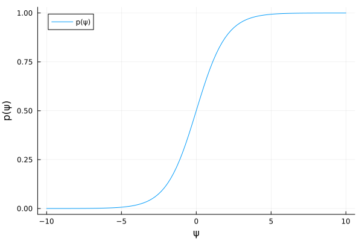
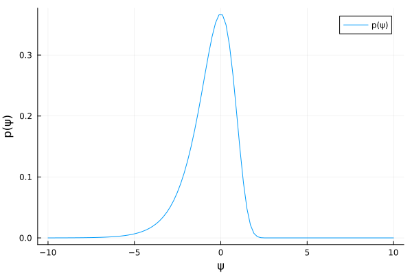

#+TITLE: Exercise 3.10 Solution Example - Hoff, A First Course in Bayesian Statistical Methods
#+SUBTITLE: 標準ベイズ統計学 演習問題 3.10 解答例
#+SETUPFILE: ../setup.org
#+STARTUP:showeverything
* question :noexport:
Change of variables:
Let \(\psi = g(\theta)\), where \(g\) is a monotone function of \(\theta\),
and let \(h\) be the inverse of \(g\) so that \(\theta = h(\psi)\).
If \(p_{\theta}(\theta)\) is the probability density of \(\theta\), then the probability density of \(\psi\) induced by \(p_{\theta}\) is given by
\(p_{\psi} (\psi) = p_{\theta}(h(\psi)) \times \mid \frac{dh}{d \psi} \mid\).
* a)
:PROPERTIES:
:ID:       a80c926c-fbd9-4a95-b5e3-dd4d42ae0faf
:END:
** question :noexport:
Let \(\theta \sim \text{beta}(a,b)\) and let \(\psi = \log \left[ \frac{\theta}{1 - \theta} \right]\).
Obtain the form of \(p_{\psi}\) and plot it for the case that \(a = b = 1\).

** answer

\begin{align*}
&\psi = \log \left[ \frac{\theta}{1 - \theta} \right] \\
\Leftrightarrow \quad & e^{\psi} = \frac{\theta}{1 - \theta} \\
\Leftrightarrow \quad & \theta = \frac{e^{\psi}}{1 + e^{\psi} }
=: h(\psi) \\
\end{align*}

また、
\begin{align*}
\frac{d h(\psi)}{d \psi}
&= \frac{e^{\psi} (1+e^{\psi}) - e^{\psi} e^{\psi} }{(1+e^{\psi})^2} \\
&= \frac{e^{\psi} (1+e^{\psi} - e^{\psi} )}{(1+e^{\psi})^2} \\
&= \frac{e^{\psi}}{(1+e^{\psi})^2} \quad ( > 0)\\
\end{align*}

よって、

\begin{align*}
p_{\psi} (\psi)
&= p_{\theta}(h(\psi)) \times \mid \frac{d h(\psi)}{d \psi} \mid \\
&= \frac{1}{B(a,b)} h(\psi)^{a-1} (1-h(\psi))^{b-1} \times \frac{e^{\psi}}{(1+e^{\psi})^2} \\
&= \frac{1}{B(a,b)} \left( \frac{e^{\psi}}{1 + e^{\psi} } \right)^{a-1} \left( \frac{1}{1 + e^{\psi} } \right)^{b-1} \times \frac{e^{\psi}}{(1+e^{\psi})^2} \\
&= \frac{1}{B(a,b)} \left( \frac{e^{\psi}}{1 + e^{\psi} } \right)^a \left( \frac{1}{1 + e^{\psi} } \right)^b
\end{align*}

#+begin_src julia :session excercise3.10 :results file :exports both :eval no-export
using Plots
using SpecialFunctions
a, b = 1, 1
p_ψ = ψ -> exp(ψ)^a * (1 + exp(ψ))^(-b) / beta(a,b)
ψs = range(-10, 10, length=100)
p = plot(ψs, p_ψ.(ψs), xlabel="ψ", ylabel="p(ψ)", label="p(ψ)")
savefig(p, "fig/excersise3-10a.png")
"fig/excersise3-10a.png"
#+end_src

#+RESULTS:
#+ATTR_HTML: :width 500

* b)
** question :noexport:
Let \(\theta \sim \text{gamma}(a,b)\) and let \(\psi = \log \theta\).
Obtain the form of \(p_{\psi}\) and plot it for the case that \(a = b = 1\).

** answer

\begin{align*}
&\psi = \log \theta \\
\Leftrightarrow \quad & \theta = e^{\psi} =: h(\psi)
\end{align*}

また、
\begin{align*}
\frac{d h(\psi)}{d \psi}
&= e^{\psi} \quad ( > 0)
\end{align*}

よって、

\begin{align*}
p_{\psi} (\psi)
&= p_{\theta}(h(\psi)) \times \mid \frac{d h(\psi)}{d \psi} \mid \\
&= \frac{b^a}{\Gamma(a)} h(\psi)^{a-1} e^{-b h(\psi)} \times e^{\psi} \\
&= \frac{b^a}{\Gamma(a)} e^{\psi (a-1)} e^{-b e^{\psi}} \times e^{\psi} \\
&= \frac{b^a}{\Gamma(a)} e^{\psi a -b e^{\psi} } \\
\end{align*}

#+begin_src julia :session excercise3.10 :exports both :eval no-export :results file
using Plots
using SpecialFunctions
a, b = 1, 1
p_ψ = ψ -> b^a/gamma(a) * exp(ψ*a - b*exp(ψ))
ψs = range(-10, 10, length=100)
p = plot(ψs, p_ψ.(ψs), xlabel="ψ", ylabel="p(ψ)", label="p(ψ)")
savefig(p, "fig/excersise3-10b.png")
"fig/excersise3-10b.png"
#+end_src

#+RESULTS:
#+ATTR_HTML: :width 500

* nav :ignore:
#+ATTR_HTML: :class nav-prev
[[./3-9.org][3.9]]

#+ATTR_HTML: :class nav-next
[[./3-12.org][3.12]]
