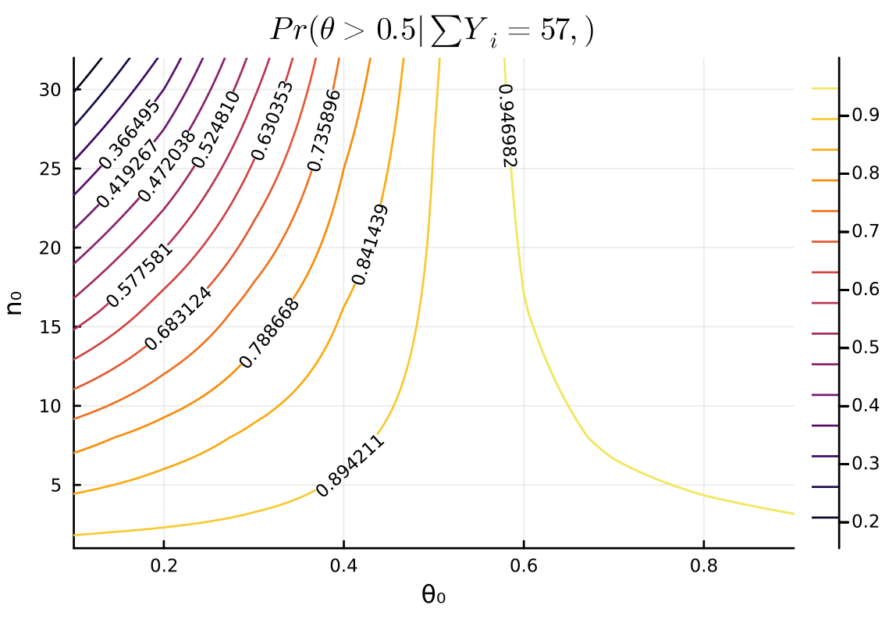

#+TITLE: 3.2
#+INCLUDE: setup.org

* Question :noexport:
Sensitivity analysis:
It is sometimes useful to express the parameters \(a\) and \(b\) in a beta distribution in terms of
\(\theta_0 = \frac{a}{a+b}\)
and
\(n_0 = a + b\),
so that \(a = \theta_0 n_0\) and
\(b = (1 − \theta_0) n_0\).
Reconsidering the sample survey data in [[./3-1.org][Exercise 3.1]], for each combination of
\(\theta_0 \in \{0.1, 0.2, \dots, 0.9\}\) and
\(n_0 \in \{1,2,9,16,32 \}\)
find the corresponding \(a, b\) values and compute
Pr(\( \theta > 0.5 \mid \sum Y_i = 57 \))
using a beta(\(a, b\)) prior distribution for \(\theta\).
Display the results with a contour plot, and discuss how the plot could be used to explain to someone whether or not they should believe that \(\theta > 0.5\),
based on the data that \(\sum_{i=1}^{100} Y_i = 57\).

* Answer
:PROPERTIES:
:ID:       8313bd28-978d-41d0-a3b5-d9a3b5eebed3
:END:

#+begin_src julia
θ₀_list = 0.1:0.1:0.9
n₀_list = [1, 2, 8, 16, 32]
n = 100
y = 57

function get_half_cdf(θ₀, n₀)
    postrior = Beta(θ₀ * n₀ + y, (1 - θ₀) * n₀ + n - y)
    return 1 - cdf(postrior, 0.5)
end

contour(
    θ₀_list, n₀_list, (θ₀_list, n₀_list) -> get_half_cdf(θ₀_list, n₀_list)
    , clabels=true
    , xlabel="θ₀", ylabel="n₀"
    , title = L"Pr(\theta > 0.5 | \sum Y_i = 57,)"
)
#+end_src

#+ATTR_HTML: :width 500

** Discussion
*** English
\(\theta_0\) represents the prior belief regarding \(\theta\), and \(n_0\) represents the strength of this prior belief.
The larger \(\theta_0\) is, the larger the posterior probability of \(\theta > 0.5\) becomes.
When comparing cases with the same \(\theta_0\): generally, if \(\theta_0 < 0.5\), a larger \(n_0\) leads to a smaller posterior probability of \(\theta > 0.5\); conversely, if \(\theta_0 > 0.5\), a larger \(n_0\) leads to a larger posterior probability of \(\theta > 0.5\).

Therefore, by considering the value of \(\theta_0\) and the strength of that belief (\(n_0\)), taking into account prior knowledge and other factors, one can update their belief about \(\theta > 0.5\) by referring to the plot above accordingly.
*** 日本語
\(\theta_0\)は\(\theta\)に関する事前の信念、
\(n_0\)は\(\theta\)の事前の信念の強さを表している。
\(\theta_0\)が大きいほど、\(\theta > 0.5\)の事後確率も大きくなり、同じ\(\theta_0\)で比べた時は、だいたい\(\theta_0 < 0.5\)で\(n_0\)が大きいほど、\(\theta > 0.5\)の事後確率が小さくなり、
\(\theta_0 > 0.5\)で\(n_0\)が大きいほど、\(\theta > 0.5\)の事後確率が大きくなる。

よって、事前の知識などを参考にしながら、\(\theta_0\)はどれくらいか、またその信念の強さはどの程度なのかを考えたうえで、それに応じて上のプロットを見ながら\(\theta > 0.5\)の信念をアップデートすることができる。

* nav :ignore:
#+ATTR_HTML: :class nav-prev
[[./3-1.org][3.1]]

#+ATTR_HTML: :class nav-next
[[./3-3.org][3.3]]
