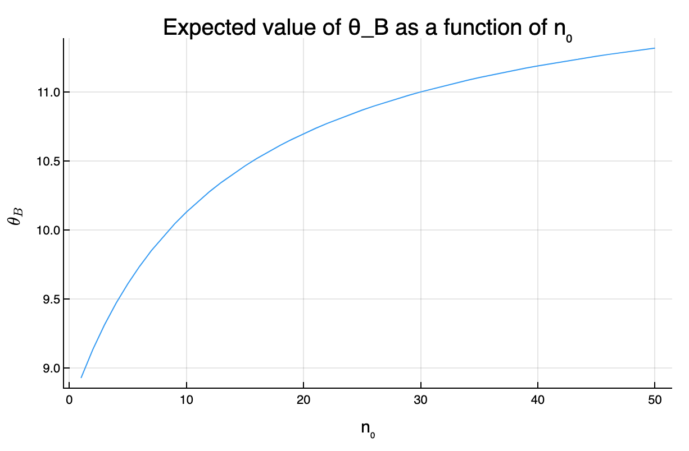
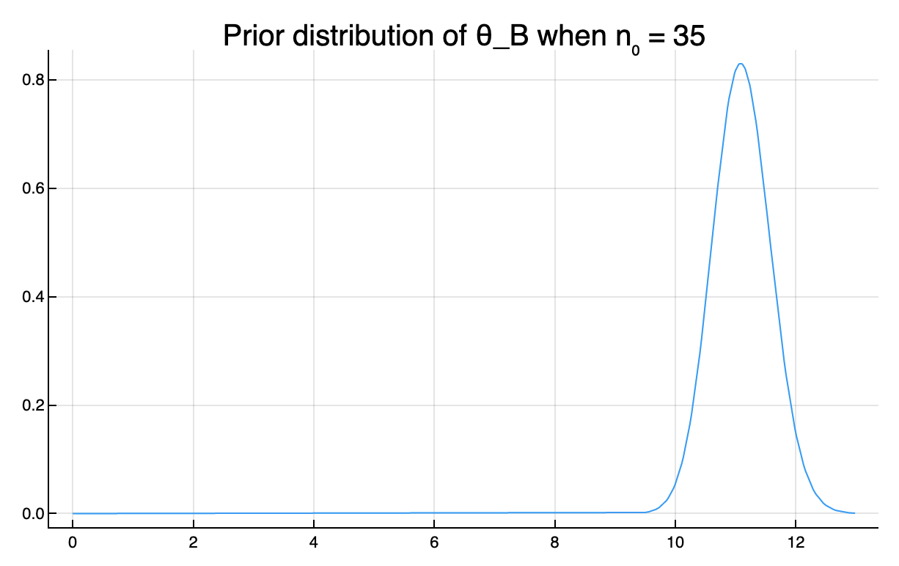

#+TITLE: 3.3
#+INCLUDE: setup.org
* Question :noexport:
Tumor counts:
A cancer laboratory is estimating the rate of tumorigenesis in two strains of mice, /A/ and /B/.
They have tumor count data for 10 mice in strain A and 13 mice in strain B. Type A mice have been well studied,
and information from other laboratories suggests that type A mice have
tumor counts that are approximately Poisson-distributed with a mean of 12.
Tumor count rates for type B mice are unknown, but type B mice are related to type A mice. The observed tumor counts for the two populations are

\begin{align*}
\boldsymbol{y}_A = (12, 9, 12, 14, 13, 13, 15, 8, 15, 6); \\
\boldsymbol{y}_B = (11, 11, 10, 9, 9, 8, 7, 10, 6, 8, 8, 9, 7).
\end{align*}
* Answer
** a)
*** Question :noexport:
Find the posterior distributions, means, variances and 95% quantile-
based confidence intervals for \(\theta_A\) and \(\theta_B\) , assuming a Poisson sampling
distribution for each group and the following prior distribution:

\[
\theta_A \sim \text{gamma}(120, 10), \ \theta_B \sim \text{gamma}(12, 1),
\ p(\theta_A, \theta_B) = p(\theta_A) p(\theta_B).
\]

*** answer

#+begin_src julia :export code
using Distributions
y_A = [12, 9, 12, 14, 13, 13, 15, 8, 15, 6]
y_B = [11, 11, 10, 9, 9, 8, 7, 10, 6, 8, 8, 9, 7]

n_A, sy_A = length(y_A) , sum(y_A)
n_B, sy_B = length(y_B) , sum(y_B)

a₀_A = 120
b₀_A = 10
a₀_B = 12
b₀_B = 1

# Posterior distributions
dist_A = Gamma(a₀_A + sy_A, 1/(b₀_A + n_A))
dist_B = Gamma(a₀_B + sy_B, 1/(b₀_B + n_B))
#+end_src

#+RESULTS:
: Gamma{Float64}(α=125.0, θ=0.07142857142857142)

#+begin_src julia :exports both
mean_A = (a₀_A + sy_A) / (b₀_A + n_A)
mean_B = (a₀_B + sy_B) / (b₀_B + n_B)
["Posterior mean of A:  $mean_A"
 , "Posterior mean of B:  $mean_B"]
#+end_src

#+RESULTS:
| Posterior mean of A:  11.85             |
| Posterior mean of B:  8.928571428571429 |

#+begin_src julia :exports both
var_A = (a₀_A + sy_A) / (b₀_A + n_A)^2
var_B = (a₀_B + sy_B) / (b₀_B + n_B)^2
["Posterior variance of A:  $var_A"
 , "Posterior variance of B:  $var_B"]
#+end_src

#+RESULTS:
| Posterior variance of A:  0.5925             |
| Posterior variance of B:  0.6377551020408163 |

#+begin_src julia :exports both
# 95% quantile-based confidence intervals
quantile_A = quantile.(dist_A, [0.025, 0.975])
quantile_B = quantile.(dist_B, [0.025, 0.975])
["Posterior 95% quantile of A:  $quantile_A"
 , "Posterior 95% quantile of B:  $quantile_B"]
#+end_src

#+RESULTS:
| Posterior 95% quantile of A:  [10.389238190941795, 13.405448325642006] |
| Posterior 95% quantile of B:  [7.432064219464302, 10.560308149242365]  |

** b
:PROPERTIES:
:ID:       cf3475bc-6fa0-4c45-95d3-c3814719e43e
:END:

*** Question :noexport:
Compute and plot the posterior expectation of \(\theta_B\) under the prior dis-
tribution
\( \theta_B \sim \text{gamma}(12 + n_0, n_0) \)
for each value of
\( n_0 \in \{1, 2, \ldots, 50\} \).
Describe what sort of prior beliefs about \(\theta_B\) would be necessary in or-
der for the posterior expectation of \(\theta_B\) to be close to that of \(\theta_A\).

*** answer

#+begin_src julia
list_n₀ = 1:50
exp_θ_B = n -> (a₀_B*n + sy_B) / (n + n_B )

# Plot
plot(
    list_n₀, exp_θ_B.(list_n₀), label="Expected value of θ_B",
    xlabel="n₀", ylabel=L"\theta_B", legend=nothing,
    title="Expected value of θ_B as a function of n₀"
)
#+end_src

#+ATTR_HTML: :width 500

\(n_0 = 35\)くらいで、\(\theta_B\)の期待値が\(\theta_A\)の期待値を上回る。
この時の\(\theta_B\)の事前分布のプロットは以下の通り。

(The expected value of \(\theta_B\) exceeds that of \(\theta_A\) when \(n_0 = 35\).
The plot of the prior distribution of \(\theta_B\) at this time is as follows.)

#+begin_src julia :exports code
n = 35
plot(
    Gamma(a₀_B*n + sy_B, 1/(n + n_B))
    , label=L"Prior distribution of \theta_B when n_0 = $n"
    , legend=false
)
#+end_src

#+ATTR_HTML: :width 500

上の分布を見ればわかるように、
\(\theta_B\)の事後期待値が\(\theta_A\)の事後期待値と同じくらいになるためには、
\(\theta_B\)がかなりの確率で 11 の近くに分布しているという信念を反映した事前分布が必要。

(As can be seen from the distribution above,
in order for the posterior expectation of \(\theta_B\) to be similar to that of \(\theta_A\),
a prior distribution reflecting the belief that \(\theta_B\) is distributed close to 11 with a high probability is required.)

** c
*** Question :noexport:
Should knowledge about population A tell us anything about population B?
Discuss whether or not it makes sense to have
\(p(\theta_A, \theta_B) = p(\theta_A) \times p(\theta_B)\)

*** answer
**** 日本語
B 系統のマウスは A 系統のマウスと関連性があるとされているので、
A 系統のマウスについての腫瘍数の情報は B 系統のマウスについての腫瘍数の事前情報になり得る。
よって、\(p(\theta_A, \theta_B) = p(\theta_A) \times p(\theta_B)\)という仮定は妥当ではなく、
B 系統のマウスと A 系統のマウスの関連の度合いに関する信念のパラメータ\(n_0\)を導入し、
\(p(\theta_B | \theta_A, n_0) = \text{gamma}(E[\theta_A] \times n_0, n_0)\)
などという形でモデル化するのが妥当であると考えられる。
また、A系統のマウスに関するデータが観測されたあとに B 系統のマウスに関する推測を行う場合には、
\(\theta_B\)の事前期待値に\(\theta_A\)の事後期待値を用いるようなモデリングも可能。

**** English
The B strain of mice is said to be related to the A strain of mice,
so information about the number of tumors in A strain mice can serve as prior information about the number of tumors in B strain mice.
Therefore, the assumption \(p(\theta_A, \theta_B) = p(\theta_A) \times p(\theta_B)\) is not valid,
and it is reasonable to introduce a parameter \(n_0\) that represents the degree of correlation between the B strain mice and the A strain mice,
and model it in the form of \(p(\theta_B | \theta_A, n_0) = \text{gamma}(E[\theta_A] \times n_0, n_0)\).
Also, when making inferences about the B strain mice after observing data about the A strain mice,
it is possible to model it using the posterior expectation of \(\theta_A\) as the prior expectation of \(\theta_B\).

aaa
* nav :ignore:
#+ATTR_HTML: :class nav-prev
[[./3-2.org][3.2]]

#+ATTR_HTML: :class nav-next
[[./3-4.org][3.4]]
