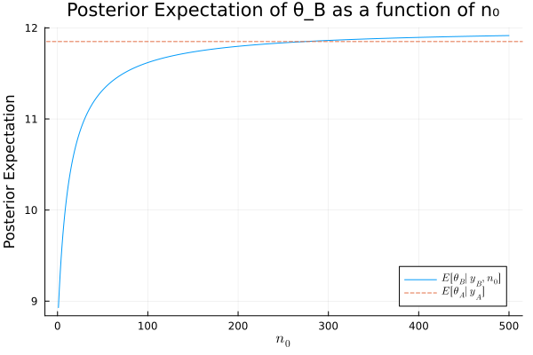
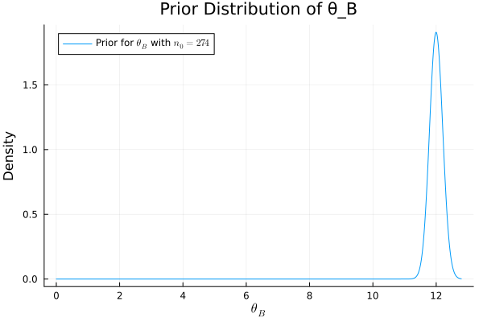

#+TITLE: Exercise 3.3 Solution Example - Hoff, A First Course in Bayesian Statistical Methods
#+SUBTITLE: 標準ベイズ統計学 演習問題 3.3 解答例
#+SETUPFILE: ../setup.org
#+PROPERTY: header-args:julia :session julia_hoff :eval no-export :exports code

* Question :noexport:
Tumor counts:
A cancer laboratory is estimating the rate of tumorigenesis in two strains of mice, /A/ and /B/.
They have tumor count data for 10 mice in strain A and 13 mice in strain B. Type A mice have been well studied,
and information from other laboratories suggests that type A mice have
tumor counts that are approximately Poisson-distributed with a mean of 12.
Tumor count rates for type B mice are unknown, but type B mice are related to type A mice. The observed tumor counts for the two populations are

\begin{align*}
\boldsymbol{y}_A = (12, 9, 12, 14, 13, 13, 15, 8, 15, 6); \\
\boldsymbol{y}_B = (11, 11, 10, 9, 9, 8, 7, 10, 6, 8, 8, 9, 7).
\end{align*}
* Answer
** a)
*** Question :noexport:
Find the posterior distributions, means, variances and 95% quantile-
based confidence intervals for \(\theta_A\) and \(\theta_B\) , assuming a Poisson sampling
distribution for each group and the following prior distribution:

\[
\theta_A \sim \text{gamma}(120, 10), \ \theta_B \sim \text{gamma}(12, 1),
\ p(\theta_A, \theta_B) = p(\theta_A) p(\theta_B).
\]

*** answer
#+begin_src julia :export code
using Distributions
using LaTeXStrings
using Plots
using StatsPlots

y_A = [12, 9, 12, 14, 13, 13, 15, 8, 15, 6]
y_B = [11, 11, 10, 9, 9, 8, 7, 10, 6, 8, 8, 9, 7]

n_A, sy_A = length(y_A) , sum(y_A)
n_B, sy_B = length(y_B) , sum(y_B)

a₀_A = 120
b₀_A = 10
a₀_B = 12
b₀_B = 1

# Posterior distributions
dist_A = Gamma(a₀_A + sy_A, 1/(b₀_A + n_A))
dist_B = Gamma(a₀_B + sy_B, 1/(b₀_B + n_B))
#+end_src

#+RESULTS:
: Gamma{Float64}(α=125.0, θ=0.07142857142857142)

#+begin_src julia :exports both
mean_A = (a₀_A + sy_A) / (b₀_A + n_A)
mean_B = (a₀_B + sy_B) / (b₀_B + n_B)
["Posterior mean of A:  $mean_A"
 , "Posterior mean of B:  $mean_B"]
#+end_src

#+RESULTS:
| Posterior mean of A:  11.85             |
| Posterior mean of B:  8.928571428571429 |

#+begin_src julia :exports both
var_A = (a₀_A + sy_A) / (b₀_A + n_A)^2
var_B = (a₀_B + sy_B) / (b₀_B + n_B)^2
["Posterior variance of A:  $var_A"
 , "Posterior variance of B:  $var_B"]
#+end_src

#+RESULTS:
| Posterior variance of A:  0.5925             |
| Posterior variance of B:  0.6377551020408163 |

#+begin_src julia :exports both
# 95% quantile-based confidence intervals
quantile_A = quantile.(dist_A, [0.025, 0.975])
quantile_B = quantile.(dist_B, [0.025, 0.975])
["Posterior 95% quantile of A:  $quantile_A"
 , "Posterior 95% quantile of B:  $quantile_B"]
#+end_src

#+RESULTS:
| Posterior 95% quantile of A:  [10.389238190941795, 13.405448325642006] |
| Posterior 95% quantile of B:  [7.432064219464302, 10.560308149242365]  |

** b
:PROPERTIES:
:ID:       cf3475bc-6fa0-4c45-95d3-c3814719e43e
:END:

*** Question :noexport:
Compute and plot the posterior expectation of \(\theta_B\) under the prior dis-
tribution
\( \theta_B \sim \text{gamma}(12 + n_0, n_0) \)
for each value of
\( n_0 \in \{1, 2, \ldots, 50\} \).
Describe what sort of prior beliefs about \(\theta_B\) would be necessary in or-
der for the posterior expectation of \(\theta_B\) to be close to that of \(\theta_A\).

*** answer

\(\theta_A\) の事後期待値は、a) の結果から \(E[\theta_A|y_A] = 11.85\) である。
一方、\(\theta_B \) の事後期待値は \(n_0\) の関数として次のように表される。

(The posterior expectation of \(\theta_A\) is \(E[\theta_A|y_A] = 11.85\) from part a).
The posterior expectation of \(\theta_B\) as a function of \(n_0\) is given by:

\[
E[\theta_B|y_B, n_0] = \frac{12n_0 + \sum y_B}{n_0 + n_B} = \frac{12n_0 + 113}{n_0 + 13}
\]

これらの期待値が等しくなる \(n_0\) を求めると、

(Solving for \(n_0\) where these expectations are equal:)

\begin{align*}
11.85 &= \frac{12n_0 + 113}{n_0 + 13} \\
11.85(n_0 + 13) &= 12n_0 + 113 \\
11.85n_0 + 154.05 &= 12n_0 + 113 \\
41.05 &= 0.15n_0 \\
n_0 &= \frac{41.05}{0.15} \approx 273.67
\end{align*}

したがって、\(n_0 \approx 274\) のとき、2つの期待値はほぼ等しくなる。

Thus, when \(n_0 \approx 274\), the two expectations are approximately equal.)

#+begin_src julia :results value raw :exports both
list_n₀ = 1:500
exp_θ_B = n -> (a₀_B * n + sy_B) / (n + n_B)

plot(list_n₀, exp_θ_B.(list_n₀), label=L"E[\theta_B|y_B, n_0]",
     xlabel=L"n_0", ylabel="Posterior Expectation",
     legend=:bottomright,
     title="Posterior Expectation of θ_B as a function of n₀")
hline!([mean_A], linestyle=:dash, label=L"E[\theta_A|y_A]")
savefig("./ch3/fig/ex3-3b1.svg")
""
#+end_src

#+RESULTS:

上の図から、\(n_0\)が大きくなるにつれて、\(\theta_B\)の事後期待値は事前期待値である12に近づいていくことがわかる。
\(n_0 \approx 274\) で2つの事後期待値はほぼ等しくなる。このときの\(\theta_B\)の事前分布は以下の通りである。

(From the figure above, it can be seen that as \(n_0\) increases, the posterior expectation of \(\theta_B\) approaches its prior expectation of 12.
The two posterior expectations become almost equal at \(n_0 \approx 274\). The prior distribution of \(\theta_B\) at this time is as follows.)

#+begin_src julia :results value raw :exports both
n₀_val = 274
prior_B_dist = Gamma(a₀_B * n₀_val, 1/n₀_val)
plot(prior_B_dist, label=L"Prior for $\theta_B$ with $n_0=274$",
     xlabel=L"\theta_B", ylabel="Density",
     legend=:topleft,
     title="Prior Distribution of θ_B")
savefig("./ch3/fig/ex3-3b2.svg")
""
#+end_src

#+RESULTS:

上の分布を見ればわかるように、
\(\theta_B\)の事後期待値が\(\theta_A\)の事後期待値と同じくらいになるためには、
「\(\theta_B\)の平均は12である」という強い信念を反映した事前分布が必要となる。
\(n_0\)は事前分布の「サンプルサイズ」と解釈でき、これが大きいほど、事前情報がデータによる更新を上回り、事後期待値は事前期待値に近づく。

(As can be seen from the distribution above, 
in order for the posterior expectation of \(\theta_B\) to be similar to that of \(\theta_A\), 
a prior distribution reflecting a strong belief that "the mean of \(\theta_B\) is 12" is required.
\(n_0\) can be interpreted as the "sample size" of the prior distribution. The larger \(n_0\) is, the more the prior information outweighs the update by the data, and the posterior expectation approaches the prior expectation.)

** c
*** Question :noexport:
Should knowledge about population A tell us anything about population B?
Discuss whether or not it makes sense to have
\(p(\theta_A, \theta_B) = p(\theta_A) \times p(\theta_B)\)

*** answer
**** 日本語
B 系統のマウスは A 系統のマウスと関連性があるとされているので、
A 系統のマウスについての腫瘍数の情報は B 系統のマウスについての腫瘍数の事前情報になり得る。
よって、\(p(\theta_A, \theta_B) = p(\theta_A) \times p(\theta_B)\)という仮定は妥当ではなく、
B 系統のマウスと A 系統のマウスの関連の度合いに関する信念のパラメータ\(n_0\)を導入し、
\(p(\theta_B | \theta_A, n_0) = \text{gamma}(E[\theta_A] \times n_0, n_0)\)
などという形でモデル化するのが妥当であると考えられる。
また、A系統のマウスに関するデータが観測されたあとに B 系統のマウスに関する推測を行う場合には、
\(\theta_B\)の事前期待値に\(\theta_A\)の事後期待値を用いるようなモデリングも可能。

**** English
The B strain of mice is said to be related to the A strain of mice,
so information about the number of tumors in A strain mice can serve as prior information about the number of tumors in B strain mice.
Therefore, the assumption \(p(\theta_A, \theta_B) = p(\theta_A) \times p(\theta_B)\) is not valid,
and it is reasonable to introduce a parameter \(n_0\) that represents the degree of correlation between the B strain mice and the A strain mice,
and model it in the form of \(p(\theta_B | \theta_A, n_0) = \text{gamma}(E[\theta_A] \times n_0, n_0)\).
Also, when making inferences about the B strain mice after observing data about the A strain mice,
it is possible to model it using the posterior expectation of \(\theta_A\) as the prior expectation of \(\theta_B\).

* nav :ignore:
#+ATTR_HTML: :class nav-prev
[[./3-2.org][3.2]]

#+ATTR_HTML: :class nav-next
[[./3-4.org][3.4]]
