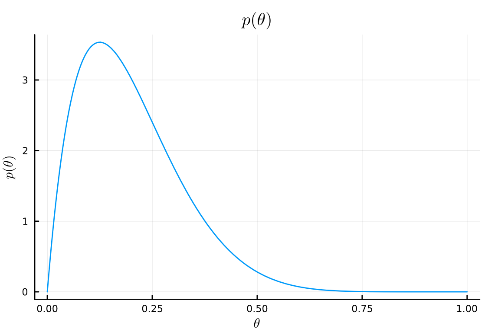
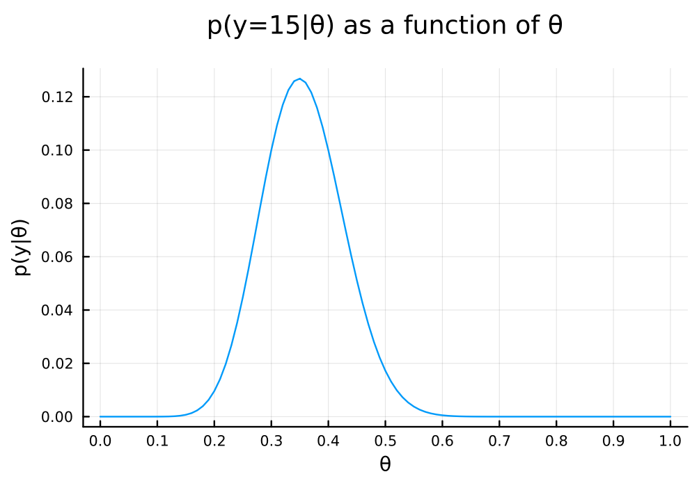
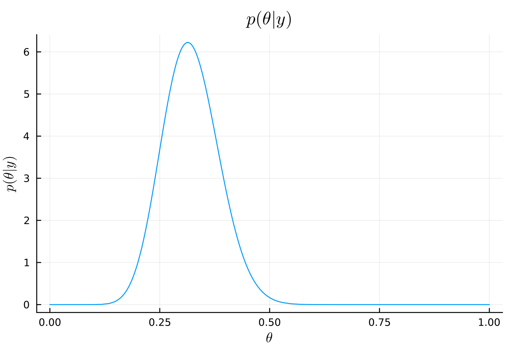
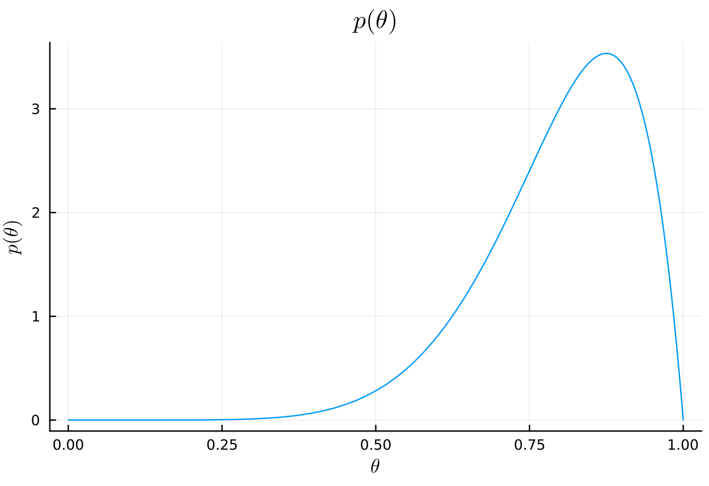
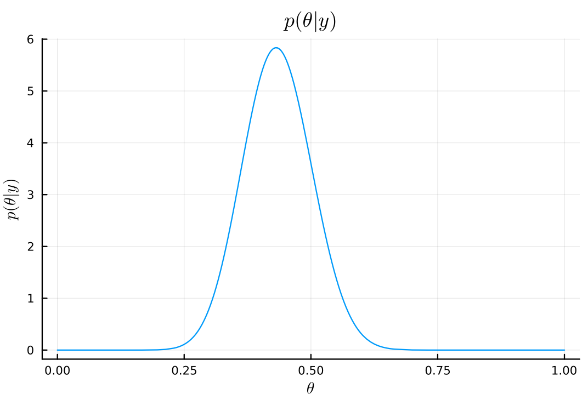
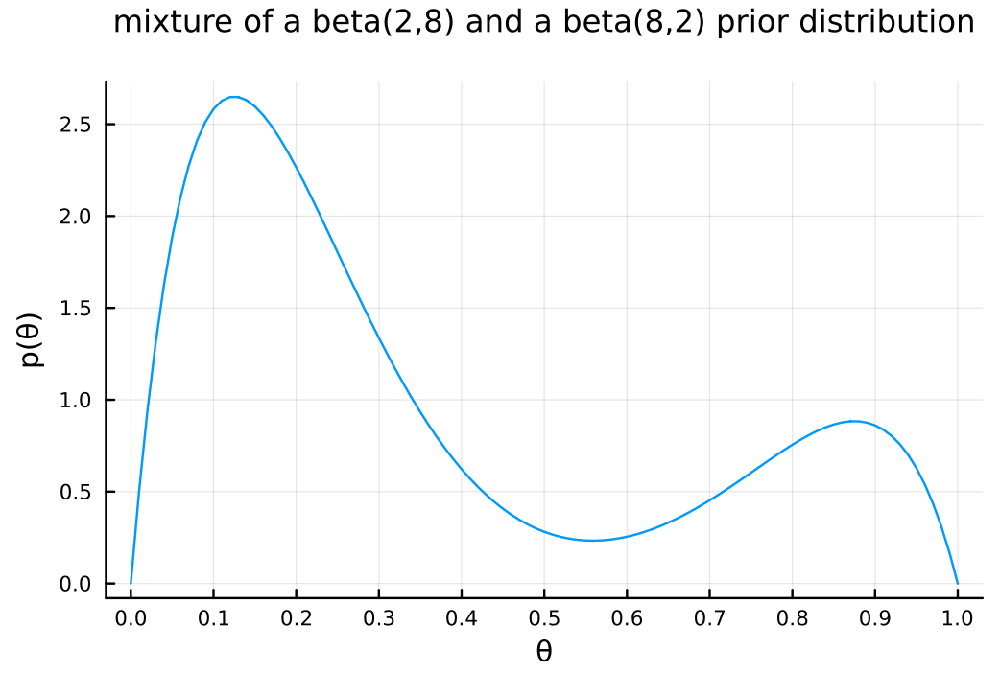
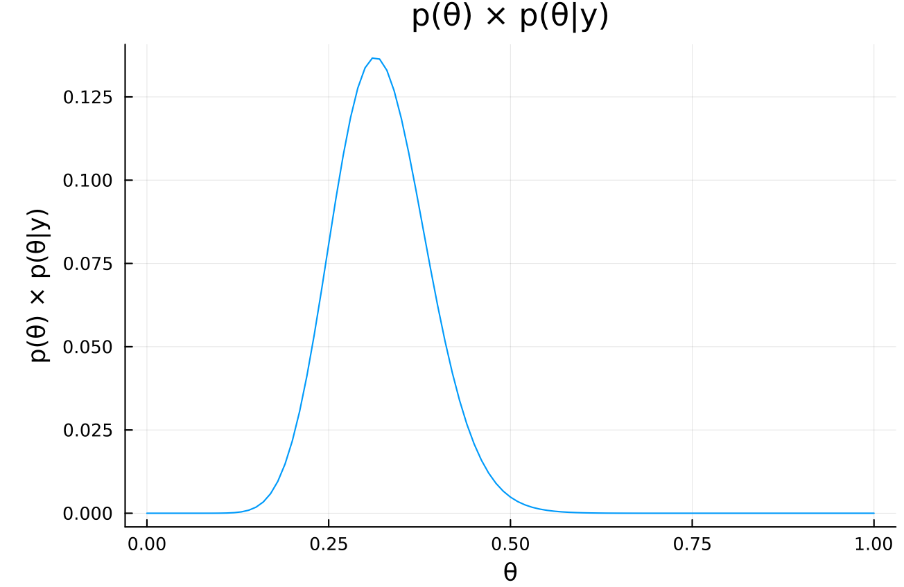

#+TITLE: Exercise 3.4 Solution - Hoff, A First Course in Bayesian Statistical Methods
#+SUBTITLE: 標準ベイズ統計学 演習問題 3.4 解答例
#+SETUPFILE: ../setup.org
* question :noexport:
Mixtures of beta priors:
Estimate the probability \(\theta\) of teen recidivism based on a study in which there were \(n = 43\) individuals released from incarceration and \(y = 15\) re-offenders within 36 months.
* Answer
** a
:PROPERTIES:
:ID:       7ca3e17b-cb8f-4b98-90df-0d77ce181a12
:END:
#+begin_src julia :exports code
using Distributions
using Plots
using StatsPlots
using LaTeXStrings
a₀ = 2
b₀ = 8
n = 43
y = 15
#+end_src

#+RESULTS:
: 15

#+begin_src julia
# prior
plot(
    Beta(a₀, b₀),
    title=L"p(\theta)",
    xlabel=L"\theta",
    ylabel=L"p(\theta)",
    legend=false,
)
#+end_src

#+ATTR_HTML: :width 500

\(y \sim \text{binomial}(43, \theta)\)より、\(p(\theta \mid y)\)を\(\theta\)の関数としてプロットすると以下のようになる。

#+begin_src julia
θ = 0:0.01:1.0
# 全てのθで計算
pdf_for_θs = map(θ -> pdf(Binomial(n, θ), y), θ)

# plot
plot(
    θ, pdf_for_θs,
    xlabel = "θ", ylabel = "p(y|θ)",
    title = "p(y=$y|θ) as a function of θ",
    legend = false,
    size = (600, 400)
    , margin = 5mm
    , xticks = 0:0.1:1.0
)
#+end_src

#+ATTR_HTML: :width 500

\begin{align*}
p(\theta \mid y)
&= \frac{1}{p(y)} p(y \mid \theta) p(\theta) \\
&= \frac{1}{p(y)} \begin{pmatrix} 43 \\ 15 \end{pmatrix} \theta^{15} (1-\theta)^{28} \frac{\Gamma(2+8)}{\Gamma(2)\Gamma(8)} \theta^{2-1} (1-\theta)^{8-1} \\
&= \frac{1}{p(y)} \begin{pmatrix} 43 \\ 15 \end{pmatrix}
\frac{\Gamma(2+8)}{\Gamma(2)\Gamma(8)} \theta^{17-1} (1-\theta)^{36-1} \\
&= const \times \theta^{17-1} (1-\theta)^{36-1} \\
&= dbeta(\theta, 17, 36)
\end{align*}

#+begin_src julia
# posterior
posterior_dist = Beta(a₀ + y, b₀ + n - y)
plot(
    posterior_dist,
    title=L"p(\theta|y)",
    xlabel=L"\theta",
    ylabel=L"p(\theta|y)",
    legend=false,
)
#+end_src

#+ATTR_HTML: :width 500

#+begin_src julia :exports both
# posterior mean
mean(posterior_dist)
μ = (a₀ + y)/(a₀ + b₀ + n)
#+end_src

#+RESULTS:
: 0.32075471698113206

#+begin_src julia :exports both
# posterior mode
mode(posterior_dist)
(a₀ + y - 1)/(a₀ + b₀ + n - 2)
#+end_src

#+RESULTS:
: 0.3137254901960784

#+begin_src julia :exports both
# posterior standard deviation
std(posterior_dist)
var = (μ*(1 - μ))/(a₀ + b₀ + n + 1)
sqrt(var)
#+end_src

#+RESULTS:
: 0.0635188989834093

#+begin_src julia :exports both :results output
# posterior 95% interval
quantile(posterior_dist, [0.025, 0.975])
#+end_src

#+RESULTS:
:
: 2-element Vector{Float64}:
:  0.2032977878191033
:  0.45102398221663165

** b
:PROPERTIES:
:ID:       3654b4ad-59d8-4c15-bcf8-8d30fbaf64c5
:END:
#+begin_src julia :exports code
a₀_b = 8
b₀_b = 2
#+end_src

#+RESULTS:
: 2

#+begin_src julia
# prior
plot(
    Beta(a₀_b, b₀_b),
    title=L"p(\theta)",
    xlabel=L"\theta",
    ylabel=L"p(\theta)",
    legend=false,
)
#+end_src

#+ATTR_HTML: :width 500

\begin{align*}
p(\theta \mid y)
&= \frac{1}{p(y)} p(y \mid \theta) p(\theta) \\
&= \frac{1}{p(y)} \begin{pmatrix} 43 \\ 15 \end{pmatrix} \theta^{15} (1-\theta)^{28} \frac{\Gamma(2+8)}{\Gamma(2)\Gamma(8)} \theta^{8-1} (1-\theta)^{2-1} \\
&= \frac{1}{p(y)} \begin{pmatrix} 43 \\ 15 \end{pmatrix}
\frac{\Gamma(2+8)}{\Gamma(2)\Gamma(8)} \theta^{23-1} (1-\theta)^{30-1} \\
&= const \times \theta^{23-1} (1-\theta)^{30-1} \\
&= dbeta(\theta, 23, 30)
\end{align*}

#+begin_src julia
# posterior
posterior_dist_b = Beta(a₀_b + y, b₀_b + n - y)
plot(
    posterior_dist_b,
    title=L"p(\theta|y)",
    xlabel=L"\theta",
    ylabel=L"p(\theta|y)",
    legend=false,
)
#+end_src

#+RESULTS:

#+ATTR_HTML: :width 500

#+begin_src julia :exports both
# posterior mean
mean(posterior_dist_b)
μ_b = (a₀_b + y)/(a₀_b + b₀_b + n)
#+end_src

#+RESULTS:
: 0.4339622641509434

#+begin_src julia :exports both
# posterior mode
mode(posterior_dist_b)
(a₀_b + y - 1)/(a₀_b + b₀_b + n - 2)
#+end_src

#+RESULTS:
: 0.43137254901960786

#+begin_src julia :exports both
# posterior standard deviation
std(posterior_dist_b)
var_b = (μ_b*(1 - μ_b))/(a₀_b + b₀_b + n + 1)
sqrt(var_b)
#+end_src

#+RESULTS:
: 0.06744531631926798

#+begin_src julia :exports both :results output
# posterior 95% interval
quantile(posterior_dist_b, [0.025, 0.975])
#+end_src

#+RESULTS:
:
: 2-element Vector{Float64}:
:  0.30469562471174694
:  0.5679527959964581

** c
:PROPERTIES:
:ID:       02109ca5-ab30-448e-94ce-678e2b8540d1
:END:
#+begin_src julia
using SpecialFunctions
prior_mix = θ -> 1//4 * gamma(10) / (gamma(2) * gamma(8)) * (3 * θ * (1 - θ)^7 + θ^7 * (1 - θ))
#+end_src

#+RESULTS:

#+begin_src julia
xs = 0:0.01:1.0
plot(
    xs, prior_mix.(xs),
    xlabel = "θ", ylabel = "p(θ)",
    title = "mixture of a beta(2,8) and a beta(8,2) prior distribution",
    titlefontsize = 12,
    legend = false,
    size = (600, 400)
    , margin = 5mm
    , xticks = 0:0.1:1.0
)
#+end_src

#+ATTR_HTML: :width 500

[[id:7ca3e17b-cb8f-4b98-90df-0d77ce181a12][a]]や[[id:3654b4ad-59d8-4c15-bcf8-8d30fbaf64c5][b]]の事前分布と異なり、上の分布は 2 つの山を持った形状になっている。
この事前分布は、再犯率は高いか低いかのどちらかに偏っているという信念を表している。
** d
For the prior in c):
*** i
Write out mathematically \(p(\theta) \times p(y \mid \theta)\) and simplify as much as possible.

Answer:

\begin{align*}
p(\theta) \times p(y \mid \theta)
&= \frac{1}{4} \frac{\Gamma(10)}{\Gamma(2)\Gamma(8)} [3 \theta (1-\theta)^7 + \theta^7 (1-\theta)] \times \begin{pmatrix} 43 \\ 15 \end{pmatrix} \theta^{15} (1-\theta)^{28} \\
&= \frac{1}{4} \frac{\Gamma(10)}{\Gamma(2)\Gamma(8)} \begin{pmatrix} 43 \\ 15 \end{pmatrix} \left[3 \theta^{1+15} (1-\theta)^{7+28} + \theta^{7+15} (1-\theta)^{1+28}\right] \\
&= \frac{1}{4} \frac{\Gamma(10) \Gamma(44)}{\Gamma(2)\Gamma(8) \Gamma(16) \Gamma(29)} \left[3 \theta^{16} (1-\theta)^{35} + \theta^{22} (1-\theta)^{29}\right] \\
\end{align*}
*** ii
:PROPERTIES:
:ID:       de979953-989c-4e64-b67f-57f4443d2d39
:END:
The posterior distribution is a mixture of two distributions you know.
Identify these distributions.

Answer:

Beta(17, 36) and Beta(23, 30)
*** iii
:PROPERTIES:
:ID:       67191524-e772-4522-9b70-ecaae9260902
:END:
On a computer, calculate and plot \(p(\theta) \times p(y \mid \theta)\)
for a variety of \(\theta\) values.
Also find (approximately) the posterior mode, and discuss its relation to the modes in [[id:7ca3e17b-cb8f-4b98-90df-0d77ce181a12][a)]] and [[id:3654b4ad-59d8-4c15-bcf8-8d30fbaf64c5][b)]].

Answer:

#+begin_src julia
cond_prob = θ -> pdf(Binomial(n, θ), y)
prior_times_cond_prob = θ -> prior_mix(θ) * cond_prob(θ)
xs = 0:0.001:1.0
plot(
    xs, prior_times_cond_prob.(xs),
    xlabel = "θ", ylabel = "p(θ) × p(θ|y)",
    title = "p(θ) × p(θ|y)",
    legend = false,
)
#+end_src

#+RESULTS:

#+ATTR_HTML: :width 500

#+begin_src julia
# prior_times_cond_probが最大になるθ
xs[argmax(prior_times_cond_prob.(xs))]
#+end_src

#+RESULTS:
: 0.314

[[id:7ca3e17b-cb8f-4b98-90df-0d77ce181a12][a)]] の mode が 0.313,[[id:3654b4ad-59d8-4c15-bcf8-8d30fbaf64c5][b)]]の mode が 0.431 であったので、この事後 mode はその中間（かなり a より)に位置している。

** e
Find a general formula for the weights of the mixture distribution in [[id:de979953-989c-4e64-b67f-57f4443d2d39][d)ii]],
and provide an interpretation for their values.

Answer:

\(n ,y\)一般に対し、事後分布は

\begin{align*}
p(\theta \mid y)
&= \frac{p(y \mid \theta) p(\theta)}{p(y)} \\
& \propto p(y \mid \theta) p(\theta) \\
&= \begin{pmatrix} n \\ y \end{pmatrix} \theta^y (1-\theta)^{n-y} \times
\frac{1}{4} \frac{\Gamma(10)}{\Gamma(2)\Gamma(8)} \left[3 \theta (1-\theta)^7 + \theta^7 (1-\theta)\right] \\
& \propto 3 \theta^{y+1} (1-\theta)^{n-y+7} + \theta^{y+7} (1-\theta)^{n-y+1} \\
& \propto \frac{3}{4} \theta^{y+2-1} (1-\theta)^{n-y+8-1} + \frac{1}{4} \theta^{y+8-1} (1-\theta)^{n-y+2-1} \\
&= \frac{3}{4} \text{dbeta}(y+2, n-y+8) + \frac{1}{4} \text{dbeta}(y+8, n-y+2)
\end{align*}

となる。
よって事後分布は、Beta(y+2, n-y+8) と Beta(y+8, n-y+2)を 3 対 1 の重みをつけて混合させたものが事後分布となる。

* nav :ignore:
#+ATTR_HTML: :class nav-prev
[[./3-3.org][3.3]]

#+ATTR_HTML: :class nav-next
[[./3-5.org][3.5]]
