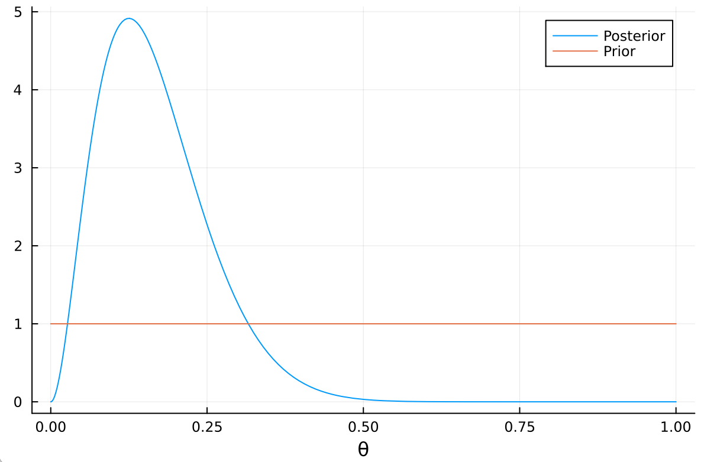
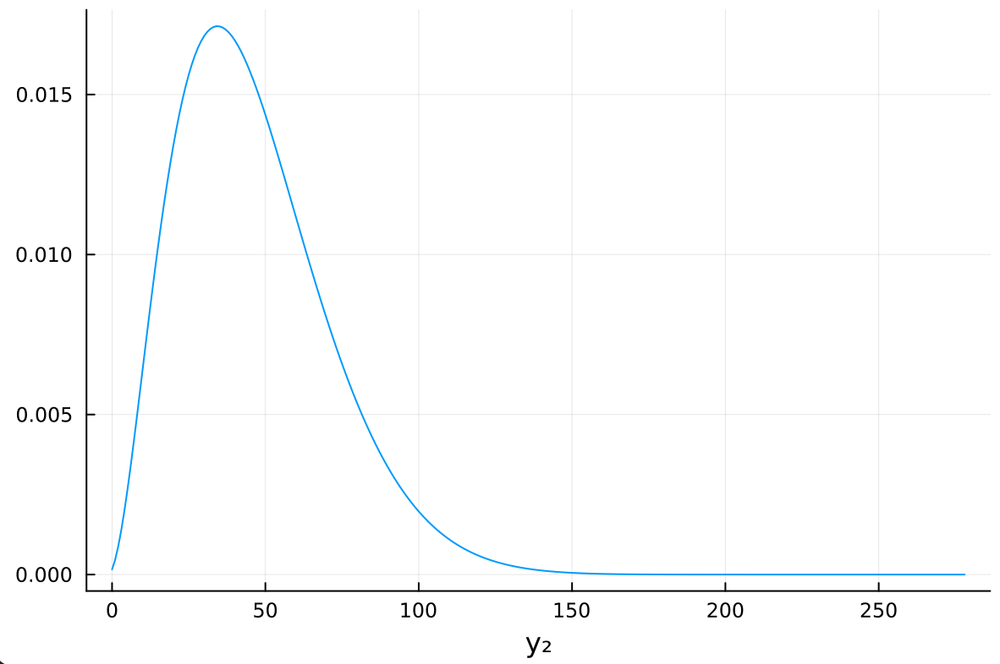
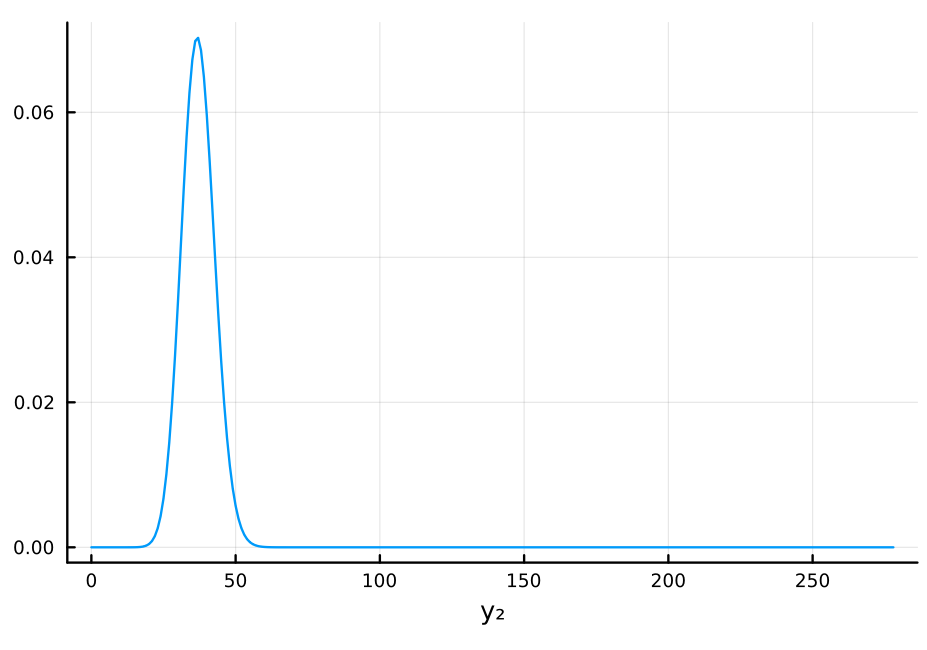

#+TITLE: 3.7
#+INCLUDE: setup.org
#+STARTUP:showeverything
* question :noexport:
Posterior prediction:
Consider a pilot study in which \(n_1 = 15\) children enrolled in special education classes were randomly selected and tested for a certain type of learning disability.
In the pilot study, \(y_1 = 2\) children tested positive for the disability.
- a) :: Using a uniform prior distribution, find the posterior distribution of \(\theta\), the fraction of students in special education classes who have the disability.
  Find the posterior mean, mode and standard deviation of \(\theta\), and plot the posterior density.
* Answer
** a)
:PROPERTIES:
:ID:       24ce68ed-df81-4b72-be05-454979aeaff5
:END:

事前分布は一様分布 Beta(1, 1)より、事後分布は Beta(3, 14)となる。
(The prior distribution is a uniform distribution Beta(1, 1), so the posterior distribution is Beta(3, 14).)

#+BEGIN_SRC julia :exports both
using Distributions
begin
a, b = 1 , 1 # prior parameters
n₁, y₁ = 15, 2 # data
mean = (a + y₁)/ (a + b + n₁) # posterior mean
"Posterior mean :  $mean"
end
#+END_SRC

#+RESULTS:
: Posterior mean :  0.17647058823529413

#+begin_src julia :exports both
mode = (a + y₁ - 1) / (a + b + n₁ - 2) # posterior mode
"Posterior mode :  $mode"
#+end_src

#+RESULTS:
: Posterior mode :  0.13333333333333333

#+begin_src julia :exports both
var = mean * (1 - mean) / (a + b + n₁ + 1) # posterior variance
std = sqrt(var) # posterior standard deviation
"Posterior standard deviation :  $std"
#+end_src

#+RESULTS:
: Posterior standard deviation :  0.08985442539129099

#+begin_src julia :exports none
using Plots
using StatsPlots
plot(Beta(a + y₁, a + b + n₁ - y₁), label = "Posterior", xlabel = "θ")
plot!(Beta(a, b), label = "Prior")
#+end_src

#+RESULTS:
: Plot{Plots.GRBackend() n=2}

#+ATTR_HTML: :width 500

** b)
*** question :noexport:
Researchers would like to recruit students with the disability to participate in a long-term study, but first they need to make sure they can recruit enough students.
Let \(n_2 = 278\) be the number of children in special education classes in this particular school district, and let \(Y_2\) be the number of students with the disability.

- b) :: Find Pr\((Y_2 = y_2 \mid Y_1= 2)\), the posterior predictive distribution of \(Y_2\), as follows:
  - i. :: Discuss what assumptions are needed about the joint distribution of \((Y_1, Y_2)\) such that the following is true:
    \[
    \text{Pr}\left( Y_2 = y_2 \mid Y_1 = 2 \right)
    = \int_0^1 \text{Pr}\left( Y_2 = y_2 \mid \theta \right) p(\theta \mid Y_1 = 2) d \theta
    \]
  - ii. :: Now plug in the forms for Pr\((Y_2 = y_2 \mid \theta)\) and p\((\theta \mid Y_1 = 2)\) in the above integral.
  - iii. :: Figure out what the above integral must be by using the calculus result discussed in Section 3.1.

*** answer: b) i.

#+NAME: 3.7bi_ans
\begin{equation}
\text{Pr}\left(Y_1 \in A_1, Y_2 \in A_2 \mid \theta \right)
= \text{Pr}\left(Y_1 \in A_1 \mid \theta \right) \text{Pr}\left(Y_2 \in A_2 \mid \theta \right)
\end{equation}

Proof:

\begin{align*}
\text{Pr}\left( Y_2 = y_2 \mid Y_1 = 2 \right)
&= \int_0^1 \text{Pr}\left( Y_2 = y_2, \theta \mid Y_1 = 2 \right) d \theta \\
&= \int_0^1 \text{Pr}\left( Y_2 = y_2 \mid \theta , Y_1 = 2 \right) \text{Pr}\left( \theta \mid Y_1 = 2 \right) d \theta \\
\end{align*}

より、等式が成り立つための条件は、
(The condition for the equality to hold is)

\begin{align*}
& \text{Pr}\left( Y_2 = y_2, \mid \theta,  Y_1 = 2 \right)
= \text{Pr}\left( Y_2 = y_2 \mid \theta \right) \\
\Leftrightarrow \quad
&\text{Pr}\left(Y_1 = 2 \mid \theta \right) \text{Pr}\left(Y_2 = y_2 \mid \theta ,  Y_1 = 2\right)
= \text{Pr}\left(Y_1 = 2 \mid \theta \right) \text{Pr}\left(Y_2 = y_2 \mid \theta \right) \\
\Leftrightarrow \quad
&\text{Pr}\left(Y_1 = 2 , Y_2 = y_2 \mid \theta \right)
= \text{Pr}\left(Y_1 = 2 \mid \theta \right) \text{Pr}\left(Y_2 = y_2 \mid \theta \right)
\end{align*}

これを\((Y_1, Y_2)\)の同時分布について一般化すると、([[3.7bi_ans]])が導かれる。
(This can be generalized to the joint distribution of \((Y_1, Y_2)\).)

*** answer: b) ii.
\begin{align*}
\text{Pr}\left( Y_2 = y_2 \mid Y_1 = 2 \right)
&= \int_0^1 \text{Pr}\left( Y_2 = y_2 \mid \theta \right) p(\theta \mid Y_1 = 2) d \theta \\
&= \int_0^1 \begin{pmatrix} 278 \\ y_2 \end{pmatrix} \theta^{y_2} (1 - \theta)^{278 - y_2} \frac{\Gamma(3 + 14)}{\Gamma(3) \Gamma(14)} \theta^2 (1 - \theta)^{13} d \theta \\
&= \frac{\Gamma(3 + 14)}{\Gamma(3) \Gamma(14)} \begin{pmatrix} 278 \\ y_2 \end{pmatrix}
\int_0^1 \theta^{y_2 + 3 - 1} (1 - \theta)^{292 - y_2 - 1} d \theta \\
\end{align*}
*** answer: b) iii.
:PROPERTIES:
:ID:       b2208b95-5176-4a27-837e-f7896a8c96a5
:END:

\begin{align*}
\int_0^1 \theta^{y_2 + 3 - 1} (1 - \theta)^{292 - y_2 - 1} d \theta
&= \frac{\Gamma(y_2 + 3) \Gamma(292 - y_2)}{\Gamma((y_2 + 3) + (292-y_2) )}  \\
&= \frac{\Gamma(y_2 + 3) \Gamma(292 - y_2)}{\Gamma(295)} \\
\end{align*}
より、
\begin{align*}
\text{Pr}\left( Y_2 = y_2 \mid Y_1 = 2 \right)
&= \frac{\Gamma(3 + 14)}{\Gamma(3) \Gamma(14)} \begin{pmatrix} 278 \\ y_2 \end{pmatrix}
\frac{\Gamma(y_2 + 3) \Gamma(292 - y_2)}{\Gamma(295)} \\
\end{align*}
** c)
:PROPERTIES:
:ID:       8e7cd2e7-db0c-47cc-bc6b-ed7637674461
:END:
*** question :noexport:
Plot the function Pr\((Y_2 = y_2 \mid Y_1 = 2)\) as a function of \(y_2\).
Obtain the mean and standard deviation of \(Y_2\), given \(Y_1 = 2\).

*** answer
:PROPERTIES:
:ID:       b3bb8d3c-c637-4296-971a-1efff087756a
:END:
[[id:b2208b95-5176-4a27-837e-f7896a8c96a5][b)iiiの答え]]に\(y_2 = 0, 1, \dots\) を代入することもできるが、

\begin{align*}
\text{Pr}\left( Y_2 = y_2 \mid Y_1 = 2 \right)
&= \frac{\Gamma(3 + 14)}{\Gamma(3) \Gamma(14)} \begin{pmatrix} 278 \\ y_2 \end{pmatrix}
\frac{\Gamma(y_2 + 3) \Gamma(292 - y_2)}{\Gamma(295)} \\
&= \begin{pmatrix} 278 \\ y_2 \end{pmatrix} \frac{B(y_2 + 3, 292 - y_2)}{B(3, 14)} \\
&= \begin{pmatrix} 278 \\ y_2 \end{pmatrix} \frac{B(y_2 + 3, 278 - y_2 + 14)}{B(3, 14)} \\
&= \text{dbetabinomial}(y_2, 278, 3, 14)
\end{align*}

より、
\(y_2\)はベータ二項分布に従うことがわかる。
これを利用してプロットすると、以下のようになる。
(Using this, we can plot the distribution as follows.)

#+begin_src julia :results output :exports code
n₂ = 278
plot(BetaBinomial(n₂, a + y₁, a + b + n₁ - y₁), 0:278, label=nothing)
xlabel!("y₂")
#+end_src

#+RESULTS:
: 278
: qt.qpa.plugin: Could not find the Qt platform plugin "wayland" in ""

#+ATTR_HTML: :width 500

** d)
*** question :noexport:
The posterior mode and the MLE (maximum likelihood estimate; see Exercise 3.14) of \(\theta\), based on data from the pilot study, are both \(\hat{\theta} = \frac{2}{15}\).
Plot the distribution Pr\((Y_2 = y_2 \mid \theta = \hat{\theta})\), and find the mean and standard deviation of \(Y_2\) given \( \theta = \hat{\theta} \).
Compare these results to the plots and calculations in [[id:8e7cd2e7-db0c-47cc-bc6b-ed7637674461][c)]] and discuss any differences.
Which distribution for \(Y_2\) would you use to make predictions, and why?

*** answer:
:PROPERTIES:
:ID:       847cfb7a-a13c-4b6d-b402-ffdbf2d7acd1
:END:
#+begin_src julia :exports code
θ̂ = 2 // 15
plot(Binomial(n₂, θ̂), 0:278, label=nothing, xlabel="y₂")
#+end_src

#+RESULTS:
: Plot{Plots.GRBackend() n=1}

#+ATTR_HTML: :width 500

#+begin_src julia :exports both
mean2 = n₂ * θ̂
var2 = n₂ * θ̂ * (1 - θ̂)
std2 = sqrt(var2)
"mean: $mean2, std: $std2"
#+end_src

#+RESULTS:
: mean: 37.06666666666666, std: 5.667843015155276

 [[id:8e7cd2e7-db0c-47cc-bc6b-ed7637674461][c)]] との比較:

mode は [[id:8e7cd2e7-db0c-47cc-bc6b-ed7637674461][c)]] が 34, で上の分布が 37 と、かなり近いが、cの分布の方がかなり裾の広い分布（分散が大きい分布）となっていることがわかる。
これは、1回目のデータが得られたあとの\(\theta\)の事後分布の不確実性が c)の分布に反映されているためである。
逆に、上の分布には 1 回目のデータのサンプルサイズ（データの妥当性）が反映されていないため、予測には c の分布を使うのがよいと考えられる。

(Comparison with [[id:8e7cd2e7-db0c-47cc-bc6b-ed7637674461][c)]]:
The mode of [[id:8e7cd2e7-db0c-47cc-bc6b-ed7637674461][c)]] is 34, while the mode of the above distribution is 37, which are quite close.
However, it can be seen that the distribution of c) has a much wider tail (larger variance).
This is because the uncertainty of \(\theta\) after obtaining the first data is reflected in the distribution of c).

* nav :ignore:
#+ATTR_HTML: :class nav-prev
[[./3-6.org][3.6]]

#+ATTR_HTML: :class nav-next
[[./3-8.org][3.8]]
