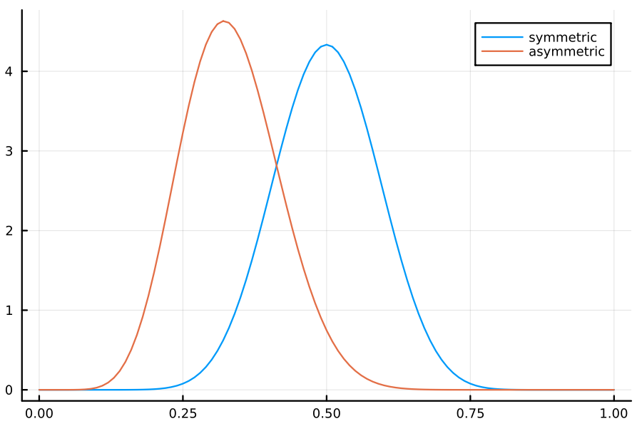
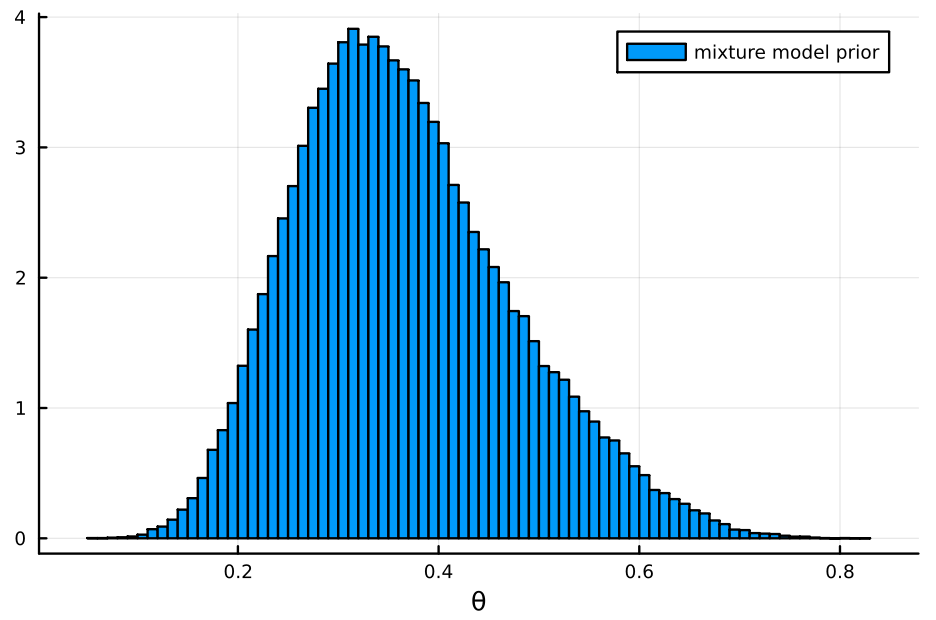
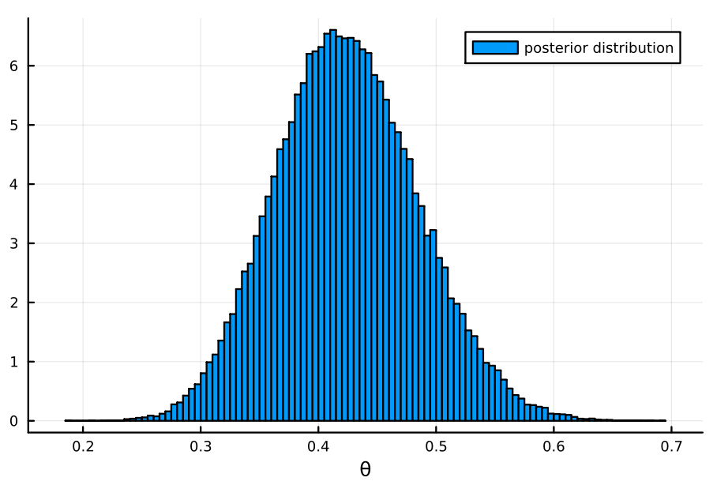
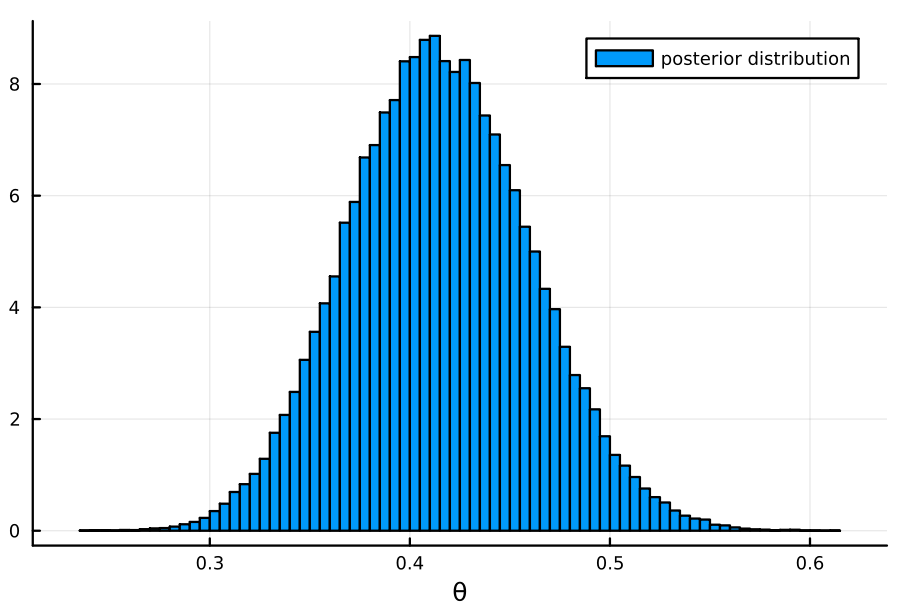

#+TITLE: Exercise 3.8 Solution - Hoff, A First Course in Bayesian Statistical Methods
#+SUBTITLE: 標準ベイズ統計学 演習問題 3.8 解答例
#+SETUPFILE: ../setup.org
#+STARTUP:showeverything
* question :noexport:
Coins: Diaconis and Ylvisaker (1985) suggest that conis spun on a flat surface display long-run frequencies of heads that vary from coin to coin.
About 20% of the coins behave symmetrically, whereas the rmaining coins tend to give frequencies of 1/3 or 2/3.
* a)
:PROPERTIES:
:ID:       7242572f-4875-4341-90b9-af5da2f9c15c
:END:
** question :noexport:
Based on the observations of Diaconis and Ylvisaker, use an appropriate mixture of beta distributions as a prior distribution for \(\theta\), the long-run frequency of heads for a particular coin.
Plot your prior.

** answer
#+begin_src julia :exports none
using Distributions
using Plot
using StatsPlots
#+end_src

#+RESULTS:

#+begin_src julia :exports code
a₀_sym, b₀_sym = 15, 15
sym = Beta(a₀_sym, b₀_sym)
a₀_asym, b₀_asym = 10, 20
asym = Beta(a₀_asym, b₀_asym)
plot(sym, 0:0.01:1, label="symmetric")
plot!(asym, 0:0.01:1, label="asymmetric")
#+end_src

#+RESULTS:
: Plot{Plots.GRBackend() n=2}

#+ATTR_HTML: :width 500

上の mixture model は、以下のようになる。
#+begin_src julia :exports code
mm = MixtureModel([sym, asym], [0.2, 0.8])
histogram(rand(mm, 100000), label="mixture model prior", bins=100, normalize=:pdf, xlabel="θ")
#+end_src

#+RESULTS:
: Plot{Plots.GRBackend() n=1}

#+ATTR_HTML: :width 500

* b)
:PROPERTIES:
:ID:       ba83d37c-181f-45cb-b806-8c4cc051c65b
:END:
** question :noexport:
Choose a single coin and spin it at least 50 times.
Record the year and denomination of the coin.

** answer

|   num | front |
|-------+-------|
|     1 |     1 |
|     2 |     1 |
|     3 |     1 |
|     4 |     1 |
|     5 |     1 |
|     6 |     0 |
|     7 |     1 |
|     8 |     0 |
|     9 |     0 |
|    10 |     1 |
|    11 |     0 |
|    12 |     0 |
|    13 |     1 |
|    14 |     0 |
|    15 |     1 |
|    16 |     1 |
|    17 |     0 |
|    18 |     0 |
|    19 |     1 |
|    20 |     0 |
|    21 |     1 |
|    22 |     0 |
|    23 |     1 |
|    24 |     0 |
|    25 |     0 |
|    26 |     0 |
|    27 |     1 |
|    28 |     0 |
|    29 |     0 |
|    30 |     1 |
|    31 |     1 |
|    32 |     0 |
|    33 |     0 |
|    34 |     0 |
|    35 |     1 |
|    36 |     1 |
|    37 |     1 |
|    38 |     0 |
|    39 |     0 |
|    40 |     1 |
|    41 |     0 |
|    42 |     0 |
|    43 |     1 |
|    44 |     0 |
|    45 |     0 |
|    46 |     0 |
|    47 |     0 |
|    48 |     1 |
|    49 |     0 |
|    50 |     1 |
|-------+-------|
| Total |    23 |
#+TBLFM: @>$2=vsum(@I..@II)

平成 26 年 100 円玉
(100 yen coin from 2014)

* c)
:PROPERTIES:
:ID:       4328caa0-9d0c-4d08-87f6-5f3f071fb0d3
:END:
** question :noexport:
Compute your posterior for \(\theta\), based on the information obtained in [[id:ba83d37c-181f-45cb-b806-8c4cc051c65b][b)]] .

** answer
:PROPERTIES:
:ID:       52862c18-5bf2-460e-9958-ab9dffc00c71
:END:
#+begin_src julia :exports code
y₁, n₁ = 23 , 50
sym₁ = Beta(a₀_sym + y₁, b₀_sym + n₁ - y₁)
asym₁ = Beta(a₀_asym + y₁, b₀_asym + n₁ - y₁)
mm₁ = MixtureModel([sym₁, asym₁], [0.2, 0.8])
histogram(rand(mm₁, 100000), label="posterior distribution", bins=100, normalize=:pdf, xlabel="θ")
#+end_src

#+RESULTS:
: Plot{Plots.GRBackend() n=1}

#+ATTR_HTML: :width 500

* d)
** question :noexport:
Repeat [[id:ba83d37c-181f-45cb-b806-8c4cc051c65b][b)]] and [[id:4328caa0-9d0c-4d08-87f6-5f3f071fb0d3][c)]] for a different coin, but possibly using a prior for \(\theta\) that includes some information from the first coin.
Your choice of a new prior may be informal, but needs to be justified.
How the results from the first experiment influence your prior for the \(\theta\) of the second coin may depend on whether or not the two coins have the same denomination, have a similar year, etc.
Report the year and denominaton of this coin.

** answer
:PROPERTIES:
:ID:       088dd018-5b4d-4404-9912-90f86a831887
:END:
今回は、令和元年 100 円玉を使う。
(I will use a 100 yen coin from 2019.)

|   num | front |
|-------+-------|
|     1 |     0 |
|     2 |     0 |
|     3 |     1 |
|     4 |     0 |
|     5 |     0 |
|     6 |     1 |
|     7 |     1 |
|     8 |     1 |
|     9 |     0 |
|    10 |     0 |
|    11 |     0 |
|    12 |     1 |
|    13 |     1 |
|    14 |     0 |
|    15 |     0 |
|    16 |     0 |
|    17 |     0 |
|    18 |     0 |
|    19 |     0 |
|    20 |     1 |
|    21 |     1 |
|    22 |     1 |
|    23 |     0 |
|    24 |     0 |
|    25 |     0 |
|    26 |     0 |
|    27 |     1 |
|    28 |     1 |
|    29 |     0 |
|    30 |     0 |
|    31 |     0 |
|    32 |     1 |
|    33 |     0 |
|    34 |     0 |
|    35 |     1 |
|    36 |     1 |
|    37 |     0 |
|    38 |     0 |
|    39 |     1 |
|    40 |     1 |
|    41 |     1 |
|    42 |     1 |
|    43 |     0 |
|    44 |     0 |
|    45 |     0 |
|    46 |     1 |
|    47 |     0 |
|    48 |     0 |
|    49 |     0 |
|    50 |     1 |
|-------+-------|
| Total |    20 |
#+TBLFM: @>$2=vsum(@I..@II)

同じ 100 円玉なので、 [[id:4328caa0-9d0c-4d08-87f6-5f3f071fb0d3][c)]] で得た事後分布を事前分布として用いると、事後分布は以下のようになる。
(Since it is the same 100 yen coin, I will use the posterior distribution obtained in [[id:4328caa0-9d0c-4d08-87f6-5f3f071fb0d3][c)]] as the prior distribution, and the posterior distribution will be as follows.)

#+begin_src julia
n₂, y₂ = 50, 20
sym₂ = Beta(a₀_sym + y₁ + y₂, b₀_sym + n₁ - y₁ + n₂ - y₂)
asym₂ = Beta(a₀_asym + y₁ + y₂, b₀_asym + n₁ - y₁ + n₂ - y₂)
mm₂ = MixtureModel([sym₂, asym₂], [0.2, 0.8])
histogram(rand(mm₂, 100000), label="posterior distribution", bins=100, normalize=:pdf, xlabel="θ")
#+end_src

#+RESULTS:
: Plot{Plots.GRBackend() n=1}

#+ATTR_HTML: :width 500

* nav :ignore:
#+ATTR_HTML: :class nav-prev
[[./3-7.org][3.7]]

#+ATTR_HTML: :class nav-next
[[./3-9.org][3.9]]
