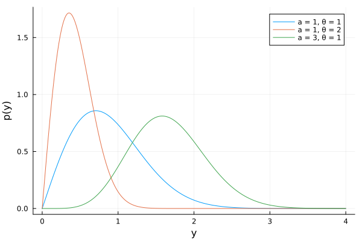

#+TITLE: 3.9
#+INCLUDE: setup.org
#+STARTUP:showeverything
* question :noexport:
Galenshore distribution:
An unkonwn quantity \(Y\) has a Galenshore(\(a, \theta\)) distribution if its density is given by
\[
p(y) = \frac{2}{\Gamma (a)} \theta^{2a} y^{2a-1} e^{-\theta^2 y^2}
\]
for \(y > 0\), \(\theta > 0\) and \(a > 0\).
Assume for now that \(a\) is known.
For this density,
\[
E[Y] = \frac{\Gamma (a + 1/2)}{\theta \Gamma (a)} , \quad E[Y^2] = \frac{a}{\theta^2}.
\]
* a)
** question :noexport:
Identify a class of conjugate prior densities for \(\theta\).
Plot a few members of this class of densities.

** answer
:PROPERTIES:
:header-args: :session exercise3.8 :eval no-export
:ID:       89711387-8f12-464b-9f26-7f489b4521fa
:END:

*** 日本語
データ\(y_1, y_2, \dots, y_n\)を観測したとき、
\(y_1, y_2, \dots, y_n \sim \text{i.i.d. Galenshore}(a, \theta)\)
とすると、
\(\theta\)の\(a\)の条件付き事後分布は、
\begin{align*}
p(\theta | y_1, \dots, y_n, a)
&\propto p(y_1, \dots, y_n | \theta, a) p(\theta | a) \\
&\propto \theta^{2a n} \exp \left( - \theta^2 \sum_{i=1}^n y_i^2 \right)
\times p(\theta | a) \\
\end{align*}
となる。
上の計算より、
\(p(\theta | a)\)が共役事前分布であるためには、
\(\theta^{2 c_1} \exp(- \theta^2) \)
のような項を含む分布である必要があるが、そのような分布としては、sampling model と同じ Galenshore 分布がある。

また、\(f(\theta) = - \theta^2 =: \phi\)とおくと、
\(\phi\)は\(\theta > 0\)で\(\theta\)の全単射の写像であり、
\begin{align*}
p(\theta | y_1, \dots, y_n, a)
&\propto \phi^{an} \exp \left( \phi \sum_{i=1}^n y_i^2 \right)
\times p(\theta | a) \\
\end{align*}
と問題を置き換えて
\(\phi\)の事前分布として、ガンマ分布を考えることもできる。

以下では、\(\theta\)の事前分布として、Galenshore 分布を用いる。
*** English
When we observe data \(y_1, y_2, \dots, y_n\), assuming
\(y_1, y_2, \dots, y_n \sim \text{i.i.d. Galenshore}(a, \theta)\),
the conditional posterior distribution of \(\theta\) given \(a\) is:
\begin{align*}
p(\theta | y_1, \dots, y_n, a)
&\propto p(y_1, \dots, y_n | \theta, a) p(\theta | a) \\
&\propto \theta^{2a n} \exp \left( - \theta^2 \sum_{i=1}^n y_i^2 \right)
\times p(\theta | a) \\
\end{align*}
From the calculation above, for \(p(\theta | a)\) to be a conjugate prior, it needs to be a distribution containing a term like
\(\theta^{2 c_1} \exp(- c_2 \theta^2) \).
One such distribution is the Galenshore distribution, the same as the sampling model.

Alternatively, if we let \(f(\theta) = - \theta^2 =: \phi\), then \(\phi\) is a bijective mapping of \(\theta\) for \(\theta > 0\). We can rephrase the problem as:
\begin{align*}
p(\theta | y_1, \dots, y_n, a)
&\propto (-\phi)^{an} \exp \left( \phi \sum_{i=1}^n y_i^2 \right)
\times p(\theta | a) \\
\end{align*}
(Note: The transformation of the prior \(p(\theta|a)\) and the Jacobian would need careful handling here, the proportionality above focuses on the likelihood part's transformation).
Considering this reparameterization, one could also consider using a Gamma distribution as the prior for \(\phi\) (since \(\phi\) would be negative, perhaps a Gamma distribution for \(-\phi\)).

In the following, we will use the Galenshore distribution as the prior for \(\theta\).

*** plot
#+begin_src julia :exports none
using Distributions
using Plots
using StatsPlots
#+end_src

#+RESULTS:
: nil

#+begin_src julia :exports code
plot(Normal(3,2), label="Normal(3,2)")
plot!(Gamma(1,1), label="Gamma(1,1)")
#+end_src

#+RESULTS:
: Plot{Plots.GRBackend() n=2}

#+ATTR_HTML: :width 500

* b)
** question :noexport:
Let \(Y_1, \ldots, Y_n \sim \text{i.i.d. Galenshore}(a, \theta) \)
Find the posterior distribution of \(\theta\) given \(Y_1, \ldots, Y_n\), using a prior from your conjugate class.

** answer
Assuming the prior for \(\theta\) is Galenshore\((b, \phi)\), the posterior can be computed as follows:

\begin{align*}
p(\theta | y_1, \dots, y_n, a)
&\propto p(y_1, \dots, y_n | \theta, a) p(\theta | a) \\
&\propto \theta^{2a n} \exp \left( - \theta^2 \sum_{i=1}^n y_i^2 \right)
\times \theta^{2b-1} e^{-\phi^2 \theta^2} \\
&= \theta^{2(an+b) - 1} \exp \left( - \left( \sum_{i=1}^n y_i^2 + \phi^2 \right) \theta^2 \right) \\
\end{align*}

ThThus, the posterior predictive density is given by:
\[\theta | y_1, \dots, y_n, a \sim \text{Galenshore}(an+b, \sqrt{\sum_{i=1}^n y_i^2 + \phi^2}\]

* c)
** question :noexport:
Write down \(p(\theta_a \mid Y_1, \dots , Y_n) / p(\theta_b \mid Y_1, \dots , Y_n)\) and simplify.
Identify a sufficient statistics.
** answer

\begin{align*}
\frac{p(\theta_a | Y_1 , \dots, Y_n)}{p(\theta_b | Y_1 , \dots, Y_n)}
&= \frac{ \frac{2}{\Gamma(an + b)} \left( \sum_{i=1}^n y_i^2 + \phi^2 \right)^{(an+b)}
\theta_a^{2(an+b)-1} e^{- \left( \sum_{i=1}^n y_i^2 + \phi^2 \right) \theta_a^2} }
{ \frac{2}{\Gamma(an + b)} \left( \sum_{i=1}^n y_i^2 + \phi^2 \right)^{(an+b)}
\theta_b^{2(an+b)-1} e^{- \left( \sum_{i=1}^n y_i^2 + \phi^2 \right) \theta_b^2} } \\
&= \left( \frac{\theta_a}{\theta_b} \right)^{2(an+b)-1} \times
e^{- \left( \sum_{i=1}^n y_i^2 + \phi^2 \right) (\theta_a^2 - \theta_b^2)} \\
\end{align*}

FFrom the above equation, we can see that the sufficient statistic is:
\(\sum_{i=1}^n y_i^2\)

* d)
** question :noexport:
Determine \(E[\theta \mid y_1, \dots , y_n ]\).
** answer

\begin{align*}
E[\theta | y_1, \dots, y_n]
= \frac{ \Gamma(an+b + \frac{1}{2}) }{ \Gamma(an+b)\sqrt{\sum_{i=1}^n y_i^2 + \phi^2} }
\end{align*}

* e)
** question :noexport:
Determine the form of the posterior predictive density
\(p(\tilde{y} | y_1, \dots , y_n)\).
** answer
Since the above is the form of a Galenshore distribution, we can conclude that:
\begin{equation}
\label{eq:galenshore}
\begin{aligned}[b]
& \int_0^{\infty} \frac{2}{\Gamma(a)} \theta^{2a} y^{2a-1} e^{-\theta^2 y^2} dy
= 1 \\
\Leftrightarrow \quad
& \frac{2}{\Gamma(a)} \theta^{2a} \int_0^{\infty} y^{2a-1} e^{-\theta^2 y^2} dy = 1 \\
\Leftrightarrow \quad
& \int_0^{\infty} y^{2a-1} e^{-\theta^2 y^2} dy
= \frac{\Gamma(a)}{2} \theta^{-2a}
\end{aligned}
\end{equation}

Thus, the posterior predictive density is given by:

\begin{align*}
p(\tilde{y} | y_1, \dots, y_n)
&= \int_0^{\infty} p(\tilde{y} | \theta) p(\theta | y_1, \dots, y_n) d\theta \\
&= \int_0^{\infty} \frac{2}{\Gamma(a)} \theta^{2a} \tilde{y}^{2a-1} e^{-\theta^2 \tilde{y}^2}
\times \frac{2}{\Gamma(an+b)} \left( \sum_{i=1}^n y_i^2 + \phi^2 \right)^{an+b}
\theta^{2(an+b)-1} e^{- \left( \sum_{i=1}^n y_i^2 + \phi^2 \right) \theta^2} d\theta \\
&= \frac{4}{\Gamma(a) \Gamma(an+b)} \left( \sum_{i=1}^n y_i^2 + \phi^2 \right)^{an+b}
\tilde{y}^{2a-1} \int_0^{\infty} \theta^{2(a + an+b)-1} e^{-(\tilde{y}^2 + \sum_{i=1}^n y_i^2 + \phi^2)\theta^2 } d\theta \\
&= \frac{4}{\Gamma(a) \Gamma(an+b)} \left( \sum_{i=1}^n y_i^2 + \phi^2 \right)^{an+b} \tilde{y}^{2a-1}
\frac{\Gamma(a + an+b)}{2(\tilde{y}^2 + \sum_{i=1}^n y_i^2 + \phi^2)^{a + an+b}}
\quad (\because \eqref{eq:galenshore})  \\
&= \frac{2}{B(a, an+b)} \left( \sum_{i=1}^n y_i^2 + \phi^2 \right)^{an+b}
\tilde{y}^{2a-1} (\tilde{y}^2 + \sum_{i=1}^n y_i^2 + \phi^2)^{-(a + an+b)} \\
\end{align*}
