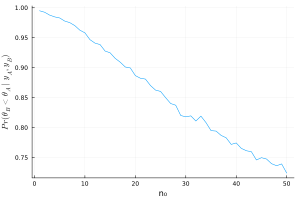
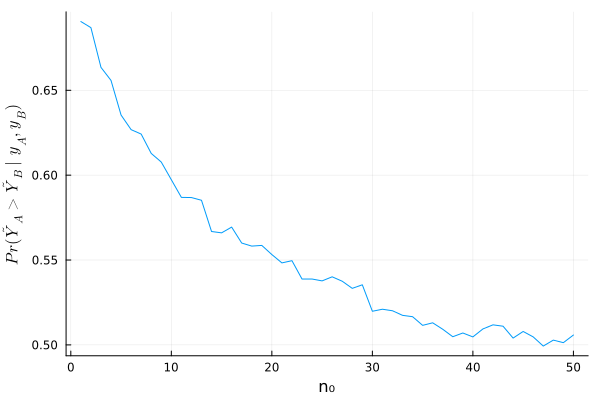

#+TITLE: 4.2
#+INCLUDE: setup.org
#+STARTUP:showeverything
* question :noexport:
Tumor count comparisons:
Reconsider the tumor count data in [[id:0e0e4476-05ff-4592-8dff-c34d6d1209e6][Exercise 3.3]] :
* a)
** question :noexport:
For the prior distribution given in [[id:9314c55b-504f-4446-adfe-c726d99efc87][part a)]] of that exercise, obtain
Pr(\(\theta_B < \theta_A \mid \boldsymbol{y}_A, \boldsymbol{y}_B\)).
via Monte Carlo sampling.

** answer

#+begin_src julia :session ch4 :exports both :eval no-export
using Distributions
using Random
Random.seed!(1234)
y_A = [12, 9, 12, 14, 13, 13, 15, 8, 15, 6]
y_B = [11, 11, 10, 9, 9, 8, 7, 10, 6, 8, 8, 9, 7]

n_A, sy_A = length(y_A) , sum(y_A)
n_B, sy_B = length(y_B) , sum(y_B)

a₀_A = 120
b₀_A = 10
a₀_B = 12
b₀_B = 1

# Posterior distributions
dist_A = Gamma(a₀_A + sy_A, 1/(b₀_A + n_A))
dist_B = Gamma(a₀_B + sy_B, 1/(b₀_B + n_B))

θ_A_mc = rand(dist_A, 5000)
θ_B_mc = rand(dist_B, 5000)

mean(θ_B_mc .< θ_A_mc)
#+end_src

#+RESULTS:
: 0.996

以上より、
\[
\text{Pr}(\theta_B < \theta_A \mid \boldsymbol{y}_A, \boldsymbol{y}_B)
\fallingdotseq 0.997
\]
* b)
** question :noexport:
For a range of values of \(n_0\), obtain
Pr(\(\theta_B < \theta_A \mid \boldsymbol{y}_A, \boldsymbol{y}_B\))
for
\( \theta_A \sim \text{gamma}(120, 10) \)
and
\( \theta_B \sim \text{gamma}(12 \times n_0, n_0) \).

** answer

#+begin_src julia :exports code
dist_θ_B = n -> Gamma(a₀_B*n + sy_B, 1/(n + n_B) )

# %%
t_mc = []
for n₀ in 1:50
    θ_B_mc = rand(dist_θ_B(n₀), 5000)
    append!(t_mc, mean(θ_B_mc .< θ_A_mc))
end
#+end_src

#+begin_src julia :results file :exports none
using Plots
using LaTeXStrings
p = plot(
    1:50, t_mc, label=L"\theta_B < \theta_A"
    , xlabel="n₀", legend=nothing
    , ylabel=L"Pr(θ_B < θ_A \mid y_A, y_B)"
)
savefig(p, "../../fig/ch4/excersise4-2b.png")
"../../fig/ch4/excersise4-2b.png"
#+end_src

#+RESULTS:
#+ATTR_HTML: :width 500

* c)
** question :noexport:
Rpeat parts a) and b), replacing the event
\(\{\theta_B < \theta_A\}\)
with the event
\(\{\tilde{Y}_B < \tilde{Y}_A\}\),
where \(\tilde{Y}_A\) and \(\tilde{Y}_B\) are samples from the posterior predictive distributions.

** answer a'

#+begin_src julia :exports both
θ_A_mc = rand(dist_A, 10000)
θ_B_mc = rand(dist_B, 10000)
y_A_mc = rand.(Poisson.(θ_A_mc))
y_B_mc = rand.(Poisson.(θ_B_mc))

mean(y_A_mc .> y_B_mc)
#+end_src

#+RESULTS:
: 0.6953

以上より、
\[
\text{Pr}(\tilde{Y}_B < \tilde{Y}_A \mid \boldsymbol{y}_A, \boldsymbol{y}_B)
\fallingdotseq 0.695
\]

** answer b'

#+begin_src julia :exports code
t_mc = []
for n₀ in 1:50
    θ_B_mc = rand(dist_θ_B(n₀), 10000)
    y_B_mc = rand.(Poisson.(θ_B_mc))
    append!(t_mc, mean(θ_B_mc .< θ_A_mc))
end
#+end_src

#+begin_src julia :exports results
p = plot(
    1:50, t_mc,
    xlabel="n₀",
    ylabel=L"Pr(\tilde{Y}_A > \tilde{Y}_B \mid y_A, y_B)",
    legend=nothing
)
#+end_src

#+RESULTS:
#+ATTR_HTML: :width 500

* nav :ignore:
#+ATTR_HTML: :class nav-prev
[[./4-1.org][4.1]]

#+ATTR_HTML: :class nav-next
[[./4-3.org][4.3]]
