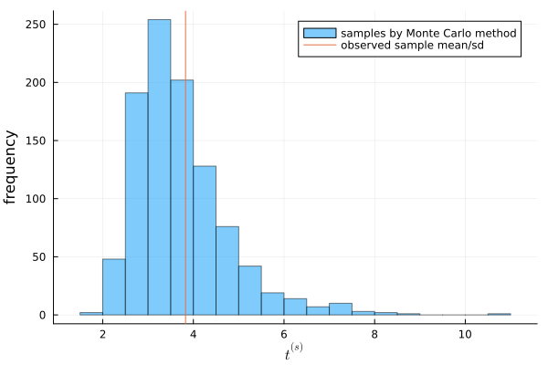
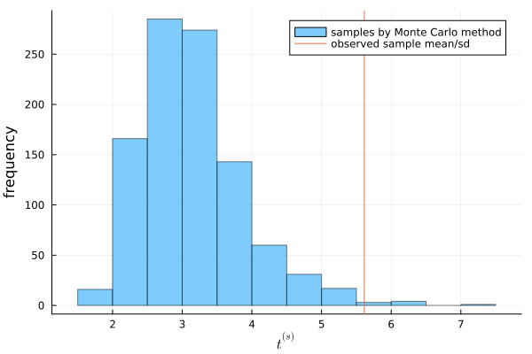

#+TITLE: Exercise 4.3 Solution - Hoff, A First Course in Bayesian Statistical Methods
#+SUBTITLE: 標準ベイズ統計学 演習問題 4.3 解答例
#+SETUPFILE: ../setup.org
#+STARTUP:showeverything
* question :noexport:
Posterior predictive checks:
Let's investigate the the adequacy of the Poisson model for the tumor count data.
Following the example in Section 4.4, generate posterior predictive datasets
\(\boldsymbol{y}^{(1)}_A, \boldsymbol{y}^{(2)}_A, \ldots, \boldsymbol{y}^{(1000)}_A\).
Each \( \boldsymbol{y}^{(s)}_A \) is a sample of size \(n_A = 10\) from the Poisson distribution with parameter \(\theta^{(s)}_A\),
\(\theta^{(s)}_A\) is itself a sample from the posterior distribution \(p(\theta_A \mid \boldsymbol{y}_A)\), and \(\boldsymbol{y}_A\) is the observed data.

* a)
** question :noexport:
For each \(s\), let \(t^{(s)} \) be the sample average of the 10 values of \(\boldsymbol{y}^{(s)}_A\),
divided by the sample standard deviation of \(\boldsymbol{y}^{(s)}_A\).
Make a histogram of \(t^{(s)}\) and compare to the observed value of this statistic.
Based on this statistic, assess the fit of the Poisson model for these data.

** answer

#+begin_src julia
using Distributions
using Random
Random.seed!(1234)
y_A = [12, 9, 12, 14, 13, 13, 15, 8, 15, 6]
y_B = [11, 11, 10, 9, 9, 8, 7, 10, 6, 8, 8, 9, 7]

n_A, sy_A = length(y_A) , sum(y_A)
n_B, sy_B = length(y_B) , sum(y_B)

a₀_A = 120
b₀_A = 10
a₀_B = 12
b₀_B = 1

# Posterior distributions
dist_A = Gamma(a₀_A + sy_A, 1/(b₀_A + n_A))
dist_B = Gamma(a₀_B + sy_B, 1/(b₀_B + n_B))

n_A = 10

# %%
t_mc = []
for s in 1:1000
    θ_A = rand(dist_A)
    y_A_mc = rand(Poisson(θ_A), n_A)
    avg = mean(y_A_mc)
    sd = std(y_A_mc)
    append!(t_mc, avg/sd )
end
#+end_src

:RESULTS:
#+ATTR_HTML: :width 500

You can see that the observed value of \(t\) is in the middle of the distribution of \(t^{(s)}\).
From this, we can conclude that the Poisson model is a good fit for the population of this data.

* b)
** question :noexport:

Repeat the above goodness of fit evaluation for the data in population \(B\).

** answer
#+begin_src julia
t_mc = []
for s in 1:1000
    θ_B = rand(dist_B)
    y_B_mc = rand(Poisson(θ_B), n_B)
    avg = mean(y_B_mc)
    sd = std(y_B_mc)
    append!(t_mc, avg/sd )
end
#+end_src

:RESULTS:
#+ATTR_HTML: :width 500

You can see that the observed value of \(t\) is located at the quite edge of the distribution.
From this, we can conclude that the Poisson model cannot reflect the feature of the population.

* nav :ignore:
#+ATTR_HTML: :class nav-prev
[[./4-2.org][4.2]]

#+ATTR_HTML: :class nav-next
[[./4-4.org][4.4]]
