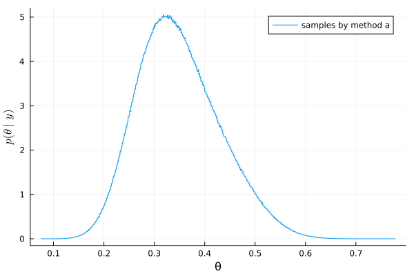
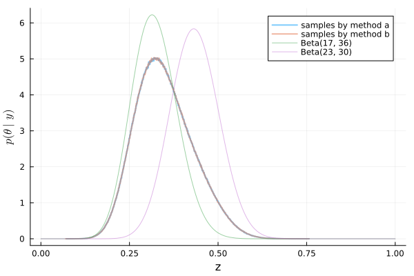

#+TITLE: Exercise 4.4 Solution Example - Hoff, A First Course in Bayesian Statistical Methods
#+SUBTITLE: 標準ベイズ統計学 演習問題 4.4 解答例
#+SETUPFILE: ../setup.org
#+STARTUP:showeverything
* question :noexport:
Mixture of conjugate priors:
For the posterior density from [[3.4][Exercise3.4:]]

* a)
** question :noexport:
Make a plot of \(p(\theta \mid y)\) or \(p( y \mid \theta) p(\theta)\)
using the mixture prior distribution and a dense sequence of \(\theta\)-values.
Can you think of a way to obtain a 95% quantile-based posterior confidence interval for \(\theta\)?
You might want to try some sort of discrete approximation.

** answer

From the result in [[../ch3/3-4.org][3.4 d) ii]], the posterior distribution when using the mixture prior distribution follows
\(\frac{3}{4} \text{Beta}(17, 36) + \frac{1}{4} \text{Beta}(23, 30)\).

The plot is as follows.

#+begin_src julia :exports both
using Distributions
using Random
using LaTeXStrings
using Plots
mm = MixtureModel(
    [Beta(17, 36), Beta(23, 30)],
    [0.75, 0.25]
)
mm_samples = rand(mm, 10_000_000)
histogram(
    mm_samples, label="mixture model posterior"
    , bins=1000, normalize=:pdf, xlabel="θ", ylabel=L"p(\theta \mid y)"
)
#+end_src

#+RESULTS:

:RESULTS:
#+ATTR_HTML: :width 500

The 95% quantile-based posterior confidence interval can be approximated using sample quantiles as follows.

#+begin_src julia :exports both :results output
quantile(mm_samples, [0.025, 0.975])
#+end_src

#+RESULTS:
: 2-element Vector{Float64}:
:  0.2098971517541345
:  0.5230478539666719
* b)
** question :noexport:
To sample a random variable \(z\) from the mixture distribution
\(w p_1(z) + (1-w)p_0(z)\), first toss a \(w\)-coin and let \(x\) be the outcome
(this can be done in Julia with
~rand(Bernoulli(w), 1)~).
Then if \(x = 1\) sample \(z\) from \(p_1\),
and if \(x=0\) sample \(z\) from \(p_0\).
Using this technique, obtain a Monte Carlo approximation of the posterior distribution
\(p(\theta \mid y)\) and a 95% quantile-based posterior confidence interval,
and compare them to the results in part a).

** answer
#+begin_src julia :exports code
w = 0.75

z_mc = []
for s in 1:10_000_000
    x = rand(Bernoulli(w), 1)
    dist = x == 1 ? Beta(17, 36) : Beta(23, 30)
    z = rand(dist)
    append!(z_mc, z)
end
#+end_src

:RESULTS:
#+ATTR_HTML: :width 500

どちらも同じ形状の分布になる！
(Same shape distribution!)

* nav :ignore:
#+ATTR_HTML: :class nav-prev
[[./4-3.org][4.3]]

#+ATTR_HTML: :class nav-next
[[./4-5.org][4.5]]
