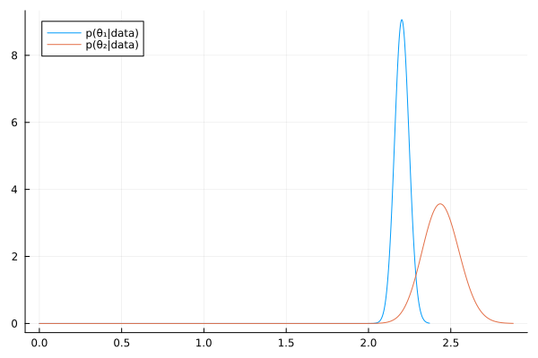
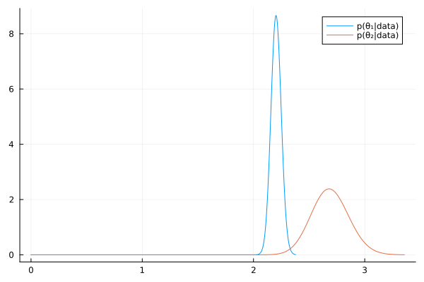

#+TITLE: Exercise 4.5 Solution - Hoff, A First Course in Bayesian Statistical Methods
#+SUBTITLE: 標準ベイズ統計学 演習問題 4.5 解答例
#+SETUPFILE: ../setup.org
#+STARTUP:showeverything
* question :noexport:
Cancer deaths:
Suppose for a set of counties \(i \in \left\{ 1, \dots, n \right\}\)
we have information on the population size
\(X_i =\) number of people in 10,000s, and
\(Y_i = \) number of cancer fatalities.
One model for the distribution of cancer fatalities is that, given the cancer rate \(\theta\),
they are independently distributed with \(Y_i \sim \text{Poisson}(\theta X_i)\).
* a)
** question :noexport:
Identify the posterior distribution of \(\theta\) given data
\((Y_1, X_1), \dots, (Y_n, X_n)\)
and gamma(\(a,b\)) prior distribution.
** answer
From \(Y_i \sim \text{Poisson}(\theta X_i)\), the likelihood is
\begin{align*}
p((Y_1, X_1), \dots, (Y_n, X_n) \mid \theta )
&= \prod_{i=1}^n p(Y_i, X_i \mid \theta )
\quad (\because \text{ i.i.d. })\\
&= \prod_{i=1}^n p(Y_i \mid X_i, \theta ) p(X_i \mid \theta ) \\
&\propto \prod_{i=1}^n p(Y_i \mid X_i, \theta )
\quad (\because  X_i \text{ is independent from } \theta) \\
&= \prod_{i=1}^n \frac{(\theta X_i)^{Y_i} e^{-\theta X_i}}{Y_i!} \\
&\propto \theta^{ \sum_{i=1}^n Y_i } e^{-\theta \sum_{i=1}^n X_i}
\end{align*}

From \(\theta \sim \text{gamma}(a, b)\), the prior distribution is
\begin{align*}
p(\theta)
&= \frac{b^a}{\Gamma(a)} \theta^{a-1} e^{-b \theta} \\
&\propto \theta^{a-1} e^{-b \theta}
\end{align*}

ベイズの定理より、事後分布は、
Using Bayes' rule, the posterior distribution is given by
\begin{align*}
p(\theta \mid (Y_1, X_1), \dots, (Y_n, X_n))
&\propto \theta^{ \sum_{i=1}^n Y_i } e^{-\theta \sum_{i=1}^n X_i}
\times \theta^{a-1} e^{-b \theta} \\
&\propto \theta^{ a-1 + \sum_{i=1}^n Y_i } e^{ - \theta (b + \sum_{i=1}^n X_i) }
\end{align*}

Therefore, the posterior distribution of \(\theta\) follows
Gamma(\(a + \sum_{i=1}^n Y_i, b + \sum_{i=1}^n X_i\))

* b)
** question :noexport:
Using the numerical values of the data, identify the posterior distributions for \(\theta_1\) and \(\theta_2\) for any values of \(a_1, b_1, a_2, b_2\).

** answer
#+begin_src julia :exports none
import Pkg; Pkg.activate("./code")
using Distributions
using Random
using LaTeXStrings
using Plots, StatsPlots
using CSV, DataFrames
using DelimitedFiles
#+end_src

#+RESULTS:

#+begin_src julia :results output
cancer_noreact=DataFrame(readdlm("./Exercises/cancer_noreact.dat", skipstart=1), :auto);
sx₁, sy₁ = sum.(eachcol(cancer_noreact))
#+end_src

#+RESULTS:
: 2-element Vector{Float64}:
:  1037.0
:  2285.0

#+begin_src julia :results output
cancer_react=DataFrame(readdlm("./Exercises/cancer_react.dat", skipstart=1), :auto);
sx₂, sy₂ = sum.(eachcol(cancer_react))
#+end_src

#+RESULTS:
: 2-element Vector{Float64}:
:   95.0
:  256.0

Counties having nearby reactors:
\begin{align*}
\sum_{i=1}^n X_i &= 95 \\
\sum_{i=1}^n Y_i &= 256
\end{align*}

Counties having no nearby reactors:
\begin{align*}
\sum_{i=1}^n X_i &= 1037 \\
\sum_{i=1}^n Y_i &= 2285
\end{align*}

From the above, the posterior distributions of \(\theta_1, \theta_2\) are as follows:
\begin{align*}
\theta_1 &\sim \text{Gamma}(a_1 + 2285, b_1 + 1037) \\
\theta_2 &\sim \text{Gamma}(a_2 + 256, b_2 + 95)
\end{align*}

* c)
** question :noexport:
Suppose cancer rates from previous years have been roughly
\(\hat{\theta} = 2.2\) per 10,000 (and note that most counties are not near reactors).
For each of the following three prior opinions, compute E[\(\theta_1 \mid \) data], E[\(\theta_2 \mid \) data], 95% quantile-based posterior intervals for \(\theta_1\) and \(\theta_2\), and
Pr(\(\theta_2 > \theta_1 \mid \) data).
Also plot the posterior densities (try to put \(p(\theta_1 \mid \) data) and \(p(\theta_2 \mid \) data) on the same plot).
Comment on the differences across posterior opinions.

** i
*** question :noexport:
Opinion 1:
\( (a_1 = a_2= 2.2 \times 100,
b_1 = b_2 = 100 )\).
Cancer rates for both types of counties are similar to the average rates across all counties from previous years.
*** answer

#+begin_src julia :exports both
a₁, b₁ = 2.2 * 100, 100
a₂, b₂ = 2.2 * 100, 100

# Posterior distributions
dist_1 = Gamma(a₁ + sy₁, 1/(b₁ + sx₁))
dist_2 = Gamma(a₂ + sy₂, 1/(b₂ + sx₂))

mean_1 = round((a₁ + sy₁) /(b₁ + sx₁), digits=2)
mean_2 = round((a₂ + sy₂) /(b₂ + sx₂), digits=2)

["Posterior mean of Group 1:  $mean_1"
 , "Posterior mean of Group 2:  $mean_2"]
#+end_src

#+RESULTS:
| Posterior mean of Group 1:  2.2  |
| Posterior mean of Group 2:  2.44 |

#+begin_src julia :exports both
# 95% quantile-based confidence intervals
ci_1 = round.(quantile.(dist_1, [0.025, 0.975]), digits=2)
ci_2 = round.(quantile.(dist_2, [0.025, 0.975]), digits=2)
["95% CI of Group 1:  $ci_1"
    , "95% CI of Group 2:  $ci_2"]
#+end_src

#+RESULTS:
| 95% CI of Group 1:  [2.12, 2.29] |
| 95% CI of Group 2:  [2.23, 2.67] |

#+begin_src julia :exports both :results output
θ₁_mc = rand(dist_1, 10000);
θ₂_mc = rand(dist_2, 10000);
"Pr(θ₂>θ₁|data) = $(mean(θ₁_mc .< θ₂_mc))"
#+end_src

#+RESULTS:
: "Pr(θ₂>θ₁|data) = 0.9788"

#+begin_src julia :exports none
fig = plot(
    dist_1, label="p(θ₁|data)"
)
fig = plot!(
    dist_2, label="p(θ₂|data)"
)
#+end_src

#+ATTR_HTML: :width 500

** ii.
*** question :noexport:
Opiion 2:
\( (a_1 = 2.2 \times 100, b_1 = 100, a_2 = 2.2, b_2 = 1 )\).
Cancer rates in this year for nonreactor counties are similar to rates in previous years in nonreactor connties are similar to rates in previous years in nonreactor counties.
We don't have much information on reactor counties, but perhaps the rates are close to those observed previously in nonreactor counties.

*** answer

#+begin_src julia :exports both
a₁, b₁ = 2.2 * 100, 100
a₂, b₂ = 2.2 , 1

# Posterior distributions
dist_1 = Gamma(a₁ + sy₁, 1/(b₁ + sx₁))
dist_2 = Gamma(a₂ + sy₂, 1/(b₂ + sx₂))

mean_1 = round((a₁ + sy₁) /(b₁ + sx₁), digits=2)
mean_2 = round((a₂ + sy₂) /(b₂ + sx₂), digits=2)

["Posterior mean of Group 1:  $mean_1"
 , "Posterior mean of Group 2:  $mean_2"]
#+end_src

#+RESULTS:
| Posterior mean of Group 1:  2.2  |
| Posterior mean of Group 2:  2.69 |

#+begin_src julia :exports both
# 95% quantile-based confidence intervals
ci_1 = round.(quantile.(dist_1, [0.025, 0.975]), digits=2)
ci_2 = round.(quantile.(dist_2, [0.025, 0.975]), digits=2)
["95% CI of Group 1:  $ci_1"
    , "95% CI of Group 2:  $ci_2"]
#+end_src

#+RESULTS:
| 95% CI of Group 1:  [2.12, 2.29] |
| 95% CI of Group 2:  [2.37, 3.03] |

#+begin_src julia :exports both :results output
θ₁_mc = rand(dist_1, 10000);
θ₂_mc = rand(dist_2, 10000);
"Pr(θ₂>θ₁|data) = $(mean(θ₁_mc .< θ₂_mc))"
#+end_src

#+RESULTS:
: "Pr(θ₂>θ₁|data) = 0.9992"

#+begin_src julia :exports none
fig = plot(
    dist_1, label="p(θ₁|data)"
)
fig = plot!(
    dist_2, label="p(θ₂|data)"
)
#+end_src

#+ATTR_HTML: :width 500

** iii.
*** question :noexport:
Opinion 3:
\( (a_1 = a_2= 2.2, b_1 = b_2 = 1 )\).
Cancer rates in this year could be different from rates in previous years, for both reactor and nonreactor counties.

*** answer

#+begin_src julia :exports both
a₁, b₁ = 2.2 , 1
a₂, b₂ = 2.2 , 1

# Posterior distributions
dist_1 = Gamma(a₁ + sy₁, 1/(b₁ + sx₁))
dist_2 = Gamma(a₂ + sy₂, 1/(b₂ + sx₂))

mean_1 = round((a₁ + sy₁) /(b₁ + sx₁), digits=2)
mean_2 = round((a₂ + sy₂) /(b₂ + sx₂), digits=2)

["Posterior mean of Group 1:  $mean_1"
 , "Posterior mean of Group 2:  $mean_2"]
#+end_src

#+RESULTS:
| Posterior mean of Group 1:  2.2  |
| Posterior mean of Group 2:  2.69 |

#+begin_src julia :exports both
# 95% quantile-based confidence intervals
ci_1 = round.(quantile.(dist_1, [0.025, 0.975]), digits=2)
ci_2 = round.(quantile.(dist_2, [0.025, 0.975]), digits=2)
["95% CI of Group 1:  $ci_1"
    , "95% CI of Group 2:  $ci_2"]
#+end_src

#+RESULTS:
| 95% CI of Group 1:  [2.11, 2.29] |
| 95% CI of Group 2:  [2.37, 3.03] |

#+begin_src julia :exports both :results output
θ₁_mc = rand(dist_1, 10000);
θ₂_mc = rand(dist_2, 10000);
"Pr(θ₂>θ₁|data) = $(mean(θ₁_mc .< θ₂_mc))"
#+end_src

#+RESULTS:
: "Pr(θ₂>θ₁|data) = 0.9984"

#+begin_src julia :exports none
fig = plot(
    dist_1, label="p(θ₁|data)"
)
fig = plot!(
    dist_2, label="p(θ₂|data)"
)
#+end_src

#+ATTR_HTML: :width 500

* d)
:PROPERTIES:
:ID:       5981ba98-9c2d-45af-a504-8ccca7c18441
:END:
** Question :noexport:
In the above analysis we assumed that population size gives no information about fatality rate.
Is this reasonable?
How would the analysis have to change if this is not reasonable?
** answer
*** 日本語
「人口が多い地域は、人口が少ない地域よりも医療が充実しており、がんになった場合の生存率が高い可能性がある」
など考えることもできるので、人口規模と致死率が独立していると考えるのは必ずしも合理的であると言えない。

そこで、
\( \theta_i \sim \exp(\beta_0 + \beta_1 X_i) \)
などとして、階層モデルを考えるなどする。
*** English
It is also conceivable that "regions with larger populations may have better healthcare compared to regions with smaller populations, potentially leading to higher survival rates in cancer cases."
Therefore, assuming that population size and mortality rate are independent may not necessarily be reasonable.

Consequently, one might consider a hierarchical model, for example, by modeling the parameter \( \theta_i \) (or a related parameter like a rate \(\lambda_i\)) as a function of covariates \(X_i\), such as \( \lambda_i = \exp(\beta_0 + \beta_1 X_i) \).

* e)
** Question :noexport:
We encoded our beliefs about \( \theta_1 \) and \( \theta_2 \) such that they gave no information about each other (they were a priori independent).
Think about why and how you might encode beliefs such that they were a priori dependent.
** Answer

\begin{align*}
\theta_1 &\sim w \times \text{Beta}(a_1, b_1) + (1-w) \times \text{Beta}(a_2, b_2) \\
\theta_2 &\sim w \times \text{Beta}(a_2, b_2) + (1-w) \times \text{Beta}(a_1, b_1)
\end{align*}

上のような形で、それぞれの事前分布を重み付きの混合分布にすることで、事前従属にできる。

(In this way, by using weighted mixture distributions for the respective priors, prior dependence can be established.)

* nav :ignore:
#+ATTR_HTML: :class nav-prev
[[./4-4.org][4.4]]

#+ATTR_HTML: :class nav-next
[[./4-6.org][4.6]]
