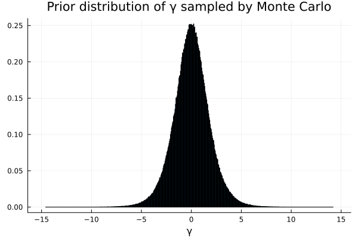

#+TITLE: Exercise 4.6 Solution Example - Hoff, A First Course in Bayesian Statistical Methods
#+SUBTITLE: 標準ベイズ統計学 演習問題 4.6 解答例
#+SETUPFILE: ../setup.org
#+STARTUP:showeverything
* Question :noexport:
Non-informative prior distributions:
Suppose for a binary sampling problem we plan on using a uniform, or beta(1,1), prior for the population proportion \( \theta \).
Perhaps our reasoning is that this represents "no prior information about \( \theta \)".
However, some people like to look at proportions on the log-odds scale, that is, they are interested in
\( \gamma = \log \frac{\theta}{1 - \theta}\).
Via Monte Carlo sampling or otherwise, find the prior distribution for \( \gamma \) that is induced by the uniform prior for \( \theta \).
Is the prior informative about \( \gamma \)?

* answer

#+begin_src julia :exports code
a, b = 1, 1
θ_prior_mc = rand(Beta(a, b), 1000000)
γ_prior_mc = map(θ -> log(θ/(1-θ)), θ_prior_mc)
#+end_src

#+RESULTS:

#+begin_src julia :exports none
plot(
    γ_prior_mc, seriestype=:histogram, label=nothing
    , title="Prior distribution of γ sampled by Monte Carlo"
    , xlabel="γ", normalize=true
)
#+end_src

#+ATTR_HTML: :width 500

This prior is informative about \( \gamma \) because this gives us information that \( \gamma \) is symmetrically distributed around 0.

* nav :ignore:
#+ATTR_HTML: :class nav-prev
[[./4-5.org][4.5]]

#+ATTR_HTML: :class nav-next
[[./4-7.org][4.7]]
