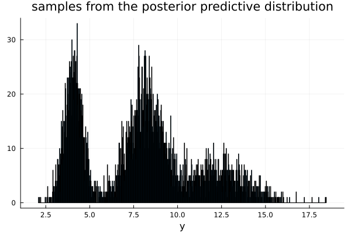
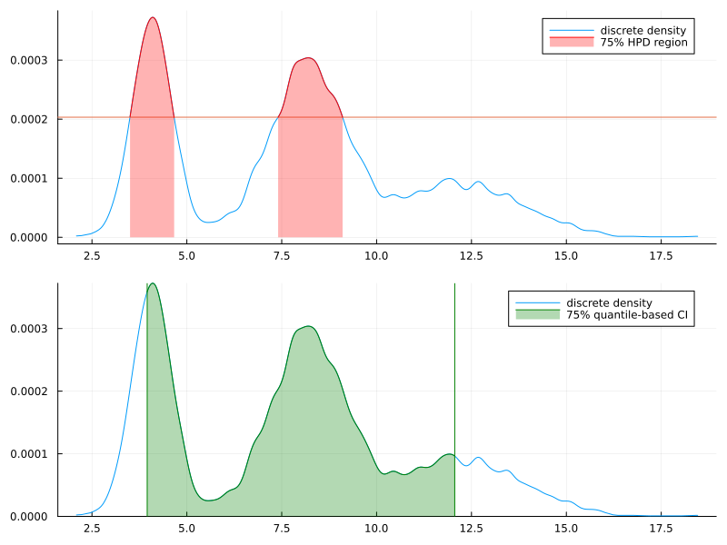

#+TITLE: 4.7
#+INCLUDE: setup.org
#+STARTUP:showeverything
* Question :noexport:
Mixture models:
After a posterior analysis on data from a population of squash plants, it was determined that the total vegetable weight of a given plant could be modeled with the following distribution:
\[
p(y \mid \sigma^2) = .31 \text{dnorm}(y, \theta, \sigma) + .46 \text{dnorm}(2 \theta_1, 2 \sigma) + .23 \text{dnorm}(y, 3 \theta_1, 3 \sigma)
\]
where the posterior distributions of the parameters have been calculated as
\(\frac{1}{\sigma^{2} } \sim \text{gamma}(10, 2.5)\), and
\( \theta \mid \sigma^2 \sim \text{normal}(4.1, \frac{\sigma^2}{20} )\).
* a)
** Question :noexport:
Sample at least 5,000 y values from the posterior predictive distribution.
** answer

#+begin_src julia :exports none
using Distributions
using Random
using LaTeXStrings
using Plots, StatsPlots
using CSV, DataFrames
using DelimitedFiles
using KernelEstimator
#+end_src

#+RESULTS:

#+begin_src julia :exports code
Random.seed!(1234)
dist_inv_σ² = Gamma(10, 1/2.5)
dist_θ = σ² -> Normal(4.1, σ²/20)

π = [0.31, 0.46, 0.23]
t = Multinomial(1, π)
dist_list = (θ, σ) -> [Normal(θ, σ), Normal(2θ, 2σ), Normal(3θ, 3σ)]
y_mc = Array{Float64, 1}()
for i in 1:5000
    inv_σ² = rand(dist_inv_σ²)
    σ² = 1 / inv_σ²
    σ = sqrt(σ²)
    θ = rand(dist_θ(σ²))
    w = rand(t) .== 1
    dist_pred = dist_list(θ, σ)[w][1]
    y = rand(dist_pred)
    append!(y_mc, y)
end
#+end_src

#+begin_src julia :exports none
p = histogram(
    y_mc, title="samples from the posterior predictive distribution",
    bins=1000, xlabel="y", label=nothing
)
#+end_src

#+ATTR_HTML: :width 500

* b)
** Question :noexport:
Form a 75% quantile-based confidence interval for a new value of \(Y\).
** answer

#+begin_src julia :exports both
# 75% quantile
prob = 0.75
lower = (1 - prob) / 2
upper = 1 - lower
ci_quantile = quantile(y_mc, [lower, upper])
#+end_src

#+RESULTS:
: 2-element Vector{Float64}:
:   3.954945418674755
:  12.059043291517227
* c)
** Question :noexport:
Form a 75% HPD region for a new \(Y\) as follows:
- i :: Compute estimates of the posterior density of \(Y\) using the
   ~KernelEstimator.kerneldensity()~ command in Julia, and then normalize the density values so they sum to 1.
- ii :: Sort these discrete probabilities in decreasing order.
- iii :: Find the first probability value such that the cumulative sum of the sorted values exceeds 0.75.
  Your HPD region includes all values of \(y\) which have a discretized probability greater than this cutoff.
  Describe your HPD region, and compare it to your quantile-based region.
** answer
#+begin_src julia
# i
sorted_y_mc = sort(y_mc)
y_density = kerneldensity(y_mc)
y_density_normalized = y_density ./ sum(y_density)

# ii
y_density_sorted = sort(y_density_normalized, rev=true)

# iii
y_density_sorted_cumsum = cumsum(y_density_sorted)
threshhold_cumsum_idx = findfirst(x -> x > prob, y_density_sorted_cumsum)
y_density_sorted_cumsum[threshhold_cumsum_idx]
threshhold_prob = y_density_sorted[threshhold_cumsum_idx]
#+end_src

#+RESULTS:
: 0.0002135540651187891

#+begin_src julia :exports none
y_prob = y_density_normalized[sortperm(y_mc)]
v = y_prob .> threshhold_prob
prev = v[1]
out = []
for (i,x) in enumerate(v)
    if x != prev
        push!(out, i)
        prev = x
    end
end
# %%
threshold_y = reshape(out, 2, :)

prob_int = Int(prob*100)

fig_hpd = plot(
    sorted_y_mc, y_prob, label="discrete density",
)
hline!(fig_hpd, [threshhold_prob], label=nothing)
# vline!(fig, sorted_y_mc[out], label="quantile-based CI")
for (i, region) in enumerate(eachcol(threshold_y))
    y_choiced = sorted_y_mc[region[1]:region[2]]
    prob_choiced = y_prob[region[1]:region[2]]
    label = i == 1 ? "$prob_int% HPD region" : nothing
    fig = plot!(
        fig_hpd, y_choiced, prob_choiced, fillrange=repeat([0], length(y_choiced))
        , fillalpha=0.3, label=label, color=:red
    )
end
fig_hpd

# %%
fig_quantile = plot(
    sorted_y_mc, y_prob, label="discrete density",
    ylims=(0, :auto)
)
quantile_idx = ci_quantile[1] .<  sorted_y_mc .< ci_quantile[2]
fig_quantile = plot!(fig_quantile,
    sorted_y_mc[quantile_idx], y_prob[quantile_idx],
    fillrange=repeat([0], sum(quantile_idx))
    , fillalpha=0.3, label="$prob_int% quantile-based CI", color=:green
)
vline!(fig_quantile, ci_quantile, label=nothing, color=:green)
fig_quantile

# %%
fig = plot(fig_hpd, fig_quantile, layout=(2,1), size=(800, 600))
#+end_src

#+ATTR_HTML: :width 500

* d)
** Question :noexport:
Can you think of a physical justification for the mixture sampling distribuiton of \(Y\)?
** answer
The model is as follows:
\begin{align*}
\boldsymbol{w} = \begin{pmatrix} w_1 \\ w_2 \\ w_3 \end{pmatrix} &\sim \text{Multinomial}(0.31, 0.46, 0.23) \\
\sigma^2 &\sim \text{InverseGamma}(10, 2.5) \\
\theta | \sigma^2 &\sim \text{Normal}(4.1, \sigma^2/20) \\
y | \theta, \sigma^2, \boldsymbol{w}
&\sim w_1 \mathcal{N}(\theta, \sigma^2) + w_2 \mathcal{N}(2 \theta, 2 \sigma^2) + w_3 \mathcal{N}(3 \theta, 3 \sigma^2)
\end{align*}

Then the marginal distribution of \(Y\) is
\begin{align*}
p(y)
&= \int \int \int p(y, \theta, \sigma^2, \boldsymbol{w}) d\theta d\sigma^2 d\boldsymbol{w} \\
&= \int \int \int p(y | \theta, \sigma^2, \boldsymbol{w}) p(\theta | \sigma^2) p(\sigma^2) p(\boldsymbol{w}) d\theta d\sigma^2 d\boldsymbol{w}. \\
\end{align*}
Therefore, \(Y\) can be sampled from the following procedure:
1. Sample \(\sigma^{2(s)} \sim p(\sigma^2) \).
2. Sample \(\theta^{(s)} \sim p(\theta | \sigma^{2(s)}) \).
3. Sample \(\boldsymbol{w}^{(s)} \sim p(\boldsymbol{w})\).
4. Sample \(y^{(s)} \sim p(y | \theta^{(s)}, \sigma^{2(s)}, \boldsymbol{w}^{(s)})\).

Then, the empirical distribution of
\(\{y^{(1)}, \dots, y^{(s)}\} \to p(y)\) as \(s \to \infty\).

* nav :ignore:
#+ATTR_HTML: :class nav-prev
[[./4-6.org][4.6]]

#+ATTR_HTML: :class nav-next
[[./4-8.org][4.8]]
