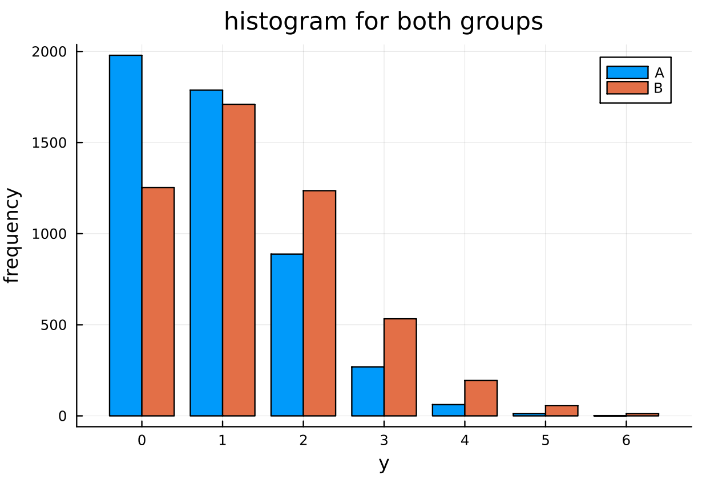
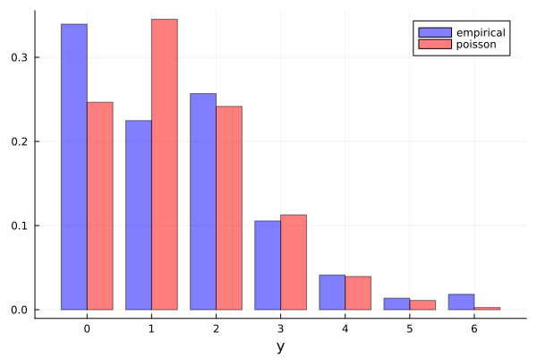
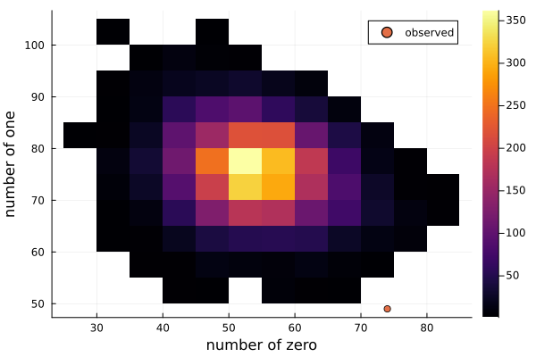

#+TITLE: Exercise 4.8 Solution - Hoff, A First Course in Bayesian Statistical Methods
#+SUBTITLE: 標準ベイズ統計学 演習問題 4.8 解答例
#+SETUPFILE: ../setup.org
#+STARTUP:showeverything
* question :noexport:
More posterior predictive checks:
Let \(\theta_A\) and \(\theta_B\) be the average number of children of men in their 30s with and without bachelor’s degrees, respectively.
* a)
** Question :noexport:
Using a Poisson sampling model, a gamma(2,1) prior for each \(\theta\) and the data in the files ~menchild30bach.dat~ and ~menchild30nobach.dat~, obtain 5,000 samples of \(\hat{Y}_A\) and \(\hat{Y}_B\) from the posterior predictive distribution of the two samples.
Plot the Monte Carlo approximations to these two posterior predictive distributions.
** answer
#+begin_src julia :export code
menchild_bach = []
open("../../Exercises/menchild30bach.dat") do file
    for line in eachline(file)
        append!(menchild_bach, parse.(Int, split(line)))
    end
end

menchild_nobach = []
open("../../Exercises/menchild30nobach.dat") do file
    for line in eachline(file)
        append!(menchild_nobach, parse.(Int, split(line)))
    end
end

# data
sy_A = sum(menchild_bach)
n_A = length(menchild_bach)

sy_B = sum(menchild_nobach)
n_B = length(menchild_nobach)

# prior parameters
a₀ = 2
b₀ = 1

# Posterior distributions
dist_θ_A = Gamma(a₀ + sy_A, 1/(b₀ + n_A))
dist_θ_B = Gamma(a₀ + sy_B, 1/(b₀ + n_B))

# Monte Carlo samples
θ_A_mc = rand(dist_θ_A, 5000)
θ_B_mc = rand(dist_θ_B, 5000)
y_A_mc = rand.(Poisson.(θ_A_mc))
y_B_mc = rand.(Poisson.(θ_B_mc))

#+end_src

#+begin_src julia :exports none
v = [y_A_mc, y_B_mc]

function plot_hist(v; kwargs...)
    flat_v = vcat(v...)
    min, max = extrema(flat_v)
    m = []
    for (i, y) in enumerate(v)
        h = fit(Histogram, y, min:max)
        push!(m, h.weights)
    end
    p = groupedbar(
        reduce(hcat, m), xticks=(min:max)
        ; kwargs...,
    )
    p
end

fig = plot_hist(
    v; title="histogram for both groups", xlabel="y", ylabel="frequency"
    , label=["A" "B"]
)
#+end_src

#+ATTR_HTML: :width 500

* b)
** Question :noexport:
Find 95% quantile-based posterior confidence intervals for \(\theta_B - \theta_A\) and \(\hat{Y}_B - \hat{Y}_A\).
Describe in words the differences between the two populations using these quantiles and the plots in a), along with any other results that may be of interest to you.
** answer

for \(\theta_B - \theta_A\):

#+begin_src julia :exports both
quantile(θ_B_mc .- θ_A_mc, [0.025, 0.975])
#+end_src

#+RESULTS:
: 2-element Vector{Float64}:
:  0.14453032216400238
:  0.7359150252471184

for \(\hat{Y}_B - \hat{Y}_A\):

#+begin_src julia :exports both
quantile(y_B_mc .- y_A_mc, [0.025, 0.975])
#+end_src

#+RESULTS:
: 2-element Vector{Float64}:
:  -2.0
:   4.0

* c)
** Question :noexport:
Obtain the empirical distribution of the data in group B.
Compare this to the Poisson distribution with mean \(\hat{\theta} = 1.4\).
Do you think the Poisson model is a good fit?
Why or why not?
** answer

#+begin_src julia :exports both
(a₀ + sy_B) / (b₀ + n_B)
#+end_src

#+RESULTS:
: 1.4018264840182648

\(\hat{\theta} = 1.4 \)はほぼ\(\theta_B\)の事後平均。

#+begin_src julia :exports none
θ̂ = 1.4
min, max = extrema(menchild_nobach)
h = fit(Histogram, menchild_nobach, min:max+1)
empirical_prob = h.weights ./ sum(h.weights)
pois_model_prob = pdf.(Poisson(θ̂), min:max)

p = groupedbar(
    [empirical_prob pois_model_prob]
    , xticks=(1: length(empirical_prob), min:max)
    , label=["empirical" "poisson"]
    , color=[:blue :red]
    , xlabel="y"
    , opacity=0.5
)
#+end_src

#+ATTR_HTML: :width 500

モデルはデータに比べて、子供の数が 1 人の人の割合が多く、0人と 2 人の割合が少ない。
Poisson モデルは峰が２つあるような分布を表現できないので、もし母集団の分布が上の empirical distribution のように、0と 2 の２点でピークを持つような分布であれば、Poisson モデルは適切ではないと考えられる。

Compared to the data, the model shows a higher proportion of individuals with ~1~ child and lower proportions for those with ~0~ and ~2~ children.
The ~Poisson~ model cannot represent a distribution with two peaks.
Therefore, if the underlying population distribution indeed has peaks at ~0~ and ~2~ as suggested by the empirical distribution above, the ~Poisson~ model would be considered inappropriate.

* d)
** Question :noexport:
For each of the 5,000 \(\theta_B\)-values you sampled, sample \(n_B = 218\) Poisson randomm variables and count the number of 0s and the number of 1s in each of the 5,000 simulated datasets.
You should now have two sequences of length 5,000 each, one sequence counting the number of people with one child.
Plot the two sequences against one another (one on the x-axis, one on the y-axis).
Add to the plot a point marking how many people in the observed dataset had zero children and one child.
Using this plot, describe the adequacy of the Poisson model.
** answer

#+begin_src julia :exports code
obs_zero = sum(menchild_nobach .== 0)
obs_one = sum(menchild_nobach .== 1)
num_zero = []
num_one = []
for θ in θ_B_mc
    y_mc = rand(Poisson(θ), n_B)
    push!(num_zero, sum(y_mc .== 0))
    push!(num_one, sum(y_mc .== 1))
end
#+end_src

#+begin_src julia :exports none
# two dimensional histogram
fig = histogram2d(
    num_zero, num_one
    , xlabel="number of zero", ylabel="number of one"
)
plot!(
    fig, [obs_zero], [obs_one], label="observed", seriestype=:scatter
    , legend=:topright
)
fig
#+end_src

#+ATTR_HTML: :width 500

上図より、Poisson モデルが母集団の真の分布であると仮定すると、今回の標本が観測される可能性は極めて低いことがわかる。
よって、Poisson モデルは適切ではないと考えられる。

From the figure above, assuming the ~Poisson~ model is the true distribution of the population, we can see that the probability of observing the current sample is extremely low.
Therefore, the ~Poisson~ model is considered inappropriate.

* nav :ignore:
#+ATTR_HTML: :class nav-prev
[[./4-7.org][4.7]]

#+ATTR_HTML: :class nav-next
[[../ch5/5-1.org][5.1]]
