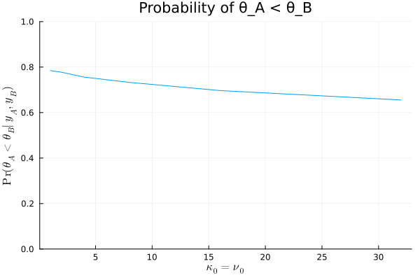

#+TITLE: Exercise 5.2 Solution Example - Hoff, A First Course in Bayesian Statistical Methods
#+SUBTITLE: 標準ベイズ統計学 演習問題 5.2 解答例
#+SETUPFILE: ../setup.org
#+STARTUP:showeverything
* question :noexport:
Sensitivity analysis:
Thirty-two students in a science classroom were randomly assigned to one of two study methods,
A and B,
so that \(n_A = n_B = 16\) students were assigned to each method.
After several weeks of study, students were examined on the course material with an exam designed to give an average score of 75 with an exam designed to give an average score of 75 with a standard deviation of 10.
The scores for  the two groups are summarized by
\(\{\bar{y}_A = 75.2, s_A = 7.3\}\) and \(\{\bar{y}_B = 77.5, s_B = 8.1\}\).
Consider independent, conjugate normal prior distributions for each of \(\theta_A\) and \(\theta_B\),
with \(\mu_0 = 75\) and \(\sigma_0^2 = 100\) for both groups.
For each
\((\kappa_0, \nu_0) \in \{ (1,1), (2.2), (4,4), (8,8), (16, 16), (32,32)\}\)
(or more values), obtain
Pr(\(\theta_A < \theta_B | \boldsymbol{y}_A , \boldsymbol{y}_B\))
via Monte Carlo sampling.
Plot this probability as a function of \(\kappa_0 = \nu_0\).
Describe how you might use this plot to convey the evidence that
\(\theta_A < \theta_B\) to people of a variety of prior opinions.
* answer
#+begin_src julia :exports code
μ₀ = 75
σ₀² = 100

# %%
n_A = 16
n_B = 16

ȳ_A = 75.2
ȳ_B = 77.5

s_A = 7.3
s_B = 8.1

calc_μn = (n, ȳ, μ₀, κ₀) -> (κ₀ * μ₀ + n * ȳ) / (κ₀ + n)
calc_σ²n = (n, ȳ, s², σ₀², κ₀, ν₀) -> (ν₀ * σ₀² + (n-1) * s² + (κ₀ * n * (ȳ - μ₀)^2) / (κ₀ + n)) / (ν₀ + n)

function calc_posterior_param(n, ȳ, s², μ₀, σ₀², κ₀, ν₀)
    κn = κ₀ + n
    νn = ν₀ + n
    μn =  (κ₀ * μ₀ + n * ȳ) / κn
    σ²n = (ν₀ * σ₀² + (n-1) * s² + (κ₀ * n * (ȳ - μ₀)^2)/ κn ) / νn

    return κn, νn, μn, σ²n
end

function calc_mc(n, ȳ, s², μ₀, σ₀², κ₀, ν₀, n_mc)
    κn, νn, μn, σ²n = calc_posterior_param(n, ȳ, s², μ₀, σ₀², κ₀, ν₀)
    dist_inverse_σ² = Gamma(νn/2, 2/(νn * σ²n))
    σ²_mc = rand(dist_inverse_σ², n_mc) .^ -1

    calc_θ_mc = σ² -> rand(Normal(μn, sqrt(σ²/κn)))
    θ_mc = calc_θ_mc.(σ²_mc)

    return θ_mc, sqrt.(σ²_mc)
end

m = 10000
prob_A_lt_B = []
for k in [2^i for i in 0:5]
    κ₀, ν₀ = k, k
    θ_mc_A, σ_mc_A = calc_mc(n_A, ȳ_A, s_A^2, μ₀, σ₀², κ₀, ν₀, m)
    θ_mc_B, σ_mc_B = calc_mc(n_B, ȳ_B, s_B^2, μ₀, σ₀², κ₀, ν₀, m)

    prob = mean(θ_mc_A .< θ_mc_B)
    push!(prob_A_lt_B, prob)
end
#+end_src

#+begin_src julia :exports none
fig = plot(
    [2^i for i in 0:5], prob_A_lt_B,
    xlabel = L"\kappa_0 = \nu_0",
    ylabel = L"\Pr(\theta_A < \theta_B | y_A , y_B)",
    legend = false,
    title = "Probability of θ_A < θ_B",
    ylims = (0, 1),
)
#+end_src

#+ATTR_HTML: :width 600

prior のパラメータ \(\kappa_0, \nu_0\) を大きくとるほど、
事後分布に対するデータの影響が相対的に小さくなり、
\(\theta_A < \theta_B\)の事後確率は減少していることがわかるが、同時に
\(\kappa_0, \nu_0\)の値を上の範囲でいくら変えても、
\(\theta_A < \theta_B\)の確率は 70%程度であることがいえる。

* nav :ignore:
#+ATTR_HTML: :class nav-prev
[[./5-1.org][5.1]]

#+ATTR_HTML: :class nav-next
[[./5-3.org][5.3]]
