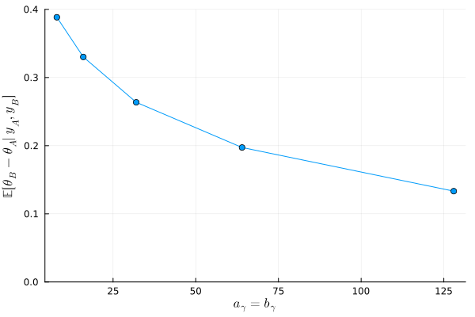

#+TITLE: Exercise 6.1 Solution Example - Hoff, A First Course in Bayesian Statistical Methods
#+SUBTITLE: 標準ベイズ統計学 演習問題 6.1 解答例
#+SETUPFILE: ../setup.org
#+STARTUP:showeverything
* Question :noexport:
Poisson population comparisons:
Let's reconsider the number of children data of [[../ch4/4-8.org][Exercise 4.8]].
We'll assume Poisson sampling models for the two groups as before, but now we'll parameterize \(\theta_A\) and \(\theta_B\) as
\(\theta_A = \theta, \theta_B = \theta \times \gamma\).
In this parameterization, \(\gamma\) represents the relative rate \(\frac{\theta_B}{\theta_A}\).
Let \(\theta \sim \text{gamma}(a_{\theta}, b_{\theta})\) and
let \(\gamma \sim \text{gamma}(a_{\gamma}, b_{\gamma})\).
* a) :ask:
** Question :noexport:
Are \(\theta_A\) and \(\theta_B\) independent or dependent under this prior distribution?
In what situations is such a joint prior distribution justified?
** answer

\begin{align*}
E[\theta_A \theta_B]
&= E[\theta \theta \gamma] \\
&= E[\theta^2] E[\gamma] \quad (\because \theta \perp\kern-5pt\perp \gamma)\\
&= \frac{(a_{\theta} + 1) a_{\theta}}{b_{\theta}^2} \times \frac{a_{\gamma}}{b_{\gamma}} \\
\\
E[\theta_A] E[\theta_B]
&= E[\theta] E[\theta \gamma] \\
&= E[\theta] E[\theta] E[\gamma] \quad (\because \theta \perp\kern-5pt\perp \gamma)\\
&= \frac{a_{\theta}^2 }{b_{\theta}^2} \times \frac{a_{\gamma}}{b_{\gamma}} \\
\end{align*}

より、
\[ E[\theta_A \theta_B] \neq E[\theta_A] E[\theta_B] \]
となるが、
もし\(\theta_A\)と\(\theta_B\)が独立ならば、
\( E[\theta_A \theta_B] = E[\theta_A] E[\theta_B] \)
が成り立つはずである。
よって、\(\theta_A\)と\(\theta_B\)は独立ではない。

(From this, we have
\[ E[\theta_A \theta_B] \neq E[\theta_A] E[\theta_B] \]
However, if \(\theta_A\) and \(\theta_B\) were independent, then
\( E[\theta_A \theta_B] = E[\theta_A] E[\theta_B] \)
should hold.
Therefore, \(\theta_A\) and \(\theta_B\) are not independent.)

また、このような同時事前分布の設定は、B群の一人当たりの子供の数が A 群の一人当たりの子供の数の実数倍であるという事前の信念がある時に正当化される。

(Furthermore, setting the joint prior distribution in this manner is justified when there is a prior belief that the number of children per person in Group B is some real-valued multiple of the number of children per person in Group A.)

* b)
** Question :noexport:
Obtain the form of the full conditional distribution of \(\theta \) given
\(\boldsymbol{y}_A\), \(\boldsymbol{y}_B\) and \(\gamma\).
** answer

\begin{align*}
p(\theta | \boldsymbol{y}_A, \boldsymbol{y}_B, \gamma)
&\propto p( \boldsymbol{y}_A , \boldsymbol{y}_B, \theta, \gamma) \\
&= p( \boldsymbol{y}_A \boldsymbol{y}_B | \theta, \gamma) p(\theta , \gamma) \\
&\propto p( \boldsymbol{y}_A | \theta) p( \boldsymbol{y}_B | \theta, \gamma) p(\theta) \\
&\propto \theta^{ \sum y_{A,i} } \exp \left( - n_A \theta \right)
\times (\theta \gamma)^{ \sum y_{B,i} } \exp \left( - n_B \theta \gamma \right) \\
&\qquad \times \theta^{a_{\theta} - 1} \exp \left( - b_{\theta} \theta \right)  \\
&\propto \theta^{ a_{\theta} + n_A \bar{y}_A + n_B \bar{y}_B - 1 }
\times \exp \left( - \theta (b_{\theta} + n_A + n_B \gamma) \right) \\
&\propto \text{dgamma}( \theta, a_{\theta} + n_A \bar{y}_A + n_B \bar{y}_B, b_{\theta} + n_A + n_B \gamma )
\end{align*}
* c)
** Question :noexport:
Obtain the form of the full conditional distribution of \(\gamma \) given \(\boldsymbol{y}_A\), \(\boldsymbol{y}_B\) and \(\theta\).
** answer

\begin{align*}
p(\gamma | \boldsymbol{y}_A, \boldsymbol{y}_B, \theta)
&\propto p( \boldsymbol{y}_A , \boldsymbol{y}_B, \theta, \gamma) \\
&= p( \boldsymbol{y}_A \boldsymbol{y}_B | \theta, \gamma) p(\theta , \gamma) \\
&\propto p( \boldsymbol{y}_B | \theta, \gamma) p(\gamma) \\
&\propto (\theta \gamma)^{ \sum y_{B,i} } \exp \left( - n_B \theta \gamma \right) \times \gamma^{a_{\gamma} - 1} \exp \left( - b_{\gamma} \gamma \right) \\
&\propto \gamma^{ a_{\gamma} + n_B \bar{y}_B - 1 }
\times \exp \left( - \gamma (b_{\gamma} + n_B \theta) \right) \\
&\propto \text{dgamma}( \gamma, a_{\gamma} + n_B \bar{y}_B, b_{\gamma} + n_B \theta )
\end{align*}
* d)
** Question :noexport:
Set \(a_{\theta} = 2\) and \(b_{\theta} = 1\).
Let \(a_{\gamma} = b_{\gamma} \in \{ 8, 16, 32, 64, 128 \}\).
For each of these five values, run a Gibbs sampler of at least 5,000 iterations and obtain \(E[\theta_B - \theta_A | \boldsymbol{y}_A, \boldsymbol{y}_B ]\).
Describe the effects of the prior distribution for \(\gamma\) on the results.
** answer
#+begin_src julia :export both
menchild_bach = []
open("../../Exercises/menchild30bach.dat") do file
    for line in eachline(file)
        append!(menchild_bach, parse.(Int, split(line)))
    end
end

menchild_nobach = []
open("../../Exercises/menchild30nobach.dat") do file
    for line in eachline(file)
        append!(menchild_nobach, parse.(Int, split(line)))
    end
end

a_θ = 2
b_θ = 1
γ_prior_param = [ 2^i for i in 3:7 ]

function get_θ_diff(y_A, y_B, a_θ, b_θ, a_γ, b_γ, S)
    sy_A = sum(y_A)
    n_A = length(y_A)
    mean_A = mean(y_A)

    sy_B = sum(y_B)
    n_B = length(y_B)
    mean_B = mean(y_B)

    θ = Vector{Float64}(undef, S)
    θ[1] = t = mean_A
    γ = Vector{Float64}(undef, S)
    γ[1] = g = mean_B/mean_A

    for s in 2:S
        dist_θ = Gamma(a_θ + sy_A + sy_B, 1/(b_θ + n_A + n_B * g))
        t = rand(dist_θ)

        dist_γ = Gamma(a_γ + sy_B, 1/(b_γ + n_B * t))
        g = rand(dist_γ)

        θ[s] = t
        γ[s] = g
    end
    θ_A_mc = θ
    θ_B_mc = θ .* γ
    return mean(θ_B_mc .- θ_A_mc)
end

function θ_diff_by_p(p, S)
    get_θ_diff(menchild_bach, menchild_nobach, a_θ, b_θ, p, p, S)
end

S = 5000
exp_diff = []
for p in γ_prior_param
    push!(exp_diff, θ_diff_by_p(p, S))
end

exp_diff
#+end_src

:RESULTS:
: 5-element Vector{Any}:
:  0.38839289030002194
:  0.3301515531279979
:  0.26360712597646224
:  0.1972987037901306
:  0.1332427833449685

#+begin_src julia :exports none
# plot
fig = plot(
    γ_prior_param, exp_diff,
    xlabel = L"a_\gamma = b_\gamma",
    ylabel = L"\mathbb{E}[\theta_B - \theta_A | y_A, y_B]",
    marker = :circle,
    ylims = (0, 0.4),
    legend = false,
)
#+end_src

#+ATTR_HTML: :width 600px

\( a_{\gamma} = b_{\gamma}\)に従うガンマ分布の期待値は 1 であり、この値が大きければ大きいほど\( \frac{\theta_B}{\theta_A} \)が 1
（すなわち、A群と B 群の子供の数の平均が等しい）
という事前の信念が強いことになる。
上のグラフからも、\(a_{\gamma} = b_{\gamma} \)が大きくなるにつれて、
データの影響が小さくなり、事後期待値の差が小さくなっていることがわかる。

(The expectation of a Gamma distribution with shape \(a_{\gamma}\) and rate \(b_{\gamma}\) where \( a_{\gamma} = b_{\gamma}\) is 1.
The larger this common value (\(a_{\gamma} = b_{\gamma}\)), the stronger the prior belief that \( \frac{\theta_B}{\theta_A} = 1 \) (i.e., that the mean number of children in Group A and Group B are equal).
From the graph above, it can also be seen that as \(a_{\gamma} = b_{\gamma} \) increases, the influence of the data decreases, and the difference between the posterior expectations becomes smaller.)

* nav :ignore:
#+ATTR_HTML: :class nav-prev
[[../ch5/5-5.org][5.5]]

#+ATTR_HTML: :class nav-next
[[./6-2.org][6.2]]
