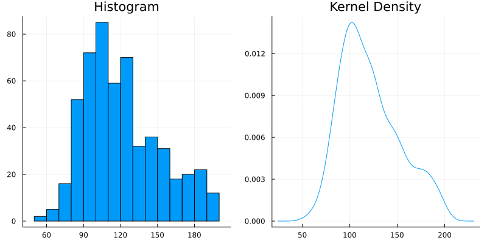
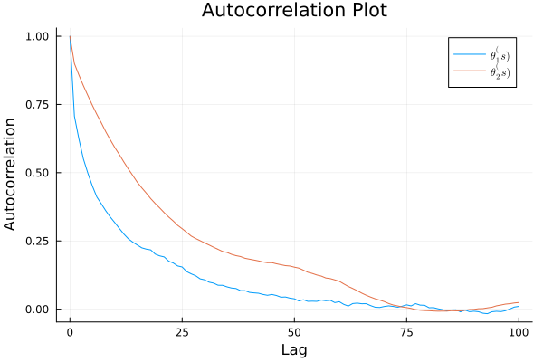
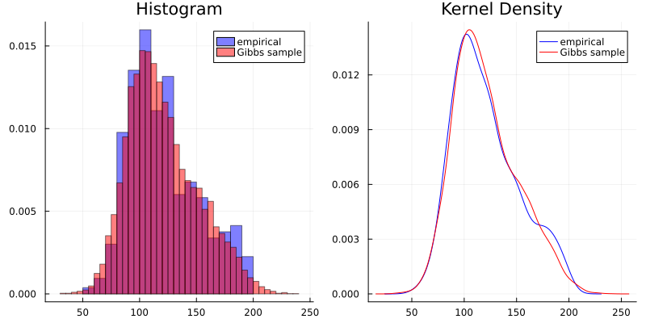

#+TITLE: 6.2
#+INCLUDE: setup.org
#+STARTUP:showeverything
* Question :noexport:
Mixture model:
The file ~glucose.dat~ contains the plasma glucose concentrations of 532 females from a study on diabetes (see Exercise 7.6).
* a)
** Question :noexport:
Make a histogram or kernel density estimate of the data.
Describe how this empirical distribution deviates from the shape of a normal distribution.
** answer

#+begin_src julia :exports none
data = readdlm("../../Exercises/glucose.dat") |> vec

p1 = histogram(data, label = false, title = "Histogram")
p2 = density(data, label = false, title = "Kernel Density")
fig = plot(p1, p2, layout = (1, 2), size = (800, 400), legend = false)
fig
#+end_src

#+ATTR_HTML: :width 600

上のヒストグラム及び kernel density のプロットは、左右非対称で右裾が長いという点で、正規分布の形から逸脱している。

The histogram and kernel density plot above deviate from the shape of a normal distribution in that they are asymmetric and right-skewed (have a long right tail).

* b)
** Question :noexport:
Consider the following mixture model for these data:
For each participant there is an unobserved group membership variable \(X_i\) which is equal to 1 or 2 with probability \(p\) and \(1-p\).
If \(X_i = 1\) then \(Y_i \sim \text{normal}(\theta_1, \sigma_1^2)\), and if \(X_i = 2\) then \(Y_i \sim \text{normal}(\theta_2, \sigma_2^2)\).
Let \(p \sim \text{beta}(a, b)\), \(\theta_j \sim \text{normal}(\mu_0, \tau_0^2)\) and
\(\frac{1}{\sigma_j} \sim \text{gamma}(\frac{\nu_0}{2}, \frac{\nu_0 \sigma_0^2}{2})\) for both \(j = 1, 2\).
Obtain the full conditional distributions of
\(( X_1, \ldots, X_n ), p, \theta_1, \theta_2, \sigma_1 \) and \( \sigma_2 \).
** answer

The joint distribution can be written as follows.

\begin{equation}
\label{eq:6.2b-2}
\begin{aligned}[b]
&p( Y_1, \dots, Y_n, X_1, \dots, X_n, p, \theta_1, \theta_2, \sigma_1^2, \sigma_2^2) \\
= &p( Y_1, \dots, Y_n | X_1, \dots, X_n, p, \theta_1, \theta_2, \sigma_1^2, \sigma_2^2) \\
&\quad \times p( X_1, \dots, X_n, p, \theta_1, \theta_2, \sigma_1^2, \sigma_2^2) \\
= &p( Y_1, \dots, Y_n | X_1, \dots, X_n, p, \theta_1, \theta_2, \sigma_1^2, \sigma_2^2) \\
&\quad \times p(X_1, \dots, X_n | p) p(p) p(\theta_1) p(\theta_2) p(\sigma_1^2) p(\sigma_2^2) \\
= & \prod_{i=1}^n p(Y_i | X_i, \theta_1, \theta_2, \sigma_1^2, \sigma_2^2) \\
&\quad \times \prod_{i=1}^n p(X_i | p) \times p(p) \times p(\theta_1) \times p(\theta_2) \times p(\sigma_1^2) \times p(\sigma_2^2) \\
= & \prod_{i; X_i = 1} p(Y_i | X_i=1, \theta_1, \sigma_1^2) \times
\prod_{i; X_i = 2} p(Y_i | X_i=2, \theta_2, \sigma_2^2) \\
&\quad \times \prod_{i=1}^n p(X_i | p) \times p(p) \times p(\theta_1) \times p(\theta_2) \times p(\sigma_1^2) \times p(\sigma_2^2) \\
\end{aligned}
\end{equation}

Joint distribution for each \(i\) can be written as follows.

\begin{equation}
\label{eq:6.2b-1}
\begin{aligned}[b]
& p( Y_i, X_i, p, \theta_1, \theta_2, \sigma_1^2, \sigma_2^2) \\
= &p( Y_i | X_i, p, \theta_1, \theta_2, \sigma_1^2, \sigma_2^2)
p(X_i, p, \theta_1, \theta_2, \sigma_1^2, \sigma_2^2) \\
= &p( Y_i | X_i, p, \theta_1, \theta_2, \sigma_1^2, \sigma_2^2)
p(X_i | p) p(p) p(\theta_1) p(\theta_2) p(\sigma_1^2) p(\sigma_2^2) \\
\end{aligned}
\end{equation}

*** the full conditional distribution of \( (X_1, \dots, X_n)\)

\begin{align*}
& p(X_i = 1 | Y_i, p, \theta_1, \theta_2, \sigma_1^2, \sigma_2^2) \\
= & \frac{p(Y_i, X_i = 1, p, \theta_1, \theta_2, \sigma_1^2, \sigma_2^2) }{p(Y_i, p, \theta_1, \theta_2, \sigma_1^2, \sigma_2^2)} \\
= & \frac{p(Y_i | X_i = 1, p, \theta_1, \theta_2, \sigma_1^2, \sigma_2^2) p(X_i = 1 | p)}{p(Y_i | X_i = 1, p, \theta_1, \theta_2, \sigma_1^2, \sigma_2^2) p(X_i = 1 | p) + p(Y_i | X_i = 2, p, \theta_1, \theta_2, \sigma_1^2, \sigma_2^2) p(X_i = 2 | p)} \\
= & \frac{p(Y_i| X_i = 1, \theta_1, \sigma_1^2) \times p}{p(Y_i| X_i = 1, \theta_1, \sigma_1^2) \times p + p(Y_i| X_i = 2, \theta_2, \sigma_2^2) \times (1 - p)} \\
= & \frac{ p \times \text{dnorm}(Y_i, \theta_1, \sigma_1) }{ p \times \text{dnorm}(Y_i, \theta_1, \sigma_1) + (1 - p) \times \text{dnorm}(Y_i, \theta_2, \sigma_2) } \\
\end{align*}

同様にして、

\begin{align*}
& p(X_i = 2 | Y_i, p, \theta_1, \theta_2, \sigma_1^2, \sigma_2^2) \\
= & \frac{p \times \text{dnorm}(Y_i, \theta_2, \sigma_2) }{ p \times \text{dnorm}(Y_i, \theta_1, \sigma_1) + (1 - p) \times \text{dnorm}(Y_i, \theta_2, \sigma_2) } \\
\end{align*}

従って、

\begin{align*}
& p( X_1, \dots, X_n | Y_1, \dots, Y_n p, \theta_1, \theta_2, \sigma_1^2,
\sigma_2^2) \\
= & \prod_{i=1}^n p( X_i | Y_i, \theta_1, \theta_2, \sigma_1^2) \\
= & \prod_{i, X_i = 1} p(X_i = 1 | Y_i, p, \theta_1, \theta_2, \sigma_1^2, \sigma_2^2) \times \prod_{i, X_i = 2} p(X_i = 2 | Y_i, p, \theta_1, \theta_2, \sigma_1^2, \sigma_2^2) \\
= & \prod_{i, X_i = 1} \frac{ p \times \text{dnorm}(Y_i, \theta_1, \sigma_1) }{ p \times \text{dnorm}(Y_i, \theta_1, \sigma_1) + (1 - p) \times \text{dnorm}(Y_i, \theta_2, \sigma_2) } \\
& \quad\times \prod_{i, X_i = 2} \frac{p \times \text{dnorm}(Y_i, \theta_2, \sigma_2) }{ p \times \text{dnorm}(Y_i, \theta_1, \sigma_1) + (1 - p) \times \text{dnorm}(Y_i, \theta_2, \sigma_2) } \\
\end{align*}

*** the full conditional distribution of \(p\)

\begin{align*}
& p(p | Y_1, \dots, Y_n, X_1, \dots, X_n, \theta_1, \theta_2, \sigma_1^2, \sigma_2^2) \\
\propto & p( Y_1, \dots, Y_n, X_1, \dots, X_n, p, \theta_1, \theta_2, \sigma_1^2,
\sigma_2^2) \\
\propto & \prod_{i=1}^n p(X_i | p) \times p(p)
\quad (\because \eqref{eq:6.2b-2}) \\
\propto & p^{\sum (2 - X_i)} (1 - p)^{\sum (X_i - 1)} \times p^{a - 1} (1 - p)^{b - 1} \\
\propto & p^{\sum (2 - X_i) + a - 1} (1 - p)^{\sum (X_i - 1) + b -1} \\
\propto & \text{dbeta}(p, \sum (2 - X_i) + a, \sum (X_i - 1) + b) \\
\end{align*}

*** the full conditional distribution of \(\theta_1\)

\begin{align*}
& p(\theta_1 | Y_1, \dots, Y_n, X_1, \dots, X_n, p, \theta_2, \sigma_1^2, \sigma_2^2) \\
\propto & p( Y_1, \dots, Y_n, X_1, \dots, X_n, p, \theta_1, \theta_2, \sigma_1^2, \sigma_2^2) \\
\propto & \prod_{i; X_i = 1} p(Y_i | X_i =1, \theta_1,
\sigma_1^2)
\times p(\theta_1)
\quad (\because \eqref{eq:6.2b-2}) \\
\propto & \prod_{i; X_i = 1} \exp \left\{ - \frac{1}{2 \sigma_1^2} \left( Y_i - \theta_1 \right)^2 \right\}
\times \exp \left\{ - \frac{1}{2 \tau_0^2} \left( \theta_1 - \mu_0 \right)^2 \right\} \\
= & \exp \left\{ - \frac{1}{2 \sigma_1^2} \sum_{i; X_i = 1} \left( Y_i - \theta_1 \right)^2 \right\}
\times \exp \left\{ - \frac{1}{2 \tau_0^2} \left( \theta_1 - \mu_0 \right)^2 \right\} \\
\propto & \text{dnormal}(\theta_1, \mu_1, \tau_1),
\quad \text{ where } \\
& \mu_1 = \frac{\frac{1}{\tau_0^2} \mu_0 + \frac{n_1}{\sigma_1^2} \bar{Y}_1}{\frac{1}{\tau_0^2} + \frac{n_1}{\sigma_1^2}},
\quad  \tau_1^2 = \left( \frac{1}{\tau_0^2} + \frac{n_1}{\sigma_1^2} \right)^{-1} \\
\end{align*}

なお、最後の式変形は教科書 p.70 を参照。

*** the full conditional distribution of \(\theta_2\)

\(\theta_2\)についても同様に計算すると、
\begin{align*}
& p(\theta_2 | Y_1, \dots, Y_n, X_1, \dots, X_n, p, \theta_1, \sigma_1^2, \sigma_2^2) \\
\propto & \text{dnormal}(\theta_2, \mu_2, \tau_2),
\quad \text{ where } \\
& \mu_2 = \frac{\frac{1}{\tau_0^2} \mu_0 + \frac{n_2}{\sigma_2^2} \bar{Y}_2}{\frac{1}{\tau_0^2} + \frac{n_2}{\sigma_2^2}},
\quad  \tau_2^2 = \left( \frac{1}{\tau_0^2} + \frac{n_2}{\sigma_2^2} \right)^{-1} \\
\end{align*}
*** the full conditional distribution of \(\sigma_1^2\)

\begin{align*}
& p(\sigma_1^2 | Y_1, \dots, Y_n, X_1, \dots, X_n, p, \theta_1, \theta_2, \sigma_2^2) \\
\propto & p( Y_1, \dots, Y_n, X_1, \dots, X_n, p, \theta_1, \theta_2, \sigma_1^2, \sigma_2^2) \\
\propto & \prod_{i; X_i = 1} p(Y_i | X_i =1, \theta_1, \sigma_1^2) \times p(\sigma_1^2)
\quad (\because \eqref{eq:6.2b-2}) \\
\propto & \prod_{i; X_i = 1} (\sigma_1^2)^{ - \frac{1}{2} } \exp \left\{ - \frac{1}{2 \sigma_1^2} \left( Y_i - \theta_1 \right)^2 \right\}
\times \sigma_1^{- ( \frac{\nu_0}{2} + 1 )} \exp \left\{ - \frac{\nu_0 \sigma_0^2}{2 \sigma_1^2} \right\} \\
\propto & (\sigma_1^2)^{- ( \frac{\nu_0 + n_1}{2} + 1 )} \exp \left\{ - \frac{1}{2 \sigma_1^2} \left( \nu_0 \sigma_0^2 + \sum_{i; X_i = 1} \left( Y_i - \theta_1 \right)^2 \right) \right\} \\
\propto & \text{dinverse-gamma}(\sigma_1^2, \frac{\nu_1}{2}, \frac{\nu_1 \sigma_1^2(\theta_1)}{2}),
\quad \text{ where } \\
& \nu_1 = \nu_0 + n_1, \\
& \sigma_1^2(\theta_1) = \frac{1}{\nu_1} [ \nu_0 \sigma_0^2 + n_1 s_1^2(\theta_1) ] \\
\end{align*}

*** the full conditional distribution of \(\sigma_2^2\)

\(\sigma_2^2\)についても同様に計算すると、
\begin{align*}
& p(\sigma_2^2 | Y_1, \dots, Y_n, X_1, \dots, X_n, p, \theta_1, \theta_2, \sigma_1^2) \\
\propto & \text{dinverse-gamma}(\sigma_2^2, \frac{\nu_2}{2}, \frac{\nu_2 \sigma_2^2(\theta_2)}{2}),
\quad \text{ where } \\
& \nu_2 = \nu_0 + n_2, \\
& \sigma_2^2(\theta_2) = \frac{1}{\nu_2} [ \nu_0 \sigma_0^2 + n_2 s_2^2(\theta_2) ] \\
\end{align*}

* c)
** Question :noexport:
Setting \(a = b = 1, \mu_0 = 120, \tau_0^2 = 200, \sigma_0^2 = 1000\) and \(\nu_0 = 10\),
implement the Gibbs sampler for at least 10,000 iterations.
Let \(\theta_{(1)}^{(s)} = \min \{ \theta_1^{(s)}, \theta_2^{(s)}\}\) and
\(\theta_{(2)}^{(s)} = \max \{ \theta_1^{(s)}, \theta_2^{(s)}\}\).
Compute and plot the autocorrelation function of \(\theta_{(1)}^{(s)}\) and \(\theta_{(2)}^{(s)}\),
as well as their effective sample sizes.
** Answer

#+begin_src julia :exports code
a = b = 1
μ₀ = 120
τ₀² = 200
σ₀² = 1000
ν₀ = 10
S = 10000

# %%
function rand_X(y, p, θ₁, θ₂, σ₁², σ₂²)

    # probability of Xi = 1
    function bin_prob(yi, p, θ₁, θ₂, σ₁², σ₂²)
        p1 = p * pdf(Normal(θ₁, sqrt(σ₁²)), yi)
        p2 = (1 - p) * pdf(Normal(θ₂, sqrt(σ₂²)), yi)
        prob = p1/(p1 + p2)
    end

    n = length(y)
    X = Vector{Float64}(undef, n)
    for i in 1:n
        X[i] =  2 - rand(Bernoulli(bin_prob(y[i], p, θ₁, θ₂, σ₁², σ₂²)))
    end

    return X
end
# %%
function rand_p(X, a, b)
    n1 = sum(X .== 1)
    n2 = sum(X .== 2)
    return rand(Beta(a + n1, b + n2))
end

# %%
function rand_θ(μ₀, τ₀², σ², y)
    n = length(y)
    ȳ = mean(y)
    μn = (μ₀/τ₀² + ȳ * n/σ²) / (1/τ₀² + n/σ²)
    τn² = 1/(1/τ₀² + n/σ²)
    return rand(Normal(μn, sqrt(τn²)))
end

# %%
function rand_σ²(θ, ν₀, σ₀², y)
    n = length(y)
    ȳ = mean(y)
    s² = var(y)
    ns² = (n-1) * s² + n * (ȳ - θ)^2
    νn = ν₀ + n
    σn² = (ν₀ * σ₀² + ns²)/νn
    α = νn/2
    β = νn * σn²/2
    return 1/rand(Gamma(α, 1/β))
end

# %%
mean_y = mean(data)
var_y = var(data)

# %%
# Gibbs Sampler

THETA = Matrix{Float64}(undef, S, 2)
SIGMA = Matrix{Float64}(undef, S, 2)
P = []
X_MC = Matrix{Int}(undef, S, length(data))

# starting values
θ₁ = θ₂ = mean_y
σ₁² = σ₂² = var_y
p = 0.5

for s in 1:S
    X_MC[s, :] = rand_X(data, p, θ₁, θ₂, σ₁², σ₂²)
    p = rand_p(X_MC[s, :], a, b)
    θ₁ = rand_θ(μ₀, τ₀², σ₁², data[X_MC[s, :] .== 1])
    θ₂ = rand_θ(μ₀, τ₀², σ₂², data[X_MC[s, :] .== 2])
    σ₁² = rand_σ²(θ₁, ν₀, σ₀², data[X_MC[s, :] .== 1])
    σ₂² = rand_σ²(θ₂, ν₀, σ₀², data[X_MC[s, :] .== 2])
    THETA[s, :] = [θ₁, θ₂]
    SIGMA[s, :] = [σ₁², σ₂²]
    push!(P, p)
    if s % 1000 == 0
        println("Iteration: $s done")
    end
end

# %%
# get smaller one for each row
THETA1 = mapslices(minimum, THETA, dims = 2)
THETA2 = mapslices(maximum, THETA, dims = 2)

# %%
# autocorrelation plot
lags = 0:100
fig = plot(
    lags, autocor(THETA1, lags), label = L"\theta_1^(s)",
    xlabel = "Lag", ylabel = "Autocorrelation", title = "Autocorrelation Plot"
)
fig = plot!(
    lags, autocor(THETA2, lags), label = L"\theta_2^(s)",
)
fig
#+end_src

#+ATTR_HTML: :width 600

#+begin_src julia :exports both
ess(Chains([THETA1 THETA2]))
#+end_src

#+RESULTS:
: ESS
:   parameters        ess      rhat
:       Symbol    Float64   Float64
:
:      param_1   464.2489    1.0002
:      param_2   238.5754    1.0000
* d)
** Question :noexport:
For each iteration \(s\), of the Gibbs sampler, sample a value
\(x \sim \text{binary}(p^{(s)}) \),
then sample \(\tilde{Y}^{(s)} \sim \text{normal}(\theta_x^{(s)}, \sigma_x^{2(s)})\).
Plot a histogram or kernel density estimate for the empirical distribution of
\( \tilde{Y}^{(1)}, \ldots, \tilde{Y}^{(S)} \),
and compare to the distribution in part a).
Discuss the adequacy of this two component mixture model for the glucose data.
** Answer

#+begin_src julia :exports code
# sample y function
function rand_y(p, θ₁, θ₂, σ₁², σ₂²)
    x = 2 - rand(Bernoulli(p))
    if x == 1
        return rand(Normal(θ₁, sqrt(σ₁²)))
    else
        return rand(Normal(θ₂, sqrt(σ₂²)))
    end
end

# %%
# Gibbs Sampler

THETA = Matrix{Float64}(undef, S, 2)
SIGMA = Matrix{Float64}(undef, S, 2)
P = []
X_MC = Matrix{Int}(undef, S, length(data))
Y = []

# starting values
θ₁ = θ₂ = mean_y
σ₁² = σ₂² = var_y
p = 0.5

for s in 1:S
    X_MC[s, :] = rand_X(data, p, θ₁, θ₂, σ₁², σ₂²)
    if s % 1000 == 0
        println("Iteration: $s")
        tmp = X_MC[s, :]
        println(sum(tmp .== 1),", ", sum(tmp .== 2))
    end
    p = rand_p(X_MC[s, :], a, b)
    θ₁ = rand_θ(μ₀, τ₀², σ₁², data[X_MC[s, :] .== 1])
    θ₂ = rand_θ(μ₀, τ₀², σ₂², data[X_MC[s, :] .== 2])
    σ₁² = rand_σ²(θ₁, ν₀, σ₀², data[X_MC[s, :] .== 1])
    σ₂² = rand_σ²(θ₂, ν₀, σ₀², data[X_MC[s, :] .== 2])
    THETA[s, :] = [θ₁, θ₂]
    SIGMA[s, :] = [σ₁², σ₂²]
    push!(P, p)

    # sample y
    y = rand_y(p, θ₁, θ₂, σ₁², σ₂²)
    push!(Y, y)
end
#+end_src

#+begin_src julia :exports none
hist = histogram(data, label = "empirical", title = "Histogram", color = :blue, normed = true, opacity = 0.5)
hist = histogram!(hist, Y, label = "Gibbs sample", title = "Histogram", color = :red, normed = true, opacity = 0.5)
kd = density(data, label = "empirical", title = "Kernel Density", color = :blue)
kd = density!(kd,Y, label = "Gibbs sample", title = "Kernel Density", color = :red)
fig = plot(hist, kd, layout = (1, 2), size = (800, 400))
fig
#+end_src

#+ATTR_HTML: :width 600

このモデルは、データの分布を割とうまく近似できてるんちゃうん。
(I think this model can approximate the data distribution well.)

* nav :ignore:
#+ATTR_HTML: :class nav-prev
[[./6-1.org][6.1]]

#+ATTR_HTML: :class nav-next
[[./6-3.org][6.3]]
