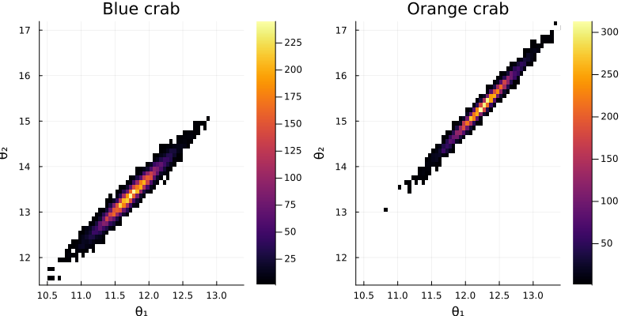
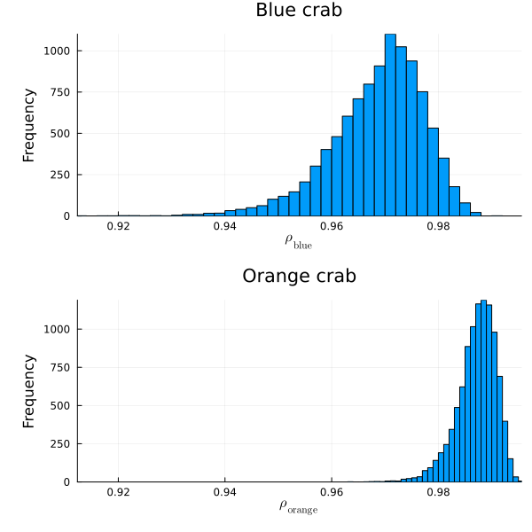

#+TITLE: Exercise 7.3 Solution - Hoff, A First Course in Bayesian Statistical Methods
#+SUBTITLE: 標準ベイズ統計学 演習問題 7.3 解答例
#+SETUPFILE: ../setup.org
#+STARTUP:showeverything
* Question :noexport:
Australian crab data:
The files ~bluecrab.dat~ and ~orangecrab.dat~ contain measurements of body depth \((Y_1)\) and rear width \((Y_2)\), in millimeters,
made on 50 male crabs from each of two species, blue and orange.
We will model these data using a bivariate normal distribution.
* a)
** Question :noexport:
For each of the two species, obtain posterior distributions of the population mean \(\boldsymbol{\theta}\) and covariance matrix \(\Sigma\) as follows:
Using the semi-conjugate prior distributions for \(\boldsymbol{\theta}\) and \(\Sigma\),
set \(\boldsymbol{\mu}_0\) equal to the sample mean of the data,
\(\Lambda_0\) and \(\boldsymbol{S}_0\) equal to the sample covariance matrix and
\(\nu_0 = 4\).
Obtain 10,000 posterior samples of \(\boldsymbol{\theta}\) and \(\Sigma\).
Note that this "prior" distribution loosely centers the parameters around empirical estimates based on the observed data (and is very similar to the unit information prior described in the previous exercise).
It cannot be considered as our true prior distribution, as it was derived from the observed data.
However, it can be roughly considered as the prior distribution of someone with weak but unbiased information.
** Answer
#+BEGIN_SRC julia :eval no-export :exports code :results silent :wrap "SRC julia :eval never"
import Pkg; Pkg.activate("..")
using DelimitedFiles
using Distributions
using LinearAlgebra
using StatsBase

bluecrab = readdlm("../../Exercises/bluecrab.dat")
orangecrap = readdlm("../../Exercises/orangecrab.dat")

μ_blue = mean(bluecrab, dims=1) |> vec
μ_orange = mean(orangecrap, dims=1) |> vec

Λ_blue = S_blue = cov(bluecrab)
Λ_orange = S_orange = cov(orangecrap)

ν₀ = 4

# Gibbs sampler
function bivariate_gibbs(S, Σ_init, μ₀, Λ₀, S₀, ν₀, Y)
    THETA = Matrix{Float64}(undef, S, 2)
    SIGMA = Matrix{Float64}(undef, S, 4)
    n = size(Y, 1)
    Σ = Σ_init
    ȳ = mean(Y, dims=1) |> vec
    for s in 1:S
        # update θ
        Λn = inv( inv(Λ₀) + n * inv(Σ) )
        μn = Λn * ( inv(Λ₀) * μ₀ + n * inv(Σ) * ȳ ) |> vec
        dist = MvNormal(μn, Symmetric(Λn))
        θ = rand(dist)

        # update Σ
        Sn = S₀ + (Y' .- θ) * (Y' .- θ)'
        Σ = rand(InverseWishart(n + ν₀, Sn))

        # save results
        THETA[s, :] = vec(θ)
        SIGMA[s, :] = vec(Σ)
    end
    return THETA, SIGMA
end

S = 10000
# Blue crab
THETA_blue, SIGMA_blue = bivariate_gibbs(S, Λ_blue, μ_blue, Λ_blue, S_blue, ν₀, bluecrab)
# Orange crab
THETA_orange, SIGMA_orange = bivariate_gibbs(S, Λ_orange, μ_orange, Λ_orange, S_orange, ν₀, orangecrap)
#+end_src
* b)
** Question :noexport:
Plot values of \(\boldsymbol{\theta} = (\theta_1, \theta_2)'\) for each group and cmpare.
Describe any size differences between the two groups.
** Answer
#+begin_src julia :exports none
using Plots
using StatsPlots

# plot posterior distribution of θ
θ₁_max = maximum([maximum(THETA_blue[:, 1]), maximum(THETA_orange[:, 1])])
θ₂_max = maximum([maximum(THETA_blue[:, 2]), maximum(THETA_orange[:, 2])])
θ₁_min = minimum([minimum(THETA_blue[:, 1]), minimum(THETA_orange[:, 1])])
θ₂_min = minimum([minimum(THETA_blue[:, 2]), minimum(THETA_orange[:, 2])])
blue_hist = histogram2d(
    THETA_blue[:, 1], THETA_blue[:, 2],
    nbins=50, title="Blue crab", xlabel="θ₁", ylabel="θ₂",
    xlims=(θ₁_min, θ₁_max), ylims=(θ₂_min, θ₂_max)
)
orange_hist = histogram2d(
    THETA_orange[:, 1], THETA_orange[:, 2],
    nbins=50, title="Orange crab", xlabel="θ₁", ylabel="θ₂",
    xlims=(θ₁_min, θ₁_max), ylims=(θ₂_min, θ₂_max)
)
fig = plot(blue_hist, orange_hist, layout=(1, 2), size=(800, 400))
#+end_src

#+ATTR_HTML: :width 600

- 両方の種で、\(\theta_1\) と \(\theta_2\) は正の相関を持つ。
  ( \(\theta_1\) and \(\theta_2\) have a positive correlation in both species.)
- orange crab の方が blue crab よりも幅、深さともに大きい。
  (Orange crab is larger in both width and depth than blue crab.)
* c)
** Question :noexport:
From each covariance matrix obtained from the Gibbs sampler,
obtain the corresponding correlation coefficient.
From these values, plot posterior densities of the correlation coefficients \(\rho_{ \text{blue} }\) and \(\rho_{ \text{orange} }\) for the two groups.
Evaluate differences between the two species by cmparing these posterior distributions.
In particular, obtain an approximation to
\(Pr(\rho_{ \text{blue} } \lt \rho_{ \text{orange} } | \boldsymbol{y}_{ \text{blue} }, \boldsymbol{y}_{ \text{orange} })\).
What do the results suggest about differences between the two populations?
** Answer
#+begin_src julia :results none :exports code
function get_pos_cor(SIGMA, p, S)
    COR = Array{Float64}(undef, p, p, S)
    for s in 1:S
        Sig = reshape(SIGMA[s, :], p, p)
        COR[:, :, s] = Sig ./ sqrt.(diag(Sig) * diag(Sig)')
    end
    return COR
end
p = bluecrab |> size |> last
COR_mc_blue = get_pos_cor(SIGMA_blue, p, S)
COR_mc_orange = get_pos_cor(SIGMA_orange, p, S)
#+end_src

#+begin_src julia :exports none
# plot posterior distribution of ρ
using Plots.PlotMeasures
ρ_max = maximum([maximum(COR_mc_blue[1, 2, :]), maximum(COR_mc_orange[1, 2, :])])
ρ_min = minimum([minimum(COR_mc_blue[1, 2, :]), minimum(COR_mc_orange[1, 2, :])])
blue_hist = histogram(
    COR_mc_blue[1, 2, :], nbins=50, title="Blue crab", xlabel=L"\rho_{\mathrm{blue}}", ylabel="Frequency",
    xlims=(ρ_min, ρ_max), left_margin=5mm, legend=false
)
orange_hist = histogram(
    COR_mc_orange[1, 2, :], nbins=50, title="Orange crab", xlabel=L"\rho_{\mathrm{orange}}", ylabel="Frequency",
    xlims=(ρ_min, ρ_max), left_margin=5mm, legend=false
)
fig = plot(blue_hist, orange_hist, layout=(2, 1), size=(600, 600))
#+end_src

#+ATTR_HTML: :width 600

#+begin_src julia :exports both
mean(COR_mc_blue[1, 2, :] .< COR_mc_orange[1, 2, :] )
#+end_src

#+RESULTS:
: 0.9893

- オレンジの方がブルーに比べて、幅と深さの相関が強い。
  (Orange crab has a higher correlation between width and depth than blue crab.)

* nav :ignore:
#+ATTR_HTML: :class nav-prev
[[./7-2.org][7.2]]

#+ATTR_HTML: :class nav-next
[[./7-4.org][7.4]]
