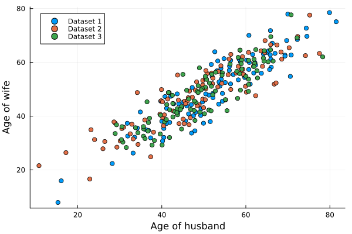
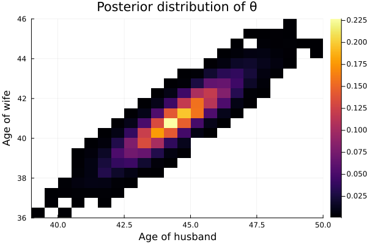
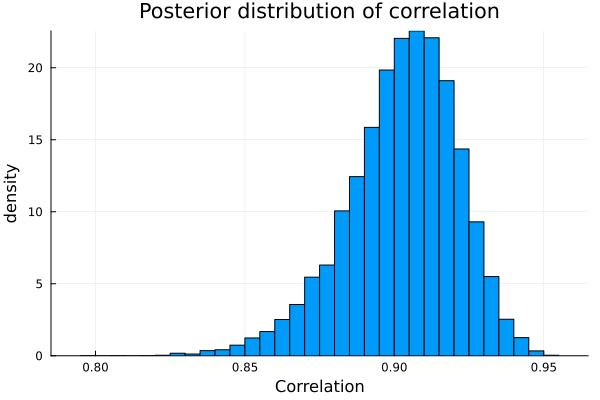
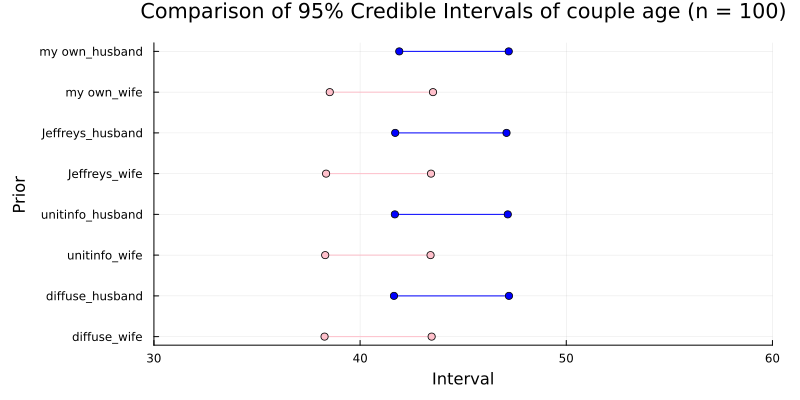
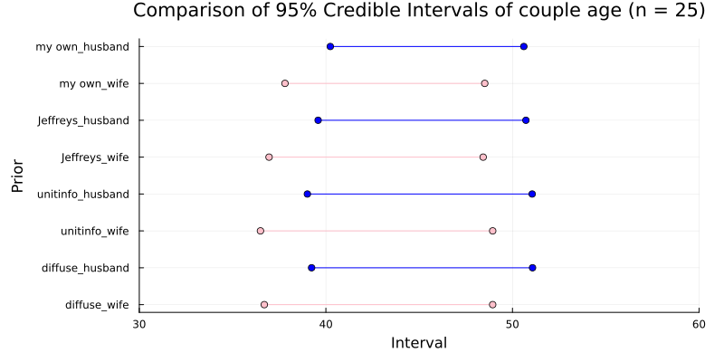
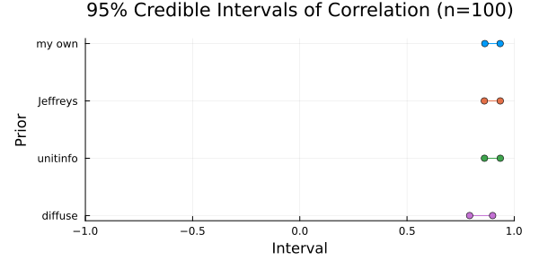
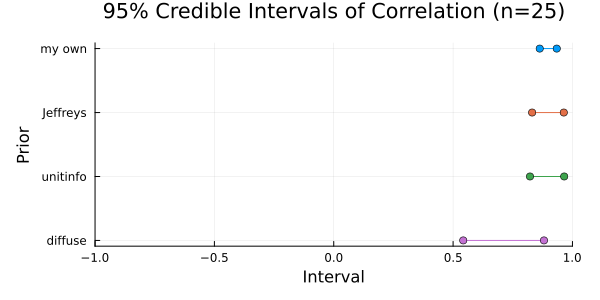

#+TITLE: Exercise 7.4 Solution - Hoff, A First Course in Bayesian Statistical Methods
#+SUBTITLE: 標準ベイズ統計学 演習問題 7.4 解答例
#+SETUPFILE: ../setup.org
#+STARTUP:showeverything
* Question :noexport:
Marriage data:
The file ~agehw.dat~ contains data on the ages of 100 married couples sampled from the U.S. population.
* a)
** Question :noexport:
Before you look at the data, use your knowledge to formulate a semiconjugate prior distribution for \(\boldsymbol{\theta} = (\theta_h, \theta_w)^T\) and \(\Sigma\),
where \(\theta_h, \theta_w\) are mean husband and wife ages, and \(\Sigma\) is the covariance matrix.
** Answer
自分のイメージでは、アメリカの平均的な夫婦の年齢は 50 歳くらいで、
やや女性の方が若いと思うので、\(\mu_h = 51, \mu_h = 49\) とする。
また、95%くらいで、25 歳から 75 歳くらいまでの範囲に収まると思うので、
\(\sigma_h = \sigma_w = 12.5\) とする。
夫婦の年齢の相関はかなり大きいイメージなので、0.9 になるように、
\begin{align*}
&0.9
= \frac{\sigma_{hw}}{\sigma_h \sigma_w}
= \frac{\sigma_{hw}}{12.5^2} \\
\iff &\sigma_{hw} = 0.9 \times 12.5^2 = 140.625
\end{align*}
と設定する。
まとめると、私の prior は以下のようになる。
\begin{align*}
\boldsymbol{\mu}_0 &= (51, 49)^T \\
\Lambda_0 &= \begin{pmatrix}
12.5^2 & 140.625 \\
140.625 & 12.5^2
\end{pmatrix} \\
\end{align*}

* b)
** Question :noexport:
Generate a /prior predictive dataset/ of size \(n = 100\), by sampling \((\boldsymbol{\theta}, \Sigma)\) from your prior distribution and then simulating
\(\boldsymbol{Y}_1, \ldots, \boldsymbol{Y}_n \sim \text{i.i.d. multivariate normal}(\boldsymbol{\theta}, \Sigma)\).
Generate several such datasets, make bivariate scatterplots for each dataset,
and make sure they roughly represent your prior beliefs about what such a dataset would actually look like.
If your prior predictive datasets do not conform to your beliefs, go back to part a) and formulate a new prior.
Report the prior that you eventually decide upon, and provide scatterplots for at least three prior predictive datasets.

** Answer
#+begin_src julia :results none :exports code
μ₀ = [51, 49]
Λ₀ = [
    12.5^2 140.625
    140.625 12.5^2
]

# %%
n = 100
prior_dist = MvNormal(μ₀, Λ₀)
dataset1 = rand(prior_dist, n)
dataset2 = rand(prior_dist, n)
dataset3 = rand(prior_dist, n)
#+end_src

#+begin_src julia :exports none
# plot the data
fig = scatter(
    dataset1[1, :], dataset1[2, :],
    label="Dataset 1",
    xlabel="Age of husband",
    ylabel="Age of wife",
    legend=:topleft
)
fig = scatter!(
    dataset2[1, :], dataset2[2, :],
    label="Dataset 2"
)
fig = scatter!(
    dataset3[1, :], dataset3[2, :],
    label="Dataset 3"
)
fig
#+end_src

#+ATTR_HTML: :width 600

- 割とイメージ通りかなあ

* c)
** Question :noexport:
Using your prior distribution and the 100 values in the dataset, obtain an MCMC approximation to
\(p(\boldsymbol{\theta}, \Sigma \mid \boldsymbol{y}_1, \ldots, \boldsymbol{y}_n)\).
Plot the joint posterior distribution of \(\theta_h\) and \(\theta_w\), and also the marginal posterior density of the correlation between \(Y_h\) and \(Y_w\), the ages of a husband and wife.
Obtain 95% posterior confidence intervals for \(\theta_h\), \(\theta_w\), and the correlation coefficient.

** Answer
*** joint posterior distribution of \(\theta_h\) and \(\theta_w\)
#+begin_src julia :results none :exports code
agehw = readdlm("../../Exercises/agehw.dat", skipstart=1)

p = size(agehw,2)
S = 10000
Σ_init = cov(agehw)
S₀ = Λ₀
ν₀ = p+2
THETA, SIGMA = bivariate_gibbs(S, Σ_init, μ₀, Λ₀, S₀, ν₀, agehw)
COR = get_pos_cor(SIGMA, p, S)
#+end_src

#+begin_src julia :exports none
# plot the data
fig = histogram2d(
    THETA[:, 1], THETA[:, 2],
    xlabel="Age of husband",
    ylabel="Age of wife",
    title="Posterior distribution of θ",
    legend=:topleft,
    norm=:pdf
)
fig
#+end_src

#+ATTR_HTML: :width 600

*** marginal posterior density of the correlation between \(Y_h\) and \(Y_w\)
#+begin_src julia :exports none
# plot the data
fig = histogram(
    COR[1, 2, :],
    xlabel="Correlation",
    ylabel="density",
    title="Posterior distribution of correlation",
    legend=:none,
    norm=:pdf
)
fig
#+end_src

#+ATTR_HTML: :width 600

*** 95% posterior confidence intervals for \(\theta_h\), \(\theta_w\), and the correlation coefficient

#+begin_src julia :exports both
quantile(THETA[:, 1], [0.025, 0.975])
quantile(THETA[:, 2], [0.025, 0.975])
quantile(COR[1, 2, :], [0.025, 0.975])
#+end_src

#+RESULTS:
#+begin_example
2-element Vector{Float64}:
 41.82793288516493
 47.10559872633597

2-element Vector{Float64}:
 38.46175689329701
 43.44815317601299

2-element Vector{Float64}:
 0.8602554314182437
 0.9340079518830947
#+end_example
* d)
** Question :noexport:
Obtain 95% posterior confidence intervals for \(\theta_h, \theta_w\) and the correlation coefficient using the following prior distribution:
- i. :: Jeffreys' prior, described in Exercise 7.1;
- ii. :: the unit information prior, described in Exercise 7.2;
- iii. :: a "diffuse prior" with \(\mu_0 = \boldsymbol{0}, \Lambda_0 = 10^5 \times \boldsymbol{I}, \boldsymbol{S}_0 = 1000 \times \boldsymbol{I} \text{ and } \nu_0 = 3\).
** Answer
*** Jeffreys' prior
#+begin_src julia :exports both

THETA_J = Matrix{Float64}(undef, S, 2)
SIGMA_J = Matrix{Float64}(undef, S, 4)
n = size(agehw, 1)
ȳ = mean(agehw, dims=1) |> vec

# Gibbs sampler
Σ = cov(agehw) # use the sample covariance matrix as initial value
for s in 1:S
    # update θ
    θ = rand(MvNormal(ȳ, Symmetric(Σ ./ n)))
    # update Σ
    S_θ = (agehw' .- θ) * (agehw' .- θ)'
    Σ = rand(InverseWishart(n+1, S_θ))
    # save results
    THETA_J[s, :] = vec(θ)
    SIGMA_J[s, :] = vec(Σ)
end

COR_J = get_pos_cor(SIGMA_J, p, S)

# 95% credible interval
quantile(THETA_J[:, 1], [0.025, 0.975])
quantile(THETA_J[:, 2], [0.025, 0.975])
quantile(COR_J[1, 2, :], [0.025, 0.975])
#+end_src

#+RESULTS:
#+begin_example julia
julia> quantile(THETA_J[:, 1], [0.025, 0.975])
2-element Vector{Float64}:
 41.68056977372846
 47.14646200233917

julia> quantile(THETA_J[:, 2], [0.025, 0.975])
2-element Vector{Float64}:
 38.3145806498635
 43.44817143945637

julia> quantile(COR_J[1, 2, :], [0.025, 0.975])
2-element Vector{Float64}:
 0.861004578540727
 0.9345565686407257
#+end_example

*** the unit information prior
#+begin_src julia :exports both
S_y = (agehw' .- ȳ) * (agehw' .- ȳ)' ./ n
THETA_U = Matrix{Float64}(undef, S, 2)
SIGMA_U = Matrix{Float64}(undef, S, 4)

for s in 1:S
    # sample Σ
    Σ = rand(InverseWishart(n-p-1, S_y .* (n+1)))
    # sample θ
    θ = rand(MvNormal(ȳ, Symmetric(Σ ./ (n+1))))
    # save results
    THETA_U[s, :] = vec(θ)
    SIGMA_U[s, :] = vec(Σ)
end

COR_U = get_pos_cor(SIGMA_U, p, S)

# 95% credible interval
quantile(THETA_U[:, 1], [0.025, 0.975])
quantile(THETA_U[:, 2], [0.025, 0.975])
quantile(COR_U[1, 2, :], [0.025, 0.975])
#+end_src

#+RESULTS:
#+begin_example julia
julia> quantile(THETA_U[:, 1], [0.025, 0.975])
2-element Vector{Float64}:

41.72596492912597
 47.1866768937701

julia> quantile(THETA_U[:, 2], [0.025, 0.975])
2-element Vector{Float64}:
 38.33626197183087
 43.4809122415242

julia> quantile(COR_U[1, 2, :], [0.025, 0.975])
2-element Vector{Float64}:
 0.8600180341629133
 0.9358050299774748
#+end_example

*** diffuse prior
#+begin_src julia :exports both
μ₀ = zeros(p)
Λ₀ = 10^5 .* Matrix{Float64}(I, p, p)
S₀ = 1000 .* Matrix{Float64}(I, p, p)
ν₀ = 3
Σ_init = cov(agehw)

THETA_D, SIGMA_D = bivariate_gibbs(S, Σ_init, μ₀, Λ₀, S₀, ν₀, agehw)

COR_D = get_pos_cor(SIGMA_D, p, S)

# 95% credible interval
quantile(THETA_D[:, 1], [0.025, 0.975])
quantile(THETA_D[:, 2], [0.025, 0.975])
quantile(COR_D[1, 2, :], [0.025, 0.975])
#+end_src

#+RESULTS:
#+begin_example julia
julia> quantile(THETA_D[:, 1], [0.025, 0.975])

2-element Vector{Float64}:
 41.716486213023344
 47.116138763264516

julia> quantile(THETA_D[:, 2], [0.025, 0.975])
2-element Vector{Float64}:
 38.335596688123054
 43.49771322728793

julia> quantile(COR_D[1, 2, :], [0.025, 0.975])
2-element Vector{Float64}:
 0.7916370487843212
 0.9002008981233564
#+end_example

* e)
** Question :noexport:
Compare the confidence intervals from d) to those obtained in c).
Discuss whether or not you think that your prior information is helpful in estimating \(\boldsymbol{\theta}\) and \(\boldsymbol{\Sigma}\),
or if you think one of the alternatives in d) is preferable.
What about if the sample size wer much smaller, say \(n = 25\)?
** Answer
*** Comparison of 95% Credible Intervals of couple age
#+begin_src julia :exports none
function plot_ci(fig, ci_values, methods, sex)
    c = sex == "husband" ? "blue" : "pink"
    fig = plot!(
        fig,
        ci_values,
        repeat([string(methods, "_", sex)], inner = 2),  # メソッドを信用区間の値数分繰り返す
        legend = false,
        xlabel = "Interval",
        ylabel = "Prior",
        title = "Comparison of 95% Credible Intervals of couple age",
        marker = :circle,
        color = c,
        yflip = true,  # メソッドを上から下に表示するためにy軸を反転
        grid = true,
    )
    fig
end

# %%
methods = ["my own", "Jeffreys", "unitinfo", "diffuse"]

# 信用区間の値を結合
cih_values = [cih_myprior, cih_jeffreys, cih_unitinfo, cih_diffuse]
ciw_values = [ciw_myprior, ciw_jeffreys, ciw_unitinfo, ciw_diffuse]
cicor_values = [cicor_myprior, cicor_jeffreys, cicor_unitinfo, cicor_diffuse]

# %%
fig = plot(size = (800, 400), margin = 5mm)
for i in 1:length(methods)
    fig = plot_ci(fig, cih_values[i], methods[i], "husband")
    fig = plot_ci(fig, ciw_values[i], methods[i], "wife")
end
fig
#+end_src

#+ATTR_HTML: :width 600

*** Comparison of 95% Credible Intervals of correlation coefficient
#+begin_src julia :exports none
# correlation
function plot_ci_cor(fig, ci_values, methods)
    fig = plot!(
        fig,
        ci_values,
        repeat([methods], inner = 2),  # メソッドを信用区間の値数分繰り返す
        legend = false,
        xlabel = "Interval",
        ylabel = "Prior",
        title = "95% Credible Intervals of Correlation",
        marker = :circle,
        yflip = true,  # メソッドを上から下に表示するためにy軸を反転
        grid = true,
    )
    fig
end

# %%
fig = plot(size = (600, 300), margin = 5mm)
for i in 1:length(methods)
    fig = plot_ci_cor(fig, cicor_values[i], methods[i])
end
fig
#+end_src

#+ATTR_HTML: :width 600

*** Discussion
**** 日本語
サンプルサイズが大きい場合\((n=100)\)、事前の情報は事後分布にほとんど影響を与えなていない。
一方で、サンプルサイズが小さいと\((n=25)\)、
相関係数の信用区間のプロットからもわかるように、
事前の情報が事後分布に与える影響が大きくなるので、事前の情報が重要になる。
**** English
When the sample size is large (~n=100~), the prior information has almost no influence on the posterior distribution.
On the other hand, when the sample size is small (~n=25~), as can also be seen from the plot of the credible interval for the correlation coefficient, the influence of the prior information on the posterior distribution becomes larger, making the prior information important.

* nav :ignore:
#+ATTR_HTML: :class nav-prev
[[./7-3.org][7.3]]

#+ATTR_HTML: :class nav-next
[[./7-5.org][7.5]]
