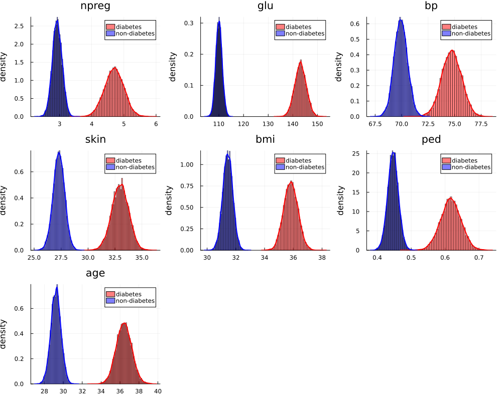
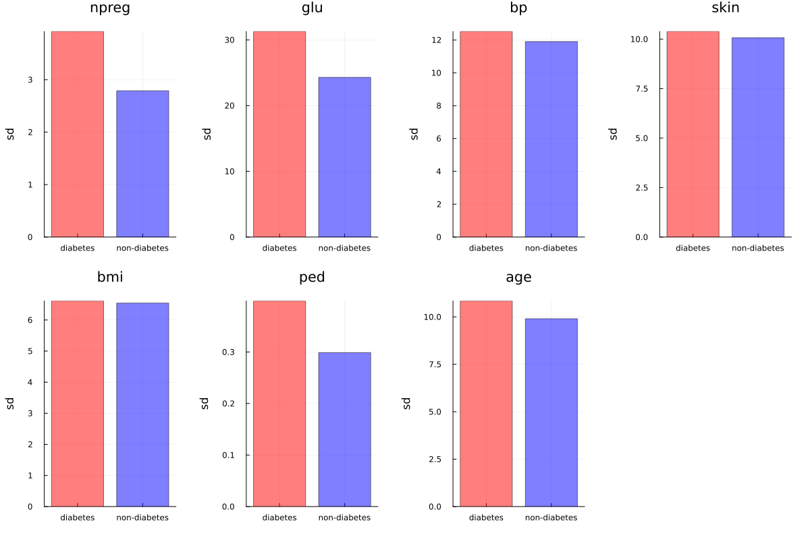
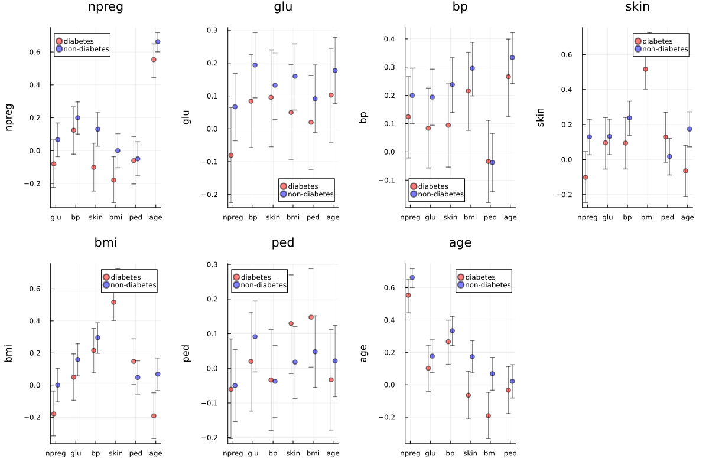

#+TITLE: 7.6
#+INCLUDE: setup.org
#+STARTUP:showeverything
* Question :noexport:
Diabetes data:
A population of 532 women living near Phoenix, Arizona were tested for diabetes.
Other information was gathered from these women at the time of testing, including number of pregnancies, glucose level, blood pressure, skin fold thickness, body mass index, diabetes pedigree and age.
This information appears in the file ~azdiabetes.dat~.
Model the joint distribution of these variables for the diabetics and non-diabetics
separately, using a multivariate normal distribution:
* a)
** Question :noexport:
For both groups separately, use the following type of unit information prior, where \(\hat{\Sigma}\) is the sample covariance matrix.
- i :: \(\boldsymbol{\mu}_0 = \bar{ \boldsymbol{y} }, \Lambda_0 = \hat{\Sigma}\);
- ii :: \(\boldsymbol{S}_0 = \hat{\Sigma}, \nu_0 = p+2=9\)
Generate at least 10,000 Monte Carlo samples for \(\{\boldsymbol{\theta}_d, \Sigma_d\}\) and \(\{\boldsymbol{\theta}_n, \Sigma_n\}\),
the model parameters for diabetics and non-diabetics respectively.
For each of the seven variables \(j \in \{1, \dots ,7\}\),
compare the marginal posterior distribution of \(\theta_{d,j}\) and \(\theta_{n,j}\).
Which variables seem to differ between the two groups?
Also obtain \(Pr(\theta_{d,j} > \theta_{n,j} | \boldsymbol{Y})\) for each \(j \in \{1, \dots ,7\}\).

** Answer
*** preprocess & Gibbs sampler
#+begin_src julia :exports code
Y_src = readdlm("../../Exercises/azdiabetes.dat", header=true)
Y = Y_src[1]
header = Y_src[2] |> vec
df = DataFrame(Y, header)

col_int = [:npreg, :glu, :bp, :skin, :age]
col_float = [:bmi, :ped]
col_str = :diabetes
df[!,col_int] = Int.(df[!,col_int])
df[!,col_float] = Float32.(df[!,col_float])
df[!,col_str] = String.(df[!,col_str])

df_d = filter(:diabetes => ==("Yes"), df)
df_n = filter(:diabetes => ==("No"), df)

function getPosterior(df, S)
    # select columns except for diabetes
    Y = select(df, Not(:diabetes)) |> Matrix
    n, p = size(Y)
    ȳ = mean(Y, dims=1) |> vec
    Σ̂ = cov(Y)

    # set prior
    μ₀ = ȳ
    Λ₀ = Σ̂
    S₀ = Σ̂
    ν₀ = p + 2

    function multivariateGibbs(S, Σ_init, μ₀, Λ₀, S₀, ν₀, Y)
        n, p = size(Y)
        THETA = Matrix{Float64}(undef, S, p)
        SIGMA = Matrix{Float64}(undef, S, p^2)
        Σ = Σ_init
        ȳ = mean(Y, dims=1) |> vec
        for s in 1:S
            # update θ
            Λn = inv( inv(Λ₀) + n * inv(Σ) )
            μn = Λn * ( inv(Λ₀) * μ₀ + n * inv(Σ) * ȳ ) |> vec
            dist = MvNormal(μn, Symmetric(Λn))
            θ = rand(dist)

            # update Σ
            Sn = S₀ + (Y' .- θ) * (Y' .- θ)'
            # Σ = rand(InverseWishart(n + ν₀, Sn))
            Σ = rand(InverseWishart(n + ν₀, round.(Sn, digits=5)))

            # save results
            THETA[s, :] = vec(θ)
            SIGMA[s, :] = vec(Σ)
        end
        return THETA, SIGMA
    end

    THETA, SIGMA = multivariateGibbs(S, Σ̂, μ₀, Λ₀, S₀, ν₀, Y)
    return THETA, SIGMA
end

S = 10000
THETA_d, SIGMA_d = getPosterior(df_d, S)
THETA_n, SIGMA_n = getPosterior(df_n, S)
#+end_src
*** marginal posterior distribution
#+begin_src julia :exports none
function plotMarginalPosterior(theta_d, theta_n, title)
    fig_each = plot(title=title, ylabel="density")
    fig_each = histogram!(
        fig_each,
        theta_d,
        label="diabetes",
        color=:red,
        normed = true,
        opacity=0.5,
        bins=:fd
    )
    fig_each = histogram!(
        fig_each,
        theta_n,
        label="non-diabetes",
        color=:blue,
        normed = true,
        opacity=0.5,
        bins=:fd
    )
    fig_each = density!(
        fig_each,
        theta_d,
        label=nothing,
        color=:red,
        normalize=:probability,
        linewidth=2
    )
    fig_each = density!(
        fig_each,
        theta_n,
        label=nothing,
        color=:blue,
        normalize=:probability,
        linewidth=2
    )
    fig_each
end

# %%
p = size(THETA_d, 2)
fig_list = []
for i in 1:p
    title = header[i]
    theta_d = THETA_d[:, i]
    theta_n = THETA_n[:, i]
    fig_each = plotMarginalPosterior(theta_d, theta_n, title)
    push!(fig_list, fig_each)
end

# %%
fig = plot(fig_list..., layout=(3, 3), size=(1000, 800))
fig
#+end_src

#+ATTR_HTML: :width 800

#+begin_src julia :exports both
p = size(THETA_d, 2)
for i in 1:p
    theta_d = THETA_d[:, i]
    theta_n = THETA_n[:, i]
    println("Pr(θd,$i > θn,$i) = ", mean(theta_d .> theta_n))
end
#+end_src

#+RESULTS:
#+begin_example julia
Pr(θd,1 > θn,1) = 1.0
Pr(θd,2 > θn,2) = 1.0
Pr(θd,3 > θn,3) = 1.0
Pr(θd,4 > θn,4) = 1.0
Pr(θd,5 > θn,5) = 1.0
Pr(θd,6 > θn,6) = 1.0
Pr(θd,7 > θn,7) = 1.0
#+end_example

- 全ての変数で、糖尿病患者と非糖尿病患者間での平均値の差があると言える。
  (For all variables, it can be said that there is a difference in mean values between diabetic and non-diabetic patients.)

* b)
** Question :noexport:
Obtain the posterior means of \(\Sigma_d\) and \(\Sigma_n\), and plot the entries versus each other.
What are the main differences, if any?
** Answer
*** standard deviation
#+begin_src julia :exports none
Σ̂_d = reshape(mean(SIGMA_d, dims=1), p, p)
Σ̂_n = reshape(mean(SIGMA_n, dims=1), p, p)

pos_var_d = diag(Σ̂_d)
pos_var_n = diag(Σ̂_n)

function plotPosSd(sd_d, sd_n, title)
    fig_each = plot(title=title, ylabel="sd", margin=5mm)
    fig_each = bar!(
        fig_each,
        ["diabetes", "non-diabetes"],
        [sd_d, sd_n],
        color=[:red, :blue],
        legend=false,
        opacity=0.5
    )
    fig_each
end

fig_list = []
for i in 1:p
    sd_d = pos_var_d[i] |> sqrt
    sd_n = pos_var_n[i] |> sqrt
    title = header[i]
    fig_each = plotPosSd(sd_d, sd_n, title)
    push!(fig_list, fig_each)
end
fig = plot(fig_list..., layout=(2, 4), size=(1200, 800))
fig
#+end_src

#+ATTR_HTML: :width 800

*** correlation
#+begin_src julia :exports none
function get_pos_cor(SIGMA, p, S)
    COR = Array{Float64}(undef, p, p, S)
    for s in 1:S
        Sig = reshape(SIGMA[s, :], p, p)
        COR[:, :, s] = Sig ./ sqrt.(diag(Sig) * diag(Sig)')
    end
    return COR
end

COR_d = get_pos_cor(SIGMA_d, p, S)
COR_n = get_pos_cor(SIGMA_n, p, S)

COR_pos_d = reshape(mean(COR_d, dims=3) ,p, p)
COR_pos_n = reshape(mean(COR_n, dims=3) ,p, p)

function plotPosCor(COR_d, COR_n, header, i)
    title = header[i]
    # choose except i-th header
    cols =  header[Not(i)]

    cor_d_mean = mean(COR_d[i, Not(i), :], dims=[2, 3])
    cor_n_mean = mean(COR_n[i, Not(i), :], dims=[2, 3])

    # 95% CI
    cor_d_95CI = zeros(2, p)
    cor_n_95CI = zeros(2, p)
    for j in 1:p
        cor_d_95CI[:, j] = quantile(COR_d[i, j, :], [0.025, 0.975])
        cor_n_95CI[:, j] = quantile(COR_n[i, j, :], [0.025, 0.975])
    end
    cor_d_95CI = cor_d_95CI[:, Not(i)]
    cor_n_95CI = cor_n_95CI[:, Not(i)]

    error_d = abs.(cor_d_95CI .- cor_d_mean')
    error_n = abs.(cor_n_95CI .- cor_n_mean')

    # make error p lenght vector (each element is a tuple)
    error_d = [(error_d[1, i], error_d[2, i]) for i in 1:p-1]
    error_n = [(error_n[1, i], error_n[2, i]) for i in 1:p-1]

    function plotPosCor(cor_d_mean, cor_n_mean, error_d, error_n, title)
        fig_each = plot(title=title, ylabel=title, margin=5mm)
        fig_each = scatter!(
            fig_each,
            [1:(p-1)...] .- 0.1,
            cor_d_mean,
            yerror=error_d,
            label="diabetes",
            color=:red,
            opacity=0.5
        )
        fig_each = scatter!(
            fig_each,
            [1:(p-1)...] .+ 0.1,
            cor_n_mean,
            yerror=error_n,
            label="non-diabetes",
            color=:blue,
            opacity=0.5
        )
        # change xticks
        xticks!(fig_each, 1:p-1, cols)
        fig_each

    end

    fig_each = plotPosCor(cor_d_mean, cor_n_mean, error_d, error_n, title)
    fig_each
end

fig_list = []
for i in 1:p
    fig_each = plotPosCor(COR_d, COR_n, header, i)
    push!(fig_list, fig_each)
end

fig = plot(fig_list..., layout=(2, 4), size=(1200, 800))
#+end_src

#+ATTR_HTML: :width 800

*** discussion
**** 日本語
- 標準偏差は、糖尿病患者群の方が、やや大きい
- 相関係数は diabetes pedigree 以外の変数に関して、非患者群の方が大きい。
**** English
- The standard deviation is slightly larger in the diabetic patient group.
- For variables other than ~diabetes pedigree~, the correlation coefficient is larger in the non-diabetic group.

* nav :ignore:
#+ATTR_HTML: :class nav-prev
[[./7-5.org][7.5]]

#+ATTR_HTML: :class nav-next
# [[../ch8/8-1.org][8.1]]
