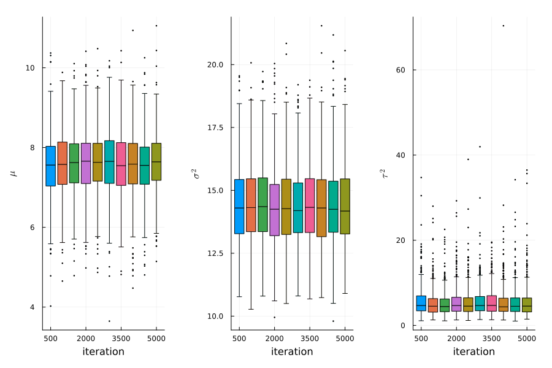
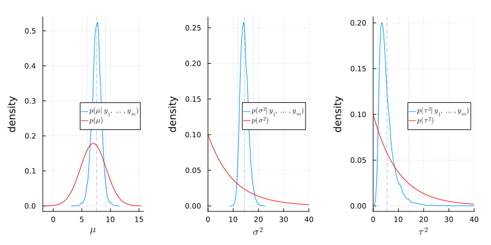
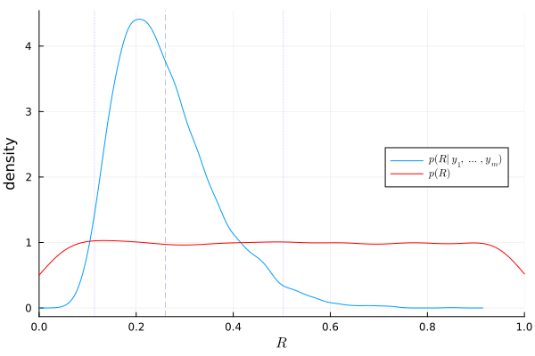
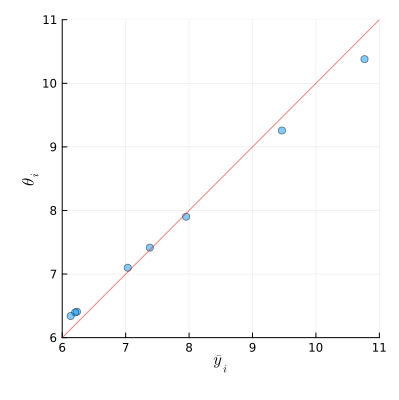

#+TITLE: 8.3
#+INCLUDE: setup.org
#+STARTUP:showeverything
* Question :noexport:
Hierarchical modeling:
The files ~school1.dat~ through ~school8.dat~ give weekly hours spent on homework for students sampled from eight different schools.
Obtain posterior distributions for the true means for the eight different schools using a hierarchical normal model with the following prior parameters:
\[
\mu_0 = 7, \gamma_0^2 = 5, \tau_0^2 = 10, \eta_0 = 2, \sigma_0^2 = 15, \nu_0 = 2.
\]

* a)
** Question :noexport:
Run a Gibbs sampling algorithm to approximate the posterior distribution of
\(\{ \boldsymbol{\theta}, \sigma^2, \mu, \tau^2 \}\).
Assess the convergence of the Markov chain, and find the effective sample size for
\(\{ \sigma^2, \mu, \tau^2 \}\).
Run the chain long enough so that the effective sample sizes are all above 1,000.

** Answer

#+begin_src julia :exports code
using Distributions
using Random
using LaTeXStrings
using Plots, StatsPlots
using Plots.Measures
using CSV, DataFrames
using DelimitedFiles
using StatsBase
using SpecialFunctions
Random.seed!(1234)

# %%
# read data
Y = Matrix{Float64}(undef, 0, 2)
for i in 1:8
    school = readdlm("../../Exercises/school$i.dat")
    Y = vcat(Y, hcat(repeat([i], size(school, 1)), school))
end

# %%
# set prior parameters
μ₀ = 7
γ₀² = 5
τ₀² = 10
η₀ = 2
σ₀² = 10
ν₀ = 2

# %%
# starting values
m = length(unique(Y[:,1]))
n = Vector{Float64}(undef, m)
ȳ = Vector{Float64}(undef, m)
sv = Vector{Float64}(undef, m)
for j in 1:m
    ȳ[j] = mean(Y[Y[:,1] .== j, 2])
    sv[j] = var(Y[Y[:,1] .== j, 2])
    n[j] = length(Y[Y[:,1] .== j, 2])
end

θ = copy(ȳ)
σ² = mean(sv)
μ = mean(θ)
τ² = var(θ)

# setup MCMC
Random.seed!(1)
S = 5000
THETA = Matrix{Float64}(undef, S, m)
MST = Matrix{Float64}(undef, S, 3)

# MCMC algorithm
for s in 1:S
    # sample new values of the θs
    for j in 1:m
        v_θ = 1 / (n[j] / σ² + 1 / τ²)
        E_θ = v_θ * (n[j]*ȳ[j]/σ² + μ/τ²)
        θ[j] = rand(Normal(E_θ, sqrt(v_θ)))
    end

    # sample new value of σ²
    νₙ = ν₀ + sum(n)
    ss = ν₀ * σ₀²
    for j in 1:m
        ss += sum((Y[Y[:,1] .== j, 2] .- θ[j]).^2)
    end
    σ² = 1 / rand(Gamma(νₙ / 2, 2/ss))

    # sample a new value of μ
    v_μ = 1 / (m/τ² + 1/γ₀²)
    E_μ = v_μ * (m * mean(θ) / τ² + μ₀ / γ₀²)
    μ = rand(Normal(E_μ, sqrt(v_μ)))

    # sample a new value of τ²
    etam = η₀ + m
    ss = η₀ * τ₀² + sum((θ .- μ).^2)
    τ² = 1 / rand(Gamma(etam/2, 2/ss))

    # store results
    THETA[s, :] = θ
    MST[s, :] = [μ, σ², τ²]
end
#+end_src

#+CAPTION: stationarity plot
#+NAME: exercise8-3_stationarity
#+ATTR_LaTeX: :placement [H]

#+begin_src julia :exports both
using MCMCDiagnosticTools
using MCMCChains

ess(MCMCChains.Chains(MST))
#+end_src

#+RESULTS:
: ESS
:   parameters         ess   ess_per_sec
:       Symbol     Float64       Missing
:
:      param_1   4046.5607       missing
:      param_2   4697.5784       missing
:      param_3   3299.9524       missing

* b)
** Question :noexport:
Compute posterior means and 95% confidence regions for \(\{\sigma^2, \mu, \tau^2\}\).
Also, compare the posterior densities to the prior densities, and discuss what was learned from the data.

** Answer
#+begin_src julia :exports code
# posterior mean and 95% confidence region for σ²
julia> mean(MST[:,2])
14.413317696499103

julia> quantile(MST[:,2], [0.025, 0.975])
2-element Vector{Float64}:
 11.733606090321313
 17.92710379952854
#+end_src

#+begin_src julia :exports code
# posterior mean and 95% confidence region for μ
julia> mean(MST[:,1])
7.587311747784735

julia> quantile(MST[:,1], [0.025, 0.975])
2-element Vector{Float64}:
 5.910059688648781
 9.160791496009686
#+end_src

#+begin_src julia :exports code
julia> mean(MST[:,3])
5.478604048700004

julia> quantile(MST[:,3], [0.025, 0.975])
2-element Vector{Float64}:
  1.9240022529423977
 14.101516261365546
#+end_src

#+begin_src julia :exports none
function plotPosterior(x, xlab, lab)
    x_mean = mean(x)
    x_lower, x_upper = quantile(x, [0.025, 0.975])
    fig = density(
        x,
        label=lab,
        xlabel=xlab,
        ylabel="density",
        linewidth=1,
        legend=:right,
    )
    vline!([x_mean], color=:blue, opacity=0.5, linewidth=0.5, linestyle=:dash, label=nothing)
    vline!([x_lower, x_upper], color=:blue, opacity=0.4, linewidth=0.5, linestyle=:dot, label=nothing)
    fig
end

# %%
fig_μ = plotPosterior(MST[:,1], L"\mu", L"p(\mu|y_1,\dots,y_m)")
fig_μ = plot!(fig_μ, Normal(μ₀, sqrt(γ₀²)), color=:red, linewidth=1, label=L"p(\mu)")
fig_μ

# %%
fig_σ² = plotPosterior(MST[:,2], L"\sigma^2", L"p(\sigma^2|y_1,\dots,y_m)")
fig_σ² = plot!(
    fig_σ², Gamma(ν₀/2, 2σ₀²/ν₀), color=:red, linewidth=1, label=L"p(\sigma^2)"
    , xlims=(0, 40)
)
fig_σ²

# %%
fig_τ² = plotPosterior(MST[:,3], L"\tau^2", L"p(\tau^2|y_1,\dots,y_m)")
fig_τ² = plot!(
    fig_τ², Gamma(η₀/2, 2τ₀²/η₀), color=:red, linewidth=1, label=L"p(\tau^2)"
    , xlims=(0, 40)
)
fig_τ²

# %%
fig = plot(fig_μ, fig_σ², fig_τ², layout=(1,3), size=(800, 400), margin=5mm)
fig
#+end_src

#+CAPTION: Comparison of posterior and prior densities
#+NAME: exercise8-3_poterior
#+ATTR_LaTeX: :placement [H]

The following things were learned from the data:
- \(\sigma^2\) is around 14.4, which is higher than the prior mean 10.0, and the variance is smaller than the prior variance 100.
- \(\mu\) is around 7.6, which is higher than the prior mean 7.0, and the variance is smaller than the prior variance 10.0.
- \(\tau^2\) is around 5.5, which is smaller than the prior mean 10.0, and the variance is smaller than the prior variance 100.
* c)
** Question :noexport:
Plot the posterior density of \(R = \frac{\tau^2}{\sigma^2 + \tau^2}\) and compare it to a plot of the prior density of \(R\).
Describe the evidence for between-school variation.

** Answer
#+begin_src julia :exports code
σ²_pri = rand(Gamma(ν₀/2, 2σ₀²/ν₀), S)
τ²_pri = rand(Gamma(η₀/2, 2τ₀²/η₀), S)
R_pri = τ²_pri ./ (σ²_pri .+ τ²_pri)
R_pos = MST[:,3] ./(MST[:,2] .+ MST[:,3])
#+end_src

#+begin_src julia :exports none
fig_R = plotPosterior(R_pos, L"R", L"p(R|y_1,\dots,y_m)")
fig_R = density!(
    fig_R, R_pri, color=:red, linewidth=1, label=L"p(R)", xlims=(0, 1)
)
fig_R
#+end_src

#+CAPTION: Prior and posterior densities of \(R\)
#+NAME: exercise8-3_R
#+ATTR_LaTeX: :placement [H]

The plot above shows that about 25% of the variance is due to between-school variation, and the rest is due to within-school variation.

* d)
** Question :noexport:
Obtain the posterior probability that \(\theta_7\) is smaller than \(\theta_6\), as well as the posterior probability that \(\theta_7\) is the smallest of all the \(\theta\)’s.
** Answer
#+begin_src julia :exports both
# posterior probability that θ₇ is smaller than θ₆
mean(THETA[:,7] .< THETA[:,6])
#+end_src

#+RESULTS:
: 0.5222

#+begin_src julia :exports both
# posterior probability that θ₇ is the smallest of all the θ’s
mean(THETA[:,7] .≤ minimum(THETA, dims=2))
#+end_src

#+RESULTS:
: 0.325

* e)
** Question :noexport:
Plot the sample averages \(\bar{y}_1, \dots, \bar{y}_8\) against the posterior expectations of
\(\theta_1, \dots, \theta_8\),
and describe the relationship.
Also compute the sample mean of all observations and compare it to the posterior mean of \(\mu\).

** Answer

#+begin_src julia :exports code
θ̄ = mean(THETA, dims=1) |> vec
fig_e = plot(
    ȳ, θ̄, seriestype=:scatter, xlabel=L"\bar{y}_i", ylabel=L"\theta_i", legend=:none,
    xlims=(6,11), ylims=(6,11), size=(400, 400), margin=5mm, alpha=0.5
)
fig_e = plot!(fig_e, x->x, color=:red, linewidth=1,alpha=0.5)
fig_e
#+end_src

#+CAPTION: Sample averages and posterior expectations
#+NAME: exercise8-3_e
#+ATTR_LaTeX: :height 7cm :placement [!h]

For the schools with large sample averages, the posterior expectations tend to be smaller than the sample averages.
For the schools with small sample averages, the posterior expectations tend to be larger than the sample averages.

#+begin_src julia :exports both
# sample mean of all observations
mean(Y[:,2])
#+end_src

#+RESULTS:
: 7.6912777777777785

#+begin_src julia :exports both
# posterior mean of μ
mean(MST[:,1])
#+end_src

#+RESULTS:
: 7.587311747784735

* nav :ignore:
#+ATTR_HTML: :class nav-prev
[[./8-2.org][8.2]]

#+ATTR_HTML: :class nav-next
[[../ch9/9-1.org][8.1]]
