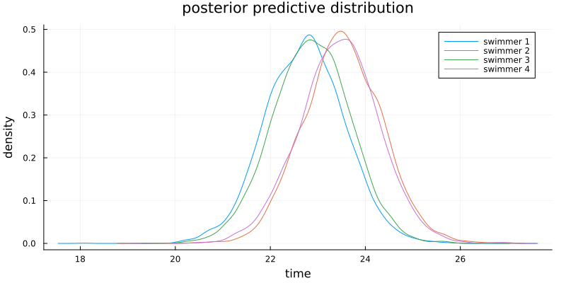

#+TITLE: Exercise 9.1 Solution - Hoff, A First Course in Bayesian Statistical Methods
#+SUBTITLE: 標準ベイズ統計学 演習問題 9.1 解答例
#+SETUPFILE: ../setup.org
#+STARTUP:showeverything
* Question :noexport:
Extrapoloation:
The file ~swim.dat~ contains data on the amount of time,
in seconds, it takes each of four high school swimmers to swim 50 yards.
Each swimmer has six times, taken on a biweekly basis.

* a)
** Question :noexport:
Perform the following data analysis for each swimmer separately:
- i. :: Fit a linear regression model of swimming time as the response and week as the explanatory variable.
   To formulate your prior, use the information that competitive times for this age group generally range from 22 to 24 seconds.
- ii. :: For each swimmer \(j\), obtain a posterior predictive distribution for \(Y_j^{\ast}\), their time if they were to swim two weeks from the last recorded time.

** Answer
The prior information means that the line \(\beta_1 + \beta_2 x\) should produce values between 22 and 24 when \(x\) is between 1 and 6.
A little algebra shows that we need a prior distribution on \((\beta_1, \beta_2)\) such that
\(\frac{98}{5} < \beta_1 < \frac{132}{5}\) and \(-\frac{2}{5} < \beta_2 < \frac{2}{5}\) with high probability.
This could be done by taking \(\boldsymbol{\beta}_0 = (23, 0) \) and \(\Sigma_0 = \text{diag}\left( \left(\frac{17}{5} \right)^2, \left(\frac{1}{5} \right)^2 \right)\).
For \(\nu_0\) and \(\sigma_0^2\), we could take \(\nu_0 = 2\) and \(\sigma_0^2 = 0.5\) so that the prior distribution of \(\sigma^2\) is concentrated around 0.5.

#+begin_src julia :exports both
# read data
swim = readdlm("../../Exercises/swim.dat", header=false)

function regressionSemiconjugatePrior(y, X, β₀, Σ₀, ν₀, σ₀²; S=5000)
    n, p = size(X)

    BETA = Matrix{Float64}(undef, S, p)
    SIGMA² = Vector{Float64}(undef, S)

    # starting values
    olsfit = lm(X, y)
    β = coef(olsfit)
    σ² = sum(map(x -> x^2, residuals(olsfit))) / (n - p)

    # MCMC algorithm
    for s in 1:S
        # update β
        V = inv(inv(Σ₀) + X'X / σ²)
        E = V * (inv(Σ₀) * β₀ + X'y / σ²)
        β = rand(MvNormal(E, Symmetric(V)))

        # update σ²
        νₙ = ν₀ + n
        SSR = sum(map(x -> x^2, y - X*β))
        νₙσ²ₙ = ν₀ * σ₀² + SSR
        σ² = rand(InverseGamma(νₙ / 2, 2/νₙσ²ₙ))

        # store
        BETA[s, :] = β
        SIGMA²[s] = σ²
    end

    return BETA, SIGMA²
end

# set prior parameters
β₀ = [23, 0]
Σ₀ = diagm([(17/5)^2, (1/5)^2])
ν₀ = 2
σ₀² = 0.5

S = 5000

Y_PRED = Matrix{Float64}(undef, S, size(swim,1))
fig = plot(
    title="posterior predictive distribution", xlabel="time", ylabel="density"
    , size=(800, 400), margin=3mm
)
for i in 1:size(swim,1)
    y = swim[i, :]
    X = [repeat([1], length(y)) 1:length(y)]
    BETA, SIGMA² = regressionSemiconjugatePrior(y, X, β₀, Σ₀, ν₀, σ₀², S=S)
    μ_ypred = BETA[:,1] .+ BETA[:,2] * (length(y)+1)
    ypred = rand.(Normal.(μ_ypred, sqrt.(SIGMA²)))
    Y_PRED[:, i] = ypred
    fig = density!(fig, ypred, label="swimmer $i")
    ypred_mean = ypred |> mean |> x -> round(x, digits=2)
    println("swimmer $i: ", ypred_mean)
end
#+end_src

:RESULTS:
: swimmer 1: 22.73
: swimmer 2: 23.52
: swimmer 3: 22.86
: swimmer 4: 23.44

* b)
** Question :noexport:
The coach of the team has to decide which of the four swimmers will compete in a swimming meet in two weeks.
Using your predictive distributions, compute
\(\mathrm{Pr}(Y_j^{\ast} = \max \{ Y_1^{\ast}, \dots, Y_4^{\ast}\} | \mathbf{Y})\)
for each swimmer \(j\), and based on this make a recommendation to the coach.

** Answer
#+begin_src julia :exports both
ind_fastest = mapslices(x -> x .== minimum(x), Y_PRED, dims=2)
mean(ind_fastest, dims=1)
#+end_src

:RESULTS:
: 1×4 Matrix{Float64}:
:  0.4184  0.1064  0.3504  0.1248

The probability that each swimmer is the fastest is shown above.
Swimmer 1 will be the fastest with probability 0.4184, so I recommend that the coach choose swimmer 1.

* nav :ignore:
#+ATTR_HTML: :class nav-prev
[[../ch8/8-3.org][8.3]]

#+ATTR_HTML: :class nav-next
[[./9-2.org][9.2]]
