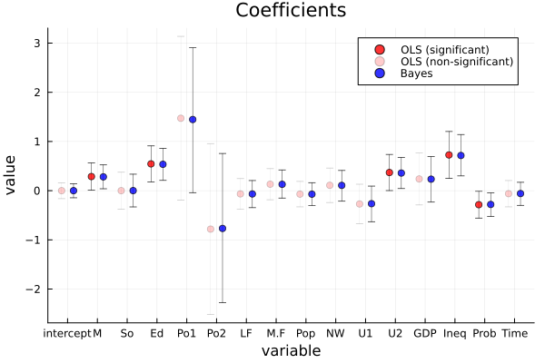
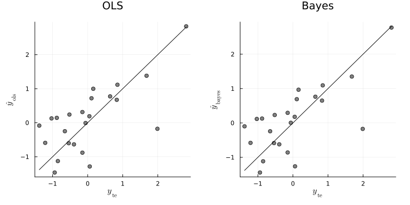
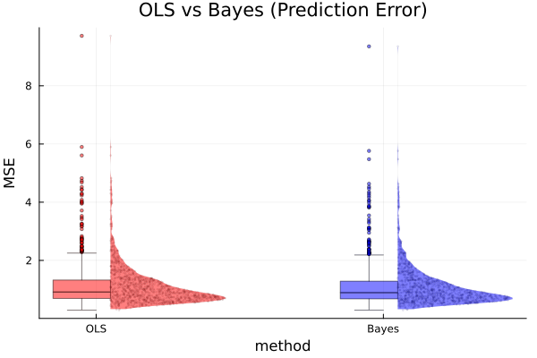

#+TITLE: 9.3
#+INCLUDE: setup.org
#+STARTUP:showeverything
* Question :noexport:
Crime:
The file ~crime.dat~ contains crime rates and data on 15 explanatory variables for 47 U.S. states, in which both the crime rates and the explanatory variables have been centered and scaled to have variance 1.
A description of the variables can be obtained by typing ~library (MASS);?UScrime~ in ~R~.
* a)
** Question :noexport:
Fit a regression model \(\boldsymbol{y} = \mathbf{X} \boldsymbol{\beta} + \epsilon\) using the /g/-prior with \(g=n, \nu_0=2\) and \(\sigma_0^2=1\).
Obtain marginal posterior mean and 95% confidence intervals for \(\boldsymbol{\beta}\),
and compare to the least square estimates.
Describe the relationships between crime and the explanatory variables.
Which variables seem strongly predictive of crime rates?

** Answer

The result of bayesian regression using the /g/-prior is shown below:

#+begin_src julia :exports both
crime_src = readdlm("../../Exercises/crime.dat", header=true)
crime = crime_src[1]
header = crime_src[2] |> vec

df = DataFrame(crime, header)

using GLM

function ResidualSE(y,X)
    fit = lm(X, y)
    return sum(map(x -> x^2, residuals(fit))) / (size(X, 1) - size(X, 2))
end

function lmGprior(y, X; g=length(y), ν₀=1, σ₀²=ResidualSE(y,X), S=1000)
    n, p = size(X)

    Hg = (g/(g+1)) * X * inv(X'X) * X'
    SSRg = y' * (diagm(ones(n)) - Hg) * y
    σ² = 1 ./ rand(Gamma((ν₀+n)/2, 2/(ν₀*σ₀²+SSRg)), S)

    Vb = g * inv(X'X) /(g+1)
    Eb = Vb * X' * y

    β = Matrix{Float64}(undef, 0, p)
    for i in 1:S
        s = σ²[i]
        β = vcat(β, rand(MvNormal(Eb, Symmetric(s * Vb)))')
    end
    return β, σ²
end

# set prior parameters
n = size(df, 1)
g = n
ν₀ = 2
σ₀² = 1

y = df[:, :y]
X = select(df, Not(:y)) |> Matrix
X = [ones(size(X, 1)) X] # add intercept
p = size(X, 2)
S=5000
BETA, SIGMA² = lmGprior(y, X; g=g, ν₀=ν₀, σ₀²=σ₀², S=S)

# posterior mean for β
β̂_gprior = mean(BETA, dims=1) |> vec

# posterior confidence intervals for β
ci_gprior = map(x -> quantile(x, [0.025, 0.975]), eachcol(BETA))

# store results
coef_name = names(df[:, Not(:y)]) |> vec
coef_name = ["intercept", coef_name...]
result_gprior = DataFrame(
    param = coef_name,
    β̂ = β̂_gprior,
    ci_lower = map(x -> x[1], ci_gprior),
    ci_upper = map(x -> x[2], ci_gprior)
)
@transform!(result_gprior, :ci_length = :ci_upper - :ci_lower)
end
#+end_src

:RESULTS:
#+begin_example
16×5 DataFrame
 Row │ param      β̂             ci_lower    ci_upper    ci_length
     │ String     Float64       Float64     Float64     Float64
─────┼────────────────────────────────────────────────────────────
   1 │ intercept  -0.00138411   -0.145485    0.141785    0.28727
   2 │ M           0.280085      0.0326016   0.522226    0.489625
   3 │ So          0.000124904  -0.335994    0.326097    0.662091
   4 │ Ed          0.531345      0.213679    0.848809    0.63513
   5 │ Po1         1.4448        0.0578835   2.9098      2.85191
   6 │ Po2        -0.769673     -2.28756     0.708661    2.99622
   7 │ LF         -0.0649535    -0.345494    0.201018    0.546512
   8 │ M.F         0.128508     -0.147925    0.402133    0.550058
   9 │ Pop        -0.0704276    -0.301267    0.153849    0.455116
  10 │ NW          0.105647     -0.200629    0.416185    0.616814
  11 │ U1         -0.265548     -0.631514    0.103081    0.734594
  12 │ U2          0.359167      0.0283685   0.688258    0.659889
  13 │ GDP         0.239074     -0.213783    0.692641    0.906425
  14 │ Ineq        0.715697      0.299354    1.13272     0.83337
  15 │ Prob       -0.27993      -0.527327   -0.0344898   0.492837
  16 │ Time       -0.0602993    -0.288748    0.181236    0.469984
#+end_example

The result of least square estimation is shown below:

#+begin_src julia :exports both
# least square estimates
olsfit = lm(X, y)

tstat = coef(olsfit) ./ stderror(olsfit)
pval = 2 * (1 .- cdf.(Normal(), abs.(tstat)))

result_ols = DataFrame(
    param = coef_name,
    β̂ = coef(olsfit),
    pvalue = pval,
    ci_lower = confint(olsfit)[:, 1],
    ci_upper = confint(olsfit)[:, 2]
)
@transform!(result_ols, :ci_length = :ci_upper - :ci_lower)
#+end_src

#+RESULTS:
#+begin_example
16×6 DataFrame
 Row │ param      β̂             pvalue      ci_lower     ci_upper    ci_length
     │ String     Float64       Float64     Float64      Float64     Float64
─────┼─────────────────────────────────────────────────────────────────────────
   1 │ intercept  -0.000458109  0.995369    -0.161444     0.160527    0.321971
   2 │ M           0.286518     0.0348684    0.00955607   0.56348     0.553924
   3 │ So         -0.000114046  0.999506    -0.375493     0.375265    0.750757
   4 │ Ed          0.544514     0.00243231   0.178196     0.910832    0.732636
   5 │ Po1         1.47162      0.0715397   -0.193934     3.13718     3.33111
   6 │ Po2        -0.78178      0.358608    -2.51862      0.955056    3.47367
   7 │ LF         -0.0659646    0.667281    -0.378923     0.246994    0.625917
   8 │ M.F         0.131298     0.397494    -0.185192     0.447788    0.63298
   9 │ Pop        -0.0702919    0.579692    -0.329144     0.18856     0.517704
  10 │ NW          0.109057     0.525852    -0.241574     0.459687    0.701261
  11 │ U1         -0.270536     0.168865    -0.671568     0.130495    0.802063
  12 │ U2          0.36873      0.0403534    0.00190637   0.735554    0.733648
  13 │ GDP         0.238059     0.357931    -0.290079     0.766198    1.05628
  14 │ Ineq        0.726292     0.00192334   0.24874      1.20384     0.955105
  15 │ Prob       -0.285226     0.033017    -0.558095    -0.0123574   0.545738
  16 │ Time       -0.0615769    0.638379    -0.328802     0.205648    0.534451
#+end_example

The point estimates and 95% confidence/credible intervals are very similar between bayesian regression and least square estimation.
The lengths of the intervals seem to be shorter in bayesian regression than in least square estimation.
Seeing the results of bayesian regression, the 95% credible intervals of coefficients of M, Ed, Po1, U2, Ineq and Prob do not include 0, so these variables seem strongly predictive of crime rates.
On the other hand, the results of least square estimation show that the p-values of M, Ed, U2 and Ineq are less than 0.05, so these variables seem strongly predictive of crime rates.
Using these types of criteria, the difference between the two results is that Po1 and Prob are predictive of crime rates in bayesian regression, but not in least square estimation.

* b)
** Question :noexport:
Lets see how well regression models can predict crime rates based on the \(\boldsymbol{X}\)-variables.
Randomly divide the crime roughly in half, into a training set \(\{\boldsymbol{y}_{ \mathrm{tr} }, \mathbf{X}_{ \mathrm{tr} }\}\) and a test set \(\{\boldsymbol{y}_{ \mathrm{te} }, \mathbf{X}_{ \mathrm{te} }\}\).
- i. :: Using only the training set, obtain least squares regression coefficients \(\hat{ \boldsymbol{\beta} }_{ \mathrm{ols} }\).
  Obtain predicted values for the test data by computing
  \( \hat{ \boldsymbol{y} }_{ \mathrm{ols} } = \mathbf{X}_{ \mathrm{te} } \hat{ \boldsymbol{\beta} }_{ \mathrm{ols} } \).
  Plot \( \hat{ \boldsymbol{y} }_{ \mathrm{ols} } \) versus \( \boldsymbol{y}_{ \mathrm{te} } \) and compute the prediction error
  \( \frac{1}{n_{ \mathrm{te} } } \sum (y_{i, \mathrm{te} } - \hat{y}_{i, \mathrm{ols} })^2 \).
- ii. :: Now obtain the posterior mean
  \( \hat{ \boldsymbol{\beta} }_{ \mathrm{Bayes} } = E[ \boldsymbol{\beta} | \boldsymbol{y}_{ \mathrm{tr} } \) using the /g/-prior described above and the training data only.
  Obtain predictions for the test set
  \( \hat{ \boldsymbol{y} }_{ \mathrm{Bayes} } = \mathbf{X}_{ \mathrm{te} } \hat{ \boldsymbol{\beta} }_{ \mathrm{Bayes} } \).
  Plot versus the test data, compute the prediction error, and compare to the OLS prediction error.
  Explain the results.
** Answer
#+begin_src julia :exports code
# split data into training and test set
Random.seed!(1234)
i_te = sample(1:n, div(n, 2), replace=false)
i_tr = setdiff(1:n, i_te)

y_tr = y[i_tr]
y_te = y[i_te]
X_tr = X[i_tr, :]
X_te = X[i_te, :]
#+end_src

#+begin_src julia :exports both
# OLS
olsfit = lm(X_tr, y_tr)
β̂_ols = coef(olsfit)
ŷ_ols = X_te * β̂_ols
error_ols = mean((y_te - ŷ_ols).^2)
#+end_src

:RESULTS:
: 0.6155918321208247

#+begin_src julia :exports both
# Bayesian
BETA, SIGMA² = lmGprior(y_tr, X_tr; g=g, ν₀=ν₀, σ₀²=σ₀², S=S)
β̂_bayes = mean(BETA, dims=1) |> vec
ŷ_bayes = X_te * β̂_bayes
error_bayes = mean((y_te - ŷ_bayes).^2)
#+end_src

:RESULTS:
: 0.6012597112455574

From the above results, the least square regression and bayesian regression seem to yield very similar predictions for the test data.
For this time, the bayesian regression predict better than the least square regression, but the gap is very small.
* c)
** Question :noexport:
Repeat the procedures in b) many times with different randomly generated test and training sets.
Compute the average prediction error for both the OLS and Bayesian methods.

** Answer
#+begin_src julia :exports both
function computeMses(y, X; g=g, ν₀=ν₀, σ₀²=σ₀², S=S)
    # split data into training and test set
    y_tr, y_te, X_tr, X_te = splitData(y, X)

    # OLS
    olsfit = lm(X_tr, y_tr)
    β̂_ols = coef(olsfit)
    ŷ_ols = X_te * β̂_ols
    error_ols = mean((y_te - ŷ_ols).^2)

    # Bayesian
    BETA, SIGMA² = lmGprior(y_tr, X_tr; g=g, ν₀=ν₀, σ₀²=σ₀², S=S)
    β̂_bayes = mean(BETA, dims=1) |> vec
    ŷ_bayes = X_te * β̂_bayes
    error_bayes = mean((y_te - ŷ_bayes).^2)

    return error_ols, error_bayes
end

# compute MSEs
n_sim = 1000
error_ols = zeros(n_sim)
error_bayes = zeros(n_sim)
for i in 1:n_sim
    error_ols[i], error_bayes[i] = computeMses(y, X)
end

# average MSEs
mean(error_ols), mean(error_bayes)
#+end_src

:RESULTS:
: (1.12446194924989, 1.092206057122776)

* nav :ignore:
#+ATTR_HTML: :class nav-prev
[[./9-2.org][9.2]]

#+ATTR_HTML: :class nav-next
[[../ch10/10-1.org][10.1]]
